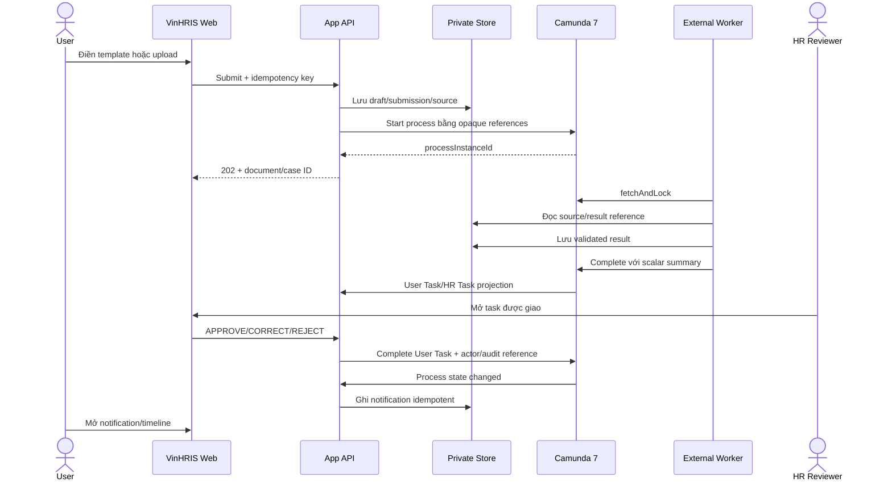
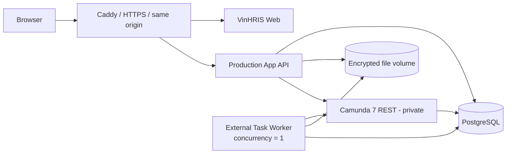

# Kế hoạch phát triển website VinHRIS và triển khai chi phí thấp

Trạng thái: `PROPOSAL`

Ngày rà soát: 14/08/2026

Baseline: `origin/main` tại `cb29592`

Phạm vi: website vận hành, phân quyền, biểu mẫu HCNS, Camunda/External Task Worker,
notification và deployment. Tài liệu này không phải phê duyệt đưa PII thật lên cloud
hoặc bật tự động phê duyệt nghiệp vụ.

## 1. Quyết định đề xuất

1. Không sửa trực tiếp OCR Lab hiện tại thành một dashboard dùng chung. Tách:
   - **VinHRIS App**: sản phẩm cho `USER`, `HR_REVIEWER`, `ADMIN`;
   - **VinHRIS Lab**: benchmark, Ground Truth, diagnostic và evidence, chỉ mở local
     hoặc bằng feature flag cho người được phép.
2. MVP chỉ chứng minh một luồng hoàn chỉnh với `leave-request-v1`:
   tạo nháp -> nộp -> Camunda -> HR review -> User nhận notification.
   Sau khi đạt gate mới mở `overtime-request-v1`, rồi mới đến các loại upload còn lại.
3. Biểu mẫu do User điền là dữ liệu có cấu trúc. Hệ thống validate trực tiếp theo
   template/schema hiện có; không tạo DOCX rồi OCR lại. DOCX/PDF chỉ được render như
   artifact đầu ra khi nghiệp vụ thật sự cần.
4. Camunda tiếp tục là nguồn sự thật cho process, assignment, User Task, SLA và
   trạng thái dài hạn. Website chỉ hiển thị projection và hoàn thành task qua backend.
5. Trình duyệt không gọi `engine-rest` và không chạy External Task Worker. Camunda,
   worker, database và file store chỉ giao tiếp trong private network.
6. Không cố chạy toàn bộ hệ thống miễn phí 24/7. Hai profile được ưu tiên:
   - **Partner demo gần 0 đồng**: chạy trên máy hiện có, truy cập có thời hạn qua
     Cloudflare Tunnel/Access, chỉ dùng synthetic hoặc dữ liệu đã được cho phép;
   - **Staging chi phí thấp**: một VPS x86 `4 vCPU / 8 GB RAM` chạy Docker Compose.
7. Không public sign-up trong MVP. Admin tạo/invite tài khoản nội bộ; phiên đăng nhập
   dùng cookie an toàn và mọi quyền đều được backend kiểm tra.

## 2. Cơ sở của kế hoạch

### 2.1 Hệ thống đã có

- Intake an toàn cho DOCX, PDF text, PDF scan, ảnh và các định dạng native khác.
- Sáu nhóm active: CV, IELTS, probation contract, leave, overtime và CCCD mặt trước.
- Template/parser/schema versioned, provenance và quality gate review-first.
- Dashboard local có upload, source preview, Prediction/Ground Truth comparison và
  bridge Camunda cho CV/IELTS/probation contract.
- Camunda 7.13 External Task REST worker, BPMN/DMN, scalar/opaque-only variables,
  idempotency và Human Review ở shadow mode.
- `autoContinueEnabled=false`; HRIS và notification thật chưa được bật.
- Frontend dùng Next/React qua vinext và đã có cấu hình Cloudflare Workers.

Nguồn trạng thái: [PROJECT_STATE](docs/PROJECT_STATE.md),
[VISION](docs/VISION.md), [ARCHITECTURE](docs/ARCHITECTURE.md),
[WORKFLOWS](docs/WORKFLOWS.md) và [HUMAN_IN_THE_LOOP](docs/HUMAN_IN_THE_LOOP.md).

### 2.2 Khoảng trống trước khi thành sản phẩm nhiều người dùng

- API hiện tại là local-only `ThreadingHTTPServer`, có loopback Host guard và chưa
  phải public production API.
- Chưa có app-managed identity, session, RBAC, account lifecycle hoặc password reset.
- `chatgpt-auth.ts` chỉ phù hợp preview/hosting context hiện tại, không thay thế
  identity và phân quyền VinHRIS.
- Chưa có database production đã merge vào `main` cho user, document metadata,
  notification và audit.
- Review queue hiện tại phục vụ local demo; chưa áp quyền theo tài khoản đăng nhập.
- File/result vẫn phụ thuộc private local data root; retention, backup/restore và
  deletion workflow production chưa hoàn chỉnh.
- UI đang đặt product flow, benchmark và engineering diagnostic trong cùng workspace.
- Các branch production API/store/telemetry/security/local-staging có nhiều work đã
  làm nhưng chưa nằm trên `origin/main`; không được coi là capability đã phát hành.
- Baseline đo gần nhất cho thấy ảnh/PDF scan chậm và ngốn RAM hơn native document.
  Do đó upload phải chạy bất đồng bộ, worker concurrency ban đầu là `1` và UI phải
  hiển thị trạng thái thay vì giữ một HTTP request dài.

### 2.3 Nguyên tắc không được phá vỡ

- Không log/commit PII, raw OCR, upload, secret, model weight hoặc private path.
- Camunda chỉ nhận opaque reference và routing metadata nhỏ.
- Không có workflow state machine thứ hai cạnh tranh với Camunda.
- Mọi field nhạy cảm, scan, low-confidence và side effect ảnh hưởng quyền lợi nhân
  viên phải qua Human Review.
- Admin hệ thống không mặc nhiên là HR reviewer.
- Không dùng cloud OCR/VLM hoặc đưa tài liệu thật lên cloud khi chưa có phê duyệt,
  DPA, region và retention rõ ràng.
- Không tự động tuyển dụng, sa thải, đổi lương, kỷ luật, phúc lợi hoặc duyệt nghỉ.

## 3. Phạm vi sản phẩm

### 3.1 Persona và quyền tối thiểu

| Khả năng | `USER` | `HR_REVIEWER` | `ADMIN` |
|---|---:|---:|---:|
| Đăng nhập/đăng xuất, đổi mật khẩu của mình | Có | Có | Có |
| Tạo và sửa draft của mình | Có | Không | Không |
| Nộp, xem timeline và bổ sung hồ sơ của mình | Có | Không | Không |
| Xem notification của mình | Có | Có | Có |
| Xem/hoàn thành User Task xác nhận dữ liệu của hồ sơ mình | Có | Không | Không |
| Xem task HR được giao/candidate group cho phép | Không | Có | Không |
| Xem source/provenance tối thiểu cần để review | Không | Có | Không |
| `APPROVE`, `CORRECT`, `REJECT`, yêu cầu bổ sung | Không | Có | Không |
| Tạo/invite, khóa/mở khóa tài khoản | Không | Không | Có |
| Gán/gỡ role | Không | Không | Có |
| Xem audit metadata và system health đã redacted | Không | Không | Có |
| Đọc nội dung hồ sơ HCNS | Chỉ hồ sơ của mình | Theo task/quyền | Không, trừ khi có thêm role HR |

Quy tắc backend:

- Mọi truy vấn document phải lọc theo owner hoặc task authorization; không dựa vào
  việc ẩn nút ở frontend.
- Role là quan hệ nhiều-nhiều để một người có thể vừa là HR vừa là Admin mà không
  làm Admin mặc nhiên đọc được PII.
- Không có anonymous registration. Admin invite/create, đặt trạng thái
  `INVITED | ACTIVE | LOCKED | DISABLED`.
- Tất cả thay đổi role, account status và quyết định HR có audit actor, thời điểm,
  request/case ID và before/after đã loại PII không cần thiết.

### 3.2 Information architecture

```text
Public
├── /                    Landing ngắn gọn
└── /login               Đăng nhập, quên/đặt lại mật khẩu

USER
├── /app                  Việc cần làm + notification mới
├── /app/documents        Hồ sơ của tôi
├── /app/documents/new    Tạo từ biểu mẫu hoặc tải file
├── /app/documents/:id    Timeline, trạng thái, phản hồi HR
└── /app/profile          Thông tin và bảo mật tài khoản

HR_REVIEWER
├── /hr/tasks             Task Camunda được phép xử lý
└── /hr/tasks/:id         Source + extracted fields + provenance + quyết định

ADMIN
├── /admin/users          Invite, khóa/mở khóa, gán role
├── /admin/audit          Audit metadata đã redacted
└── /admin/system         Health, worker/Camunda status, không chứa PII

LOCAL/FEATURE FLAG
└── /lab                  Benchmark, Ground Truth, OCR diagnostic, evidence
```

Không nhúng Camunda Tasklist/Cockpit bằng iframe. VinHRIS dùng backend service
credential để lấy task được phép và hoàn thành task, đồng thời ghi actor VinHRIS vào
audit. Cockpit chỉ dành cho vận hành nội bộ và không public.

### 3.3 Thiết kế trải nghiệm

- Giao diện tiếng Việt trước, timezone `Asia/Ho_Chi_Minh`, ngày hiển thị
  `dd/mm/yyyy` nhưng API lưu ISO-8601 UTC.
- App shell theo role; desktop dùng sidebar, màn nhỏ dùng navigation gọn. Không đưa
  benchmark, model version hoặc Ground Truth lên trang User mặc định.
- Mỗi document có một timeline dễ hiểu: `Nháp`, `Đã nộp`, `Đang xử lý`,
  `Chờ người dùng xác nhận`, `Chờ HR`, `Cần bổ sung`, `Đã duyệt`, `Từ chối`, `Lỗi`.
  Đây chỉ là nhãn projection từ Camunda, không phải state machine độc lập.
- Status phải có text + icon, không chỉ dựa vào màu. Tất cả form dùng label thật,
  keyboard focus, error summary và contrast hướng tới WCAG 2.2 AA.
- Mobile ưu tiên upload ảnh/chụp scan, nhưng cảnh báo chất lượng trước khi nộp.
- Field nhạy cảm mặc định mask; hành động reveal/download phải được authorize và audit.
- HR review dùng bố cục source bên trái, field/provenance bên phải; luôn hiển thị
  confidence, validation, lý do review và side effect sau approve để giảm automation bias.
- Action nguy hiểm cần xác nhận, reason bắt buộc cho `REJECT`/yêu cầu bổ sung.
- Empty/loading/error/expired-session/worker-incident phải có hướng xử lý rõ, không chỉ
  hiện lỗi kỹ thuật.

## 4. Hai luồng tài liệu

### 4.1 Tạo từ biểu mẫu

MVP chỉ mở `leave-request-v1`, sau đó `overtime-request-v1`.

1. User chọn template.
2. Server tạo draft và pin `templateId/templateVersion`.
3. User nhập field cấu trúc; Save draft rõ ràng trước khi thêm autosave.
4. Backend validate theo schema/policy hiện có.
5. Khi submit, backend tạo immutable submission version và idempotency key.
6. Dữ liệu cấu trúc đi thẳng tới result store/Business JSON; không OCR lại.
7. Camunda nhận document/case/result reference và tạo User/HR Task theo BPMN.
8. Nếu cần bản hành chính, server render DOCX/PDF từ đúng template version và lưu như
   output artifact; artifact không được đưa ngược qua OCR.

Nếu template đổi version khi draft còn mở, hệ thống phải báo khác version và yêu cầu
migrate/reconfirm; không âm thầm đổi nội dung đã được User xác nhận.

### 4.2 Tải tài liệu lên

CV, IELTS, probation contract, CCCD mặt trước và file scan tiếp tục dùng intake hiện có:

1. Kiểm tra extension, MIME, magic bytes, size/page/ZIP safety.
2. Lưu file vào encrypted private storage trước khi tạo job.
3. Trả `202 Accepted` cùng document/job ID; browser không chờ OCR hoàn tất.
4. Camunda External Task Worker fetch-and-lock, native parse trước và OCR chỉ khi cần.
5. Lưu result bền vững trước khi complete task.
6. Low-confidence/sensitive/scan luôn đi Human Review.
7. UI polling theo document status; chưa cần WebSocket/SSE ở MVP.

## 5. Camunda, review và notification in-app



Notification MVP:

- Chỉ in-app; chưa gửi email/SMS/push.
- Event tối thiểu: submitted, processing failed, user action required, HR approved,
  rejected, changes requested và completed.
- Notification không chứa PII; chỉ có tiêu đề an toàn, case reference và link đã
  authorize.
- Unique event key ngăn tạo trùng khi Camunda retry.
- UI lấy unread count khi load/on-focus và polling chậm; đánh dấu đã đọc bằng endpoint
  idempotent. Thêm realtime chỉ khi đo được nhu cầu.

## 6. Kiến trúc triển khai tối thiểu



Một host trước, chưa tách microservice theo hạ tầng:

- `caddy`: TLS, security headers, request limits và reverse proxy same-origin;
- `web`: Next/vinext UI;
- `app-api`: production HTTP adapter bao quanh application services hiện có;
- `idp-worker`: External Task Worker, concurrency `1` cho OCR visual;
- `camunda`: engine/webapps chỉ private hoặc admin VPN;
- `postgres`: một server, database/schema tách cho app và Camunda;
- encrypted host volume cho source/result; backup mã hóa sang vị trí thứ hai.

Chưa thêm Redis, RabbitMQ, Kubernetes, MinIO cluster hoặc service mesh. Camunda đã là
orchestrator; chỉ thêm thành phần khi đo được giới hạn của cấu hình một host.

Các branch `api-prod-001`, `store-prod-001`, `obs-001`, `sec-data-001`,
`local-staging-001`, `alg-001` và `perf-001` phải được review và port từng capability
trên latest `main`; không merge/cherry-pick cả chuỗi lớn một cách mù quáng.

## 7. Lựa chọn deployment và chi phí

Giá/giới hạn dưới đây được kiểm tra ngày 14/08/2026 và phải kiểm tra lại trước khi mua.

| Phương án | Chi phí thấp nhất | Kết luận cho VinHRIS |
|---|---:|---|
| Máy hiện có + named Cloudflare Tunnel/Access | Gần `0 USD/tháng` ngoài điện/domain | **Chọn cho partner demo có thời hạn**. Không SLA; chỉ synthetic hoặc dữ liệu được phép. Quick Tunnel chỉ dùng test, không production. |
| Cloudflare Workers/Pages | Free tier; Paid từ khoảng `5 USD/tháng` | Frontend phù hợp vì repo đã có vinext/Worker config. Không chạy được Camunda/OCR worker. D1/R2 chỉ xem xét sau data approval; không tạo data store thứ hai trong MVP. |
| Vercel Hobby | `0 USD/tháng` | Chỉ personal/non-commercial; không phù hợp partner/business production và không chạy worker liên tục. Có thể dùng preview cá nhân, không phải kiến trúc chính. |
| Railway Free | Sau trial giới hạn khoảng `0.5 GB RAM/service` | Không đủ cho OCR + Camunda. |
| Railway Hobby | Tối thiểu `5 USD/tháng` rồi tính usage | Tốt cho spike/deploy nhanh, nhưng nhiều service luôn chạy và RAM OCR có thể tốn hơn một VPS cố định. Không chọn mặc định. |
| Shared cPanel | Tùy gói sẵn có | Không phù hợp full stack. Chỉ dùng static frontend; nếu có root/Docker thì thực chất là VPS có cPanel và cPanel chỉ tăng overhead. |
| Oracle Always Free A1 | Có thể `0 USD`, tối đa tương đương `2 OCPU/12 GB` theo tài liệu hiện tại | Chỉ PoC sau khi chứng minh image/dependency OCR chạy ARM64. Có rủi ro hết capacity và instance idle bị thu hồi; không cam kết partner demo. |
| VPS x86 `4 vCPU/8 GB` | Tham khảo khoảng `7-20 USD/tháng`, tùy region/IP/backup | **Chọn cho staging chi phí thấp**. Ưu tiên region gần Việt Nam và điều khoản dữ liệu; giá thấp không được vượt privacy requirement. |

Nguồn kiểm tra:

- [Cloudflare Workers pricing](https://developers.cloudflare.com/workers/platform/pricing/)
- [Cloudflare Tunnel](https://developers.cloudflare.com/tunnel/)
- [Cloudflare Quick Tunnel limitations](https://developers.cloudflare.com/cloudflare-one/networks/connectors/cloudflare-tunnel/do-more-with-tunnels/trycloudflare/)
- [Vercel Hobby](https://vercel.com/docs/plans/hobby)
- [Railway pricing](https://railway.com/pricing)
- [Railway billing](https://docs.railway.com/pricing/understanding-your-bill)
- [Oracle Always Free resources](https://docs.oracle.com/en-us/iaas/Content/FreeTier/freetier_topic-Always_Free_Resources.htm)
- [Ví dụ giá VPS 8 GB](https://www.hetzner.com/cloud/)

### 7.1 Profile A - Partner demo gần 0 đồng

- Chạy toàn bộ stack trên máy hiện tại hoặc một máy demo 8 GB RAM.
- Dùng Docker Compose sau khi parity với local runtime đã pass.
- Dùng named Cloudflare Tunnel + Access allowlist theo email; không dùng Quick Tunnel
  làm endpoint cố định.
- Bật theo time window, tắt ngoài buổi demo; chỉ public `443` qua tunnel.
- Dùng synthetic demo accounts và synthetic documents. Nếu dùng file thật đã được
  cho phép thì file vẫn ở private local root và phải xóa theo retention đã duyệt.
- Seed một flow leave request để partner luôn demo được ngay cả khi OCR visual chậm.

### 7.2 Profile B - Staging chi phí thấp

- Một VPS Linux x86 `4 vCPU/8 GB`, SSD tối thiểu `80 GB` hoặc theo capacity estimate.
- Docker Compose, same-origin HTTPS, firewall deny-by-default.
- Camunda REST/webapps, Postgres và worker không public.
- Worker visual concurrency `1`; đặt CPU/memory limit để Camunda và database không bị
  OCR làm OOM.
- Daily encrypted backup, giữ ít nhất một bản ngoài VPS; restore drill trước UAT.
- Hard spend/bandwidth alert và log retention ngắn, không log field value.
- Chỉ mở PII thật sau threat model, retention owner, data region/DPA và rollback được
  ký duyệt.

### 7.3 Khi nào mới tách hạ tầng

Chỉ tách database/object storage/worker sang dịch vụ riêng khi có một trong các bằng
chứng: RAM thường xuyên >80%, queue wait vượt SLA, backup window không đạt, cần nhiều
worker, cần HA hoặc yêu cầu compliance. Không đưa Kubernetes vào roadmap MVP.

## 8. Dữ liệu tối thiểu

Không lưu process state song song. Database app chỉ cần:

- `users`, `roles`, `user_roles`;
- `auth_sessions`, `password_reset_tokens` (hash token, expiry, one-time use);
- `documents` và immutable `document_versions`;
- `workflow_cases` chỉ giữ mapping document <-> Camunda process/reference và projection
  cuối để hiển thị, không tự quyết định transition;
- `notifications` với unique event key và read timestamp;
- `audit_events` append-only, redacted;
- template registry/manifest vẫn versioned trong code; chưa cần template CMS/database.

File source, preview, result và rendered artifact nằm trong encrypted storage, không
nằm trong PostgreSQL hoặc Camunda variables. Download dùng authorization check và
short-lived response; không tạo public URL lâu dài.

## 9. Authentication và security gate

- Admin-created account, không public registration.
- Password dùng password hashing chuyên dụng (ưu tiên Argon2id); không tự mã hóa mật
  khẩu. Chính sách reset bằng token ngẫu nhiên one-time và expiry ngắn.
- Session token opaque, lưu hash phía server; cookie `HttpOnly`, `Secure`,
  `SameSite=Lax/Strict`, rotate sau login/role change và revoke khi khóa account.
- CSRF protection cho mutation, origin/host validation, upload/request limit, login
  throttling và account lock policy.
- 401 cho chưa đăng nhập, 403 cho sai quyền; test chống horizontal privilege escalation
  bằng hai User khác nhau.
- Không tin role/owner/task ID từ client. Backend đối chiếu database và Camunda task
  authorization trước mọi read/write.
- Secret chỉ từ runtime environment/secret manager; production fail closed nếu dùng
  default credential hoặc thiếu encryption key.
- Audit reveal/download/correction/decision/account-role change; không audit raw field.
- Retention và quyền xóa phải được business owner chốt trước dữ liệu thật. Xóa file/result
  theo case nhưng giữ audit tombstone tối thiểu theo policy hợp pháp.
- Backup phải mã hóa, tách credential và có restore test; backup chưa test không được
  coi là backup.

## 10. Milestone triển khai

Ước lượng là developer-day để chia việc, không phải cam kết deadline.

### M0 - Reconcile baseline và quyết định deploy (2-3 ngày)

- Audit các branch production đang mở, dependency và conflict với latest `main`.
- Port từng capability cần thiết bằng PR nhỏ: production API boundary, storage,
  telemetry redacted, private-root security, runtime identity và stage timing.
- Chốt một ADR cho website/auth/deployment; tạo Docker Compose tối thiểu sau khi ADR duyệt.
- Chạy CI hiện tại và synthetic local smoke; không dùng private corpus cho CI.

Gate: `main` sạch, CI pass, không có PII/secret, có sơ đồ/owner/rollback và resource
budget. Không bắt đầu auth trên branch production cũ chưa reconcile.

### M1 - Product shell, identity và RBAC (4-6 ngày)

- Tách `/app`, `/hr`, `/admin`, `/lab`; role-based navigation.
- Production App API/session store, login/logout, admin-created account, role mapping.
- User/admin screens tối thiểu; Lab giữ local/feature-flag.
- RBAC matrix tests, CSRF/session tests và horizontal access tests.

Gate: anonymous không đọc API; User A không đọc User B; Admin không đọc document nếu
không có HR role; khóa account revoke session.

### M2 - Leave form-first end-to-end (4-6 ngày)

- Template picker chỉ mở `leave-request-v1`.
- Create/edit/save draft, schema validation, preview và immutable submit version.
- Start Camunda bằng reference-only variables, idempotency và status timeline.
- Không OCR structured form; optional render artifact sau submit.

Gate: retry không tạo duplicate document/process; template version được pin; Camunda
không nhận raw field; User chỉ thấy document của mình.

### M3 - HR Review trong app (4-6 ngày)

- Task list theo Camunda assignment/candidate group.
- Review source/field/provenance, `APPROVE | CORRECT | REJECT` và reason.
- Case version/payload hash, before/after correction và audit reference.
- Không tạo queue/state machine riêng trong app.

Gate: task sai HR trả 403; approval cũ không dùng lại sau document change; Camunda
User Task là nguồn trạng thái; scan/sensitive vẫn review-only.

### M4 - Notification và Admin hoàn chỉnh (3-5 ngày)

- Notification table/API/unread/read và event idempotency.
- User nhận approved/rejected/changes-requested/incident notification.
- Admin invite, disable/enable, role change; system health redacted.
- Retention/delete flow và audit export metadata.

Gate: notification không PII/không duplicate; role change được audit; Admin không vượt
quyền document.

### M5 - Partner demo gần 0 đồng (2-4 ngày)

- Compose, healthcheck, Caddy, named Tunnel/Access allowlist và demo seed synthetic.
- Backup/restore smoke, worker concurrency limit, incident/retry drill.
- Runbook start/stop/demo/rollback và cost note.

Gate: một người mới có thể theo runbook để chạy flow User -> Camunda -> HR -> User;
không expose Camunda/API private, không cần secret trong repo.

### M6 - Low-cost staging và mở rộng có kiểm soát (3-5 ngày)

- VPS x86 8 GB, deploy từ protected `main`, TLS/firewall/backup/monitoring.
- Đo RAM/CPU/queue latency/cost trên synthetic workload trước.
- Mở overtime sau leave gate; CV/IELTS/contract/CCCD vẫn upload + review-only theo gate.
- Chỉ UAT dữ liệu thật sau phê duyệt privacy/retention/region.

Gate: restore pass, no critical vulnerability, no PII logs, budget alert hoạt động và
rollback được diễn tập.

## 11. Definition of Done của epic

- Admin tạo/khóa User và HR, gán role, mọi thay đổi có audit.
- User đăng nhập, tạo leave draft, submit, xem status/timeline và không thấy hồ sơ khác.
- Camunda tạo đúng process/task; External Worker chạy server-side, idempotent và không
  đưa raw content vào process variables.
- HR chỉ thấy task được phép, review có provenance và hoàn thành qua Camunda.
- User nhận notification in-app sau quyết định HR.
- Admin không mặc nhiên đọc tài liệu; Lab không xuất hiện cho production role thường.
- 401/403, CSRF, session revoke, upload safety và horizontal access tests pass.
- Docker demo từ clean checkout, healthcheck/backup/restore/rollback pass.
- Không có PII/secret/private path/upload/model trong Git, logs hoặc CI artifacts.
- Có cost/resource report từ synthetic run; production không dựa trên giả định free tier.

## 12. Tự phản biện và các phương án bị loại

- **Full stack trên Vercel:** loại vì worker phải chạy dài hạn, OCR nặng và Hobby không
  dành cho commercial/partner production.
- **Toàn bộ trên Railway Free:** loại vì 0.5 GB/service không đủ; Hobby vẫn tính RAM của
  nhiều persistent service. Railway chỉ giữ làm spike hoặc phương án khi ưu tiên vận hành
  nhanh hơn chi phí.
- **Shared cPanel:** loại vì không sở hữu đầy đủ Java/Docker/background process/storage.
- **Free cloud là production:** loại; Oracle A1 có ARM/capacity/reclamation risk và phải
  chứng minh dependency compatibility trước.
- **Tách frontend free và backend nhiều nơi ngay:** hoãn vì tăng CORS, session, secret,
  egress và debugging. Same-origin một host rẻ và an toàn hơn cho MVP.
- **Rich-text/Word editor trong browser:** loại khỏi MVP. Structured template form giải
  đúng bài toán, dễ validate/version/audit hơn.
- **Sinh DOCX rồi OCR lại:** loại vì chậm, giảm chất lượng và tạo sai số không cần thiết.
- **Tự xây review queue/status trong app:** loại vì cạnh tranh với Camunda.
- **Realtime WebSocket, email/SMS, template CMS, Redis, Kubernetes:** hoãn đến khi có
  metric hoặc yêu cầu nghiệp vụ chứng minh cần thiết.
- **Auto-approve high confidence:** tiếp tục đóng; promotion gate, privacy và business
  authorization chưa cho phép.

## 13. Quy tắc Git/GitHub cho team

- Bảo vệ `main`: không push trực tiếp; require PR, CI, ít nhất một approval, resolved
  conversations và cấm force-push. Direct push chỉ là ngoại lệ do repository owner
  yêu cầu rõ ràng cho checkpoint tài liệu này.
- Một ticket -> một branch -> một outcome -> một PR. Tên gợi ý:
  `feat/AUTH-001-rbac`, `feat/DOC-001-leave-form`, `infra/DEPLOY-001-compose`.
- Mỗi branch có một owner; không rebase branch đang dùng chung.
- Dùng clone/worktree riêng từ `origin/main`; không switch/pull vào working tree đang dở.
- Mở Draft PR sớm, ghi file dự kiến chạm; tránh hai người cùng sửa `Dashboard.tsx`, API
  router hoặc BPMN nếu chưa chia ownership.
- Không trộn format/refactor unrelated. PR phải ghi mục tiêu, test, screenshot UI, risk,
  migration/rollback và file có thể chứa dữ liệu nhạy cảm.
- Trước Ready: fetch/rebase `origin/main` trên branch riêng, chạy targeted test rồi CI.
- Squash merge, xóa branch sau merge; migration/schema phải backward-compatible trong
  deployment window.
- Không commit `.env`, database, upload, OCR output, private corpus, weight hoặc secret.

## 14. Các quyết định owner cần chốt

Những câu hỏi này không chặn M0-M2 với synthetic data, nhưng chặn dữ liệu thật:

1. Domain và danh sách email partner được phép vào demo.
2. Dự án là personal/non-commercial hay commercial để chọn đúng hosting plan.
3. Data region, DPA và mức dữ liệu được phép ở cloud/tunnel.
4. Retention cho từng loại document, backup và audit.
5. HR candidate group/assignment rule, SLA và escalation owner.
6. Có bắt buộc xuất DOCX/PDF có giá trị hành chính hay chỉ cần submission record.
7. Ngân sách staging hàng tháng và region ưu tiên gần Việt Nam.
8. Kế hoạch giữ Camunda 7.13 hay upgrade có kiểm soát sau khi compatibility test.
9. Ai là security/privacy approver và ai có quyền rollback production.

## 15. Thứ tự ticket khuyến nghị

`BASE-001 -> DEPLOY-001/ADR -> AUTH-001 -> RBAC-001 -> DOC-001 -> CAM-001 -> HR-001 -> NOTI-001 -> ADMIN-001 -> DEMO-001 -> STAGING-001`

Không giao toàn bộ chuỗi cho một người trong một PR. Có thể song song UI shell và
production API/storage sau khi contract/auth boundary được chốt; Camunda, HR review và
notification phụ thuộc document ownership/RBAC đã merge.
