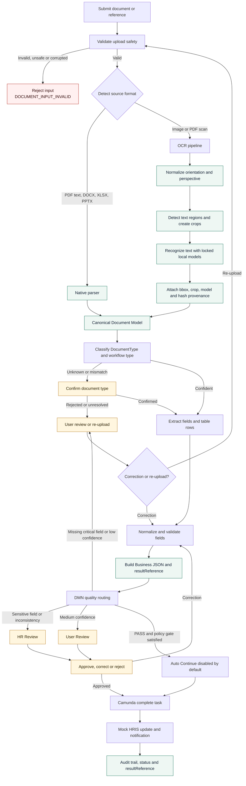

# HCNS Automation Agent

[](https://github.com/tandung060604-prog/hcns-automation-agent/actions/workflows/ci.yml)


> Nền tảng Intelligent Document Processing (IDP) cho tài liệu hành chính nhân sự
> tiếng Việt, kết hợp native parsing, OCR có provenance, human review và Camunda
> orchestration.

## MVP Template-first (Phase 1)

MVP mặc định hiện dùng **closed-set document processing** để giảm biến số và tăng khả
năng kiểm chứng. Mỗi nghiệp vụ chỉ được mở khi đã có template, schema, parser,
validator và regression test riêng. Pipeline generic trước đây vẫn được giữ để tương
thích, nhưng không tự ép tài liệu lạ vào một loại đã biết.

### Cập nhật mới nhất: các mẫu hành chính nhân sự chuẩn

Luồng mặc định hiện tập trung vào biểu mẫu chuẩn do doanh nghiệp cung cấp: nhân viên
tải mẫu, điền thông tin và gửi lại; hệ thống nhận diện đúng phiên bản template rồi
trích xuất theo schema, parser và validator tương ứng. Cách tiếp cận này không xóa
pipeline IDP/OCR cũ, mà đặt nó thành luồng tương thích riêng trong thời gian MVP
Template-first được hoàn thiện.

Hai loại biểu mẫu DOCX đang được hỗ trợ:

| Biểu mẫu HCNS | Template | Document type | Định dạng | Cách đọc |
|---|---|---|---|---|
| Đơn xin nghỉ phép | `leave-request-v1` | `LEAVE_REQUEST` | DOCX | Native OOXML |
| Đơn xin tăng ca | `overtime-request-v1` | `OVERTIME_REQUEST` | DOCX | Native OOXML |

> Bộ regression hiện có **14 hồ sơ synthetic** gồm 7 đơn nghỉ phép và 7 đơn tăng
> ca. Đây là 14 file dữ liệu thuộc 2 loại biểu mẫu, không phải 14 loại đơn khác nhau.

Kết quả kiểm chứng Phase 1:

| Hạng mục | Kết quả |
|---|---:|
| Nhận diện đúng template | 14/14 |
| Required-field exact match | 126/126 |
| JSON Schema error | 0 |
| Test Python toàn repository tại checkpoint TF-P1-003 | 219 passed |
| Test web dashboard | 8 passed |

Phạm vi dữ liệu, cách tính metric và các field required/optional được ghi tại
[báo cáo Template-first Phase 1](docs/TEMPLATE_FIRST_PHASE1_REPORT.md).

### Thử một file mới trên dashboard

Khởi động OCR Lab theo hướng dẫn bên dưới, sau đó mở
[`http://localhost:3000`](http://localhost:3000). Chế độ **Mẫu chuẩn** là chế độ mặc
định:

1. Chọn file DOCX được điền từ mẫu nghỉ phép hoặc tăng ca đang hỗ trợ.
2. Nhấn **Trích xuất theo mẫu chuẩn**.
3. Kiểm tra loại tài liệu, template/version, confidence và quality action.
4. Xem từng field, `missingFields`, `validationErrors` hoặc full JSON.
5. Xóa phiên local khi không còn cần kết quả.

Dashboard dùng `GET /api/templates` để hiển thị registry và
`POST /api/documents/process` để xử lý upload. Luồng **OCR/IDP cũ** vẫn có trên giao
diện dưới dạng một chế độ riêng.

Khởi động API local:

```powershell
$env:PYTHONPATH = "src"
.\.venv\Scripts\python.exe apps\ocr_lab\api\serve_dashboard_api.py `
  --data-root "C:\Camunda\private-data\paddleocr-hr-baseline"
```

Liệt kê template và xử lý một file:

```powershell
curl.exe http://127.0.0.1:8765/api/templates
curl.exe -F "file=@C:\path\to\request.docx" `
  http://127.0.0.1:8765/api/documents/process
```

Response rút gọn:

```json
{
  "status": "SUCCESS",
  "documentType": "LEAVE_REQUEST",
  "templateId": "leave-request-v1",
  "data": {
    "employeeName": "...",
    "startDate": "2026-06-01",
    "missingFields": [],
    "validationErrors": [],
    "recommendedAction": "AUTO_CONTINUE"
  },
  "quality": {
    "recommendedAction": "AUTO_CONTINUE"
  }
}
```

Field không xuất hiện trong tài liệu luôn là `null`. Thiếu required field, mâu thuẫn
hoặc template chỉ khớp một phần sẽ trả `MANUAL_REVIEW`. Tài liệu không thuộc hai
template trả `REJECT_UNSUPPORTED`; file hỏng trả `TECHNICAL_ERROR`. Raw DOCX và full
PII không được đưa vào Camunda variables.

Kết quả được lưu trong private data root theo `documentId` và có thể xóa bằng:

```powershell
curl.exe -X DELETE "http://127.0.0.1:8765/user/session?id=<documentId>"
```

Để thêm template thứ ba: tạo parser/validator dưới `src/hcns_agent/templates/`, thêm
schema dưới `schemas/templates/`, đăng ký definition versioned trong
`templates/registry.py`, rồi bổ sung unit test và regression Ground Truth ngoài Git.

Giới hạn hiện tại: chỉ DOCX có native text; chưa hỗ trợ PDF/ảnh scan, OCR fallback,
template tự do hoặc quyết định HR tự động.

### Những năng lực cũ vẫn được giữ

Các thành phần Universal Intake, native/OCR routing, Canonical Document, OCR CCCD,
generic classifier/extractor, quality gate, Camunda BPMN/DMN và External Task worker
vẫn còn trong repository. Chúng phục vụ khả năng tương thích, benchmark và lộ trình
mở rộng; không được dùng để tự động ép một tài liệu lạ vào hai template Phase 1.

## Tóm tắt nhanh

Nền tảng local-first để đọc, chuẩn hóa và kiểm duyệt tài liệu hành chính nhân sự
tiếng Việt. Hệ thống tách rõ **native parsing**, **OCR**, **trích xuất theo loại tài
liệu**, **quality gate** và **human review**; Camunda chỉ nhận trạng thái và tham
chiếu kết quả, không nhận raw file hay PII đầy đủ.

| Nội dung | Trạng thái hiện tại |
|---|---|
| Luồng MVP mặc định | Template-first cho đơn nghỉ phép và đơn tăng ca DOCX |
| Định dạng | Ảnh/PDF scan qua OCR; PDF text, DOCX, XLSX, PPTX qua native parsing |
| Khả năng nền tảng/legacy | CCCD, CV, hợp đồng/quyết định, đơn/biểu mẫu, bằng cấp/chứng chỉ, bảng biểu HR |
| OCR CCCD | Phase 11.5 dùng ROI mặt trước, 4 recognizer và provenance theo field |
| Chất lượng | `SHADOW_REVIEW_ONLY` — chưa đủ điều kiện production hoặc tự động fallback |
| Camunda | BPMN/DMN và External Task worker ở mức shadow/dry-run; HRIS là mock adapter |
| Dữ liệu | Tài liệu thật, Ground Truth, OCR output và model weights ở local/private, không commit Git |

### Kết quả OCR cần hiểu đúng

Trên tập development 15 CCCD đã review, Phase 11.5 đạt **Field Exact Match 60,00%**,
**ASCII Exact Match 61,67%**, **CER 43,60%**, **DER 12,65%**, **Field Presence 95,83%**
và **Accepted Precision 100%**. Tuy vậy, `fullName` ASCII Exact Match mới 73,33% và
địa chỉ mới 3,33%; vì thế mọi field không đủ bằng chứng vẫn là `needs_review`.
Protected replay Phase 11.6 không làm giảm baseline, nhưng held-out v1 mới có 9 tài
liệu không trùng lặp, chưa đạt cổng tối thiểu 15 tài liệu và vẫn là
`SHADOW_REVIEW_ONLY`.

### Chạy OCR Lab trên máy local

```powershell
git clone https://github.com/tandung060604-prog/hcns-automation-agent.git
cd hcns-automation-agent
python -m pip install -e ".[dev]"
Set-Location apps\ocr_lab\web
npm ci
Set-Location ..\..\..
.\apps\ocr_lab\api\start_dashboard.ps1 `
  -DataRoot "C:\Camunda\private-data\paddleocr-hr-baseline" `
  -HeldoutRoot "C:\Camunda\private-data\paddleocr-hr-heldout-v1"
```

Mở `http://localhost:3000`. API chỉ bind loopback tại `http://127.0.0.1:8765`; xem
hướng dẫn đầy đủ ở [OCR Lab](apps/ocr_lab/README.md).

Nền tảng xử lý tài liệu hành chính nhân sự tiếng Việt theo hướng **Intelligent
Document Processing (IDP)**, kết hợp quy trình kiểm duyệt của con người và khả
năng điều phối bằng Camunda.

> IDP đọc và chuẩn hóa tài liệu. Agent phân tích và đề xuất. Camunda điều phối
> quy trình. Con người phê duyệt các quyết định quan trọng.

Dự án được thiết kế để tiếp nhận nhiều loại hồ sơ HCNS, trích xuất dữ liệu có
bằng chứng, đánh giá chất lượng và tạo Business JSON sẵn sàng cho tầng quy trình.
CCCD chỉ là một trong nhiều loại tài liệu được hỗ trợ; mục tiêu của dự án không
giới hạn ở nhận dạng giấy tờ định danh.

## Mục tiêu

- Tiếp nhận thống nhất ảnh, PDF, DOCX, XLSX và PPTX.
- Ưu tiên trích xuất native với tài liệu có lớp văn bản; chỉ dùng OCR cho ảnh
  hoặc PDF scan.
- Chuẩn hóa kết quả về Canonical Document Model có provenance.
- Phân loại tài liệu, trích xuất trường nghiệp vụ và kiểm tra chất lượng.
- Không tự suy đoán hoặc âm thầm điền trường thiếu bằng AI.
- Chuyển trường không chắc chắn sang `needs_review` để con người đối chiếu.
- Tạo Business JSON nhỏ gọn, có version và phù hợp để Camunda định tuyến.
- Giữ tài liệu thật, OCR output và PII trong môi trường local/private.

## Luồng xử lý tổng thể

```text
Tài liệu hoặc document reference
  → kiểm tra định dạng và an toàn tệp
  → chọn native parser hoặc OCR
  → Canonical Document Model + provenance
  → phân loại DocumentType
  → trích xuất trường và bảng
  → validation + quality gate
  → PASS / REVIEW / REJECT
  → Business JSON + resultReference
  → Camunda Service Task / User Task
```

### Workflow kỹ thuật end-to-end

Sơ đồ dưới đây mô tả đường đi của một hồ sơ từ lúc tiếp nhận đến khi Camunda
định tuyến và con người hoàn tất review. Raw file, OCR text và PII đầy đủ được
giữ trong storage local/private; Camunda chỉ nhận trạng thái, ID và
`resultReference`.



Các nguyên tắc bất biến trong workflow:

- Native parsing được ưu tiên khi tài liệu đã có lớp văn bản; OCR chỉ là nhánh
  cho ảnh hoặc PDF scan.
- Mọi trường không đủ bằng chứng giữ trạng thái `needs_review`; recognizer
  fallback chưa được tự động thay thế primary.
- Camunda điều phối task, retry, timer và review; IDP không tự xây workflow
  engine cạnh tranh với Camunda.
- `AUTO_CONTINUE` chỉ có thể được mở theo promotion policy riêng; hiện mặc
  định tắt trong shadow pilot.

Ba khái niệm được tách biệt:

- `SourceFormat` quyết định cách đọc tệp.
- `DocumentType` quyết định extractor nghiệp vụ.
- `WorkflowType` là ngữ cảnh quy trình do Camunda quản lý.

Thiết kế này giúp thay OCR backend hoặc mở rộng loại tài liệu mà không đưa logic
Camunda vào domain của IDP.

## Khả năng hiện có

### Tiếp nhận đa định dạng

| Định dạng | Cách xử lý ưu tiên |
|---|---|
| PNG, JPG, JPEG | OCR engine thông qua `OcrEngine` port |
| PDF có text layer | Native PDF extraction |
| PDF scan hoặc hybrid | Native extraction kết hợp OCR khi cần |
| DOCX | Đọc paragraph và table trực tiếp |
| XLSX | Đọc sheet, cell, formula và merged range trực tiếp |
| PPTX | Trích xuất text theo slide |
| DOC, XLS legacy | Trả `CONVERSION_REQUIRED`; không tự chạy Office |

Safety gate kiểm tra MIME, magic bytes, cấu trúc OOXML ZIP, giới hạn dung lượng,
page count, archive expansion ratio, path traversal, macro, encryption và file
hỏng. Hệ thống không chỉ tin phần mở rộng của tên tệp.

### Document understanding

Kiến trúc đã có classifier và extractor độc lập, với baseline deterministic cho:

- CV;
- hợp đồng lao động;
- đơn xin nghỉ phép;
- bảng chấm công;
- phiếu và biểu mẫu hành chính nhân sự.

Các trường được trả kèm nguồn bằng chứng như trang, block, bounding box,
sheet/row/cell hoặc source reference. Document type chưa chắc chắn, extractor
chưa được phê duyệt, trường thiếu/xung đột hoặc confidence thấp đều phải qua
Human-in-the-loop.

### Quality gate và Business JSON

Quality gate đánh giá required field, confidence, validation, xung đột, trường
nhạy cảm và khả năng truy nguyên. Kết quả sử dụng ba trạng thái:

- `PASS`: đủ điều kiện kỹ thuật theo policy hiện hành;
- `REVIEW`: cần người có thẩm quyền kiểm tra;
- `REJECT`: đầu vào không hợp lệ hoặc không thể xử lý an toàn.

Business JSON `2.0.0` chứa classification candidates, field provenance,
validation issues, quality status và `resultReference`. Raw file, toàn bộ OCR
text và Canonical Document payload không được đưa vào process variables.

## Benchmark có thể kiểm chứng

Benchmark harness chạy offline và áp dụng cùng một `IdpResult` contract cho
baseline lẫn challenger. Các nhóm metric gồm:

- OCR CER, WER và exact reading order;
- classification accuracy theo loại tài liệu;
- field exact match và document completeness;
- false `PASS`/`REJECT`, review rate và sensitive false acceptance;
- latency, failure rate và promotion gate.

Ground Truth, prediction chứa field value và tài liệu nguồn phải nằm ngoài Git.
Report trong repository chỉ được chứa metric tổng hợp, không chứa raw PII.

```powershell
hcns-agent-benchmark evaluate `
  --ground-truth <authorized-ground-truth.json> `
  --predictions <baseline-predictions.json> `
  --output <aggregate-report.json>
```

Challenger chỉ được promote khi sử dụng đúng cùng dataset version/digest, cải
thiện metric mục tiêu và không làm tăng false `PASS`, sensitive false acceptance
hoặc rủi ro vận hành.

Để chẩn đoán riêng lỗi mất dấu tiếng Việt, Phase 13.1 có CLI recognition-only:

```powershell
hcns-agent-recognition audit-charset `
  --dictionary <recognition-dictionary.txt> `
  --model-identifier <model-id> `
  --output <charset-audit.json>

hcns-agent-recognition evaluate `
  --ground-truth <private-line-ground-truth.json> `
  --predictions <private-recognizer-predictions.json> `
  --output <aggregate-recognition-report.json>
```

Report chỉ chứa CER, WER, Exact Match, Diacritic Error Rate, accepted precision
và latency; raw text vẫn nằm ngoài Git.

Từ Phase 14.6, các phase recognition dùng chung metric spec
`vi-ocr-metrics/1.0.0`. Exact Match giữ nguyên hoa/thường và dấu câu; agreement
sau `casefold` được báo cáo riêng. DER dùng số ký tự reference có dấu làm mẫu
số, nên report cũ trước spec này không được so trực tiếp.

Phase 13.2 đã chạy ba recognizer trên cùng corpus synthetic 240 crop dòng:
EasyOCR `vi` đạt 82,92% Exact Match và 0% DER, được chọn cho pilot; VietOCR
`vgg_seq2seq` làm recognizer kiểm chứng. Đây chưa phải tuyên bố production:
trường chỉ được auto-accept khi hai engine đồng thuận và validation đạt, nếu
không sẽ chuyển `needs_review`.

Phase 13.3 đã tích hợp chuỗi Paddle detector → EasyOCR → VietOCR verifier và
thử trên 15 CCCD scan thật đã xác nhận Ground Truth. Chỉ 18/671 dòng đồng thuận
(2,68%), document CER hybrid 68,74%; vì vậy quyết định hiện tại là
`NOT_PROMOTED`. Kết quả này xác nhận corpus synthetic chưa đủ để thay recognizer
production và mọi dòng bất đồng vẫn phải qua human review.

Phase 14 đã mở rộng Ground Truth lên 309/309 crop của 15 tài liệu thật có quyền
sử dụng. Benchmark mù chọn VietOCR `vgg_seq2seq` (30,74% Exact Match,
18,19% CER) thay vì `vgg_transformer` (27,18% Exact Match, 14,16% CER); model
Transformer chậm hơn và không đạt promotion gate. Khi tính lại theo metric spec
1.0.0, Phase 14.5 fallback document-level đạt 40,13% Exact Match nhưng làm mất
một dòng primary vốn
đúng; vì vậy chỉ chạy `SHADOW_REVIEW_ONLY`. Pipeline vẫn
`NOT_PRODUCTION_READY`; prediction bất đồng tiếp tục đi qua human review.

Phase 14.6 đã khóa `bbox_balanced_64`, policy review-only và SHA-256 của
VietOCR seq2seq, VietOCR transformer cùng Paddle detector. Khi dataset mới sẵn
sàng, hệ thống phải tạo prediction ẩn trước, xác nhận Ground Truth từ ảnh gốc,
rồi đánh giá một lần mà không chỉnh threshold trên tập held-out.

## OCR Lab local

Source website và API local nằm tại [`apps/ocr_lab`](apps/ocr_lab/README.md).
Giao diện hỗ trợ upload, xem evidence/JSON, xác nhận Ground Truth dòng và tiếp
tục đúng crop chưa review sau khi tải lại trang. Upload được kiểm tra magic
content, format mismatch, encryption, macro, archive expansion và page limit
trước parser/OCR.

## Camunda và Human-in-the-loop

Camunda là nguồn sự thật cho BPMN, Service Task, User Task, timer, SLA, retry,
escalation, assignment, incident và process state dài hạn. IDP worker chỉ xử lý
một job hữu hạn, lưu kết quả bền vững rồi trả `resultReference` cùng routing
summary.

Repository có package tham chiếu:

- [`camunda/HR_DOCUMENT_AGENT_MVP_V2.bpmn`](camunda/HR_DOCUMENT_AGENT_MVP_V2.bpmn)
- [`camunda/HR_DOCUMENT_QUALITY_ROUTING.dmn`](camunda/HR_DOCUMENT_QUALITY_ROUTING.dmn)

Package hiện là tài sản thiết kế dành cho review/dry-run, chưa phải xác nhận đã
deploy production. **Liên kết Camunda Modeler/Operate/Tasklist sẽ được cập nhật
sau khi môi trường tích hợp được công bố.**

M4 shadow scaffolding đã khóa Camunda Platform 7.13, bổ sung External Task REST
client, handler registry cho chín topic, process-variable whitelist/schema và
mock HRIS/notification. BPMN hiện đọc native/OCR trước khi phân loại nội dung;
DMN không thể `AUTO_CONTINUE` khi có trường nhạy cảm cần review và cờ
`autoContinueEnabled` mặc định là `false`. Stage operation thật, Camunda
deployment và User Task UI vẫn chờ OCR Phase 14.6 vượt promotion gate.

Xem thêm [thiết kế workflow](docs/WORKFLOWS.md) và
[Human-in-the-loop](docs/HUMAN_IN_THE_LOOP.md). Kế hoạch/điều kiện rollout nằm
tại [Camunda MVP V2 integration plan](docs/CAMUNDA_MVP_V2_INTEGRATION_PLAN.md).

## Cài đặt

Yêu cầu Python 3.10 trở lên.

```powershell
git clone https://github.com/tandung060604-prog/hcns-automation-agent.git
cd hcns-automation-agent

python -m venv .venv
.\.venv\Scripts\Activate.ps1
python -m pip install --upgrade pip
python -m pip install -e ".[dev]"
```

PaddleOCR là dependency tùy chọn và được load lazy:

```powershell
python -m pip install -e ".[paddle]"
```

MinerU challenger:

```powershell
python -m pip install -e ".[mineru]"
```

Không cài cả hai backend nếu chỉ cần chạy unit/contract tests.

## Chạy kiểm thử

```powershell
python -m unittest discover -s tests -v
python -m ruff check src tests scripts
python -m mypy src
python scripts/check_repository.py
```

Test sử dụng fixture synthetic, không cần network, model weights, Camunda server
hoặc tài liệu thật.

## Ví dụ sử dụng pipeline

```python
from hcns_agent.adapters.mock_ocr import DeterministicMockOcrEngine
from hcns_agent.application.business_json import BusinessJsonBuilder
from hcns_agent.bootstrap import build_default_pipeline
from hcns_agent.ports.document_parser import DocumentSource

pipeline = build_default_pipeline(DeterministicMockOcrEngine())
result = pipeline.execute(
    DocumentSource(
        document_id="SYNTHETIC-001",
        filename="form.png",
        content=b"synthetic-content",
    )
)
business_json = BusinessJsonBuilder().build(result)
```

## Cấu trúc repository

```text
src/hcns_agent/
├── domain/          # Canonical model, IDP result, quality và evaluation
├── application/     # intake, understanding, benchmark và job handling
├── ports/           # parser, OCR, classifier, extractor và orchestration
└── adapters/        # native parsers, OCR, storage và benchmark JSON

schemas/             # JSON Schema cho Business JSON và benchmark
camunda/             # BPMN/DMN package tham chiếu
configs/             # policy cấu hình được version hóa
docs/                # kiến trúc, bảo mật, evaluation, workflow và ADR
tests/               # synthetic unit/contract/architecture tests
scripts/             # repository quality checks
```

## An toàn dữ liệu

- Không commit dataset, model weights, upload, Ground Truth riêng tư hoặc OCR
  output thật.
- Không gửi tài liệu HCNS lên cloud/API nếu chưa có phê duyệt rõ ràng.
- Không đặt raw file, raw OCR hoặc PII đầy đủ trong Camunda process variables.
- Không tự động hóa quyết định tuyển dụng, sa thải, lương, kỷ luật hoặc phúc lợi.
- Mọi hành động ghi HRM/BPM phải có policy, idempotency key và human approval.

Đọc [chính sách an toàn dữ liệu](docs/DATA_SECURITY.md) trước khi chạy với tài
liệu thật.

## Trạng thái dự án

Dự án hiện ưu tiên **Template-first Phase 1** cho các mẫu hành chính nhân sự chuẩn,
đồng thời giữ lại nền tảng IDP/OCR cũ:

- Registry đã có `leave-request-v1` và `overtime-request-v1`.
- Dashboard local mặc định xử lý DOCX theo template, hiển thị field, quality và JSON.
- API local có `GET /api/templates` và `POST /api/documents/process`.
- Regression Template-first đạt 14/14 classification, 126/126 required fields và
  không có JSON Schema error.
- Universal Document Intake và native/OCR routing đã có.
- Canonical model, classifier, extractor và quality gate đã có.
- Benchmark baseline/challenger và promotion gate đã có.
- Benchmark recognition-only và audit charset tiếng Việt đã có.
- EasyOCR đã được chọn cho pilot recognition; VietOCR dùng để kiểm chứng.
- Camunda 7 shadow contract, BPMN/DMN safety routing và REST worker runtime đã có.
- Benchmark trên tài liệu thật có quyền sử dụng và triển khai Camunda thực tế
  vẫn đang chờ phê duyệt.

Các baseline rule-based và fixture synthetic dùng để kiểm tra kiến trúc/contract,
không phải tuyên bố độ chính xác production. Xem
[trạng thái dự án](docs/PROJECT_STATE.md), [kiến trúc](docs/ARCHITECTURE.md),
[đánh giá](docs/EVALUATION.md) và [lộ trình](docs/ROADMAP.md).

## Giấy phép và đóng góp

Các dependency và model backend tuân theo giấy phép riêng của từng dự án. Trước
khi đưa model hoặc dataset mới vào benchmark, cần ghi rõ nguồn, version, license
và phạm vi sử dụng.

Khi đóng góp, hãy chạy đầy đủ quality gates, không đưa dữ liệu thật vào commit và
đảm bảo thay đổi public contract được cập nhật bằng test cùng tài liệu liên quan.
