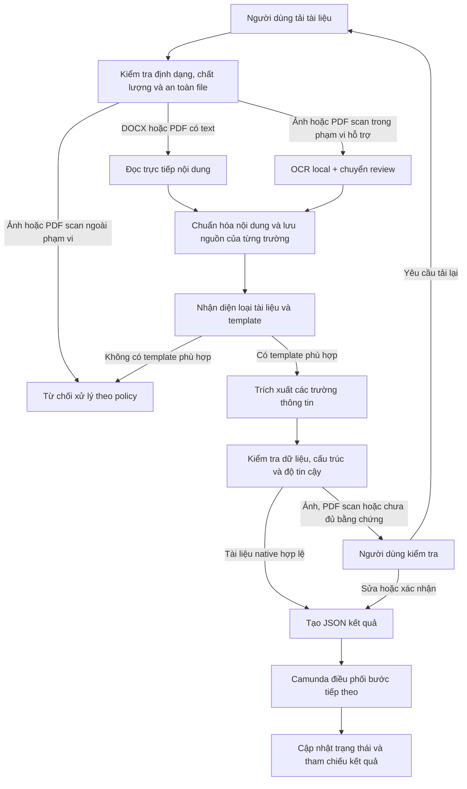

# OCR / Document AI Engineer Portfolio

Một hệ thống OCR và Document AI chạy local, tập trung vào tài liệu hành chính nhân sự dạng in: tiếp nhận file, đọc nội dung, nhận diện loại tài liệu, trích xuất trường thông tin, kiểm tra chất lượng và trả kết quả JSON để hệ thống nghiệp vụ có thể tự động điền form.

Dự án được xây dựng theo hướng có thể self-host, giữ dữ liệu trong môi trường kiểm soát và luôn chuyển các trường chưa đủ tin cậy cho người kiểm tra. Phạm vi hiện tại là tài liệu in, ảnh chụp và PDF scan; chưa xử lý chữ viết tay.

## Bài toán và luồng xử lý

Các trường có thể lưu kèm độ tin cậy, nguồn trích xuất, trang và tọa độ vùng chữ để người kiểm tra đối chiếu với tài liệu gốc. Kết quả chi tiết được lưu local; workflow chỉ nhận metadata và tham chiếu kết quả cần thiết.

## Năng lực kỹ thuật đã triển khai

| Năng lực | Cách triển khai trong dự án |
|---|---|
| Tiếp nhận tài liệu | DOCX, PDF có text, PDF scan và PNG/JPG/JPEG |
| OCR local | PaddleOCR và EasyOCR cho ảnh hoặc nội dung scan |
| Đọc tài liệu có text layer | Native parsing cho DOCX và PDF để giảm phụ thuộc OCR |
| Phân loại tài liệu | Registry theo nội dung và anchor, không phụ thuộc tên file |
| Bóc tách thông tin | Parser theo loại tài liệu, field mapping và validation |
| Chuẩn hóa output | JSON Schema, trạng thái field, confidence và provenance |
| Human-in-the-loop | Giao diện xem tài liệu, trường kết quả, evidence và chỉnh sửa |
| Workflow nghiệp vụ | BPMN/DMN, External Task, User Task, retry, correction và re-upload trên Camunda 7.13 |
| Chạy offline | Model và dữ liệu được quản lý trong môi trường local/self-hosted |

## Phạm vi tài liệu

| Nhóm | Loại tài liệu | Trạng thái |
|---|---|---|
| Đã kiểm chứng | Đơn xin nghỉ phép | Native DOCX/PDF và luồng ảnh/PDF scan có review |
| Đã kiểm chứng | Đơn xin tăng ca | Native DOCX/PDF và luồng ảnh/PDF scan có review |
| Đang thử nghiệm | CV | Kết quả chỉ dùng để người duyệt kiểm tra |
| Đang thử nghiệm | Hợp đồng thử việc | Kết quả chỉ dùng để người duyệt kiểm tra |
| Đang thử nghiệm | Chứng chỉ IELTS | Kết quả chỉ dùng để người duyệt kiểm tra |
| Đang thử nghiệm | CCCD mặt trước | Chỉ review thủ công, chưa tự động chấp nhận trường nhạy cảm |

Không tuyên bố hỗ trợ chữ viết tay, CCCD mặt sau hoặc tài liệu chưa có schema/template riêng. Với tài liệu ngoài phạm vi, hệ thống fail-closed thay vì ép tài liệu vào loại gần giống.

## Kết quả kiểm thử tiêu biểu

- Phân loại hai mẫu tài liệu chính xác **10/10** trên bộ kiểm thử native.
- Các trường bắt buộc đạt **90/90 exact match** trên bộ kiểm thử native.
- **0 lỗi JSON Schema** trong regression test được ghi nhận.
- Ảnh và PDF scan đã có OCR local nhưng vẫn chuyển qua người kiểm tra; confidence không được dùng một mình để tự động chấp nhận dữ liệu.
- Camunda local đã được kiểm tra với các luồng review, correction, re-upload, retry và idempotent replay.

Các con số trên là bằng chứng kỹ thuật của bộ dữ liệu kiểm thử hiện tại, không phải cam kết chất lượng production cho mọi loại giấy tờ.

### Benchmark theo định dạng tài liệu

| Định dạng | Classification | Required-field exact match | Schema errors | Kết quả xử lý |
|---|---:|---:|---:|---|
| DOCX | 10/10 | 90/90 (100%) | 0 | Native |
| PDF có text | 10/10 | 90/90 (100%) | 0 | Native |
| Ảnh camera | 6/6 | 31/54 (57,41%) | 0 | 6/6 chuyển review |
| PDF tạo từ ảnh scan | 6/6 | 31/54 (57,41%) | 0 | 6/6 chuyển review |

### Benchmark field extraction theo loại tài liệu

Bộ development gồm 12 tài liệu và 112 trường đối chiếu, dùng để tìm lỗi parser/OCR và chưa dùng để tuyên bố chất lượng production.

| Nhóm tài liệu | Field Exact Match | Tỷ lệ |
|---|---:|---:|
| Hợp đồng | 40/42 | 95,24% |
| CV | 30/50 | 60,00% |
| IELTS/chứng chỉ | 20/20 | 100,00% |
| **Tổng** | **90/112** | **80,36%** |

### Benchmark OCR trên 77 crop dòng tiếng Việt đã được xác nhận

Đây là benchmark so sánh recognizer trên cùng crop và cùng bộ text tham chiếu. VietOCR chỉ được dùng để benchmark đối chiếu, không phải backend mặc định của luồng xử lý template hiện tại.

| Backend/profile | Exact Match | CER | WER |
|---|---:|---:|---:|
| Paddle raw | 25,97% | 28,39% | 63,56% |
| EasyOCR profile tốt nhất | 7,79% | 41,49% | — |
| VietOCR sequence-to-sequence | **42,86%** | **15,59%** | **32,20%** |

Exact Match là so sánh nghiêm ngặt sau chuẩn hóa Unicode và khoảng trắng; CER/WER dùng khoảng cách chỉnh sửa trên ký tự/từ. Các kết quả OCR scan vẫn cần human review, không tự động chấp nhận chỉ vì confidence cao.

## Công nghệ sử dụng

- Python 3.10+
- PaddleOCR và EasyOCR
- VietOCR cho benchmark so sánh recognizer
- Native OOXML/PDF parsing
- JSON Schema và typed data models
- TypeScript cho giao diện upload và review
- Camunda 7.13 BPMN/DMN và External Task REST API
- Pytest, Ruff và mypy
- Local/private storage, không gửi tài liệu lên cloud trong luồng mặc định

## Định hướng mở rộng theo bài toán Document AI

Các hạng mục dưới đây là hướng phát triển tiếp theo khi có thêm dữ liệu và loại giấy tờ:

- Tiền xử lý ảnh scan: deskew, denoise, sửa xoay, kiểm tra chất lượng và phối cảnh.
- Phân tích layout: vùng chữ, bảng biểu, nhiều cột, chữ ký, con dấu và logo.
- Mở rộng classification và key information extraction cho công văn, giấy giới thiệu, giấy chứng nhận và hồ sơ điện tử.
- Bổ sung ngôn ngữ theo dữ liệu thực tế của dự án; hiện chưa chốt một bộ ngôn ngữ đa ngữ cố định.
- Xây dựng annotation guideline, dataset versioning, active learning và pipeline fine-tune.
- Đóng gói inference cho GPU/self-hosted deployment bằng Docker, ONNX hoặc model serving khi cần.

## Chạy thử local

Yêu cầu: Python 3.10+, Node.js/npm và một thư mục dữ liệu local do người vận hành quản lý.

~~~powershell
git clone https://github.com/tandung060604-prog/hcns-automation-agent.git
Set-Location hcns-automation-agent

python -m venv .venv
.\.venv\Scripts\Activate.ps1
python -m pip install --upgrade pip
python -m pip install -e ".[dev,easyocr]"

Set-Location apps\ocr_lab\web
npm ci
Set-Location ..\..\..

.\apps\ocr_lab\api\start_dashboard.ps1 -DataRoot "C:\path\to\private-data\ocr-documents" -PythonPath ".\.venv\Scripts\python.exe"
~~~

Mở http://localhost:3000, tải một tài liệu thuộc phạm vi hỗ trợ và xem preview, field extraction, confidence, evidence và JSON. Không đưa tài liệu thật hoặc output chứa PII vào Git.

## Kiểm thử

~~~powershell
python -m pytest -q
python -m ruff check src tests scripts
python -m mypy src
python scripts/check_repository.py
~~~

Các test mặc định sử dụng dữ liệu synthetic, không cần tài liệu thật, model weights hoặc Camunda server.

## Bảo mật và vận hành

- Dữ liệu, model weights, file upload và output OCR thật nằm ngoài Git.
- Luồng mặc định không gửi tài liệu hoặc nội dung OCR lên cloud/API bên ngoài.
- Camunda chỉ nhận các biến scalar, trạng thái và reference; không nhận raw file hoặc full OCR payload.
- Các quyết định ảnh hưởng nghiệp vụ vẫn cần human approval.
- Hệ thống hiện phù hợp cho local development, demo và môi trường thử nghiệm review-first; chưa phải triển khai production hoặc tự động phê duyệt hồ sơ.

## Tài liệu tham khảo

- [Kiến trúc hệ thống](docs/ARCHITECTURE.md)
- [Đánh giá OCR và Document AI](docs/EVALUATION.md)
- [Bảo mật dữ liệu](docs/DATA_SECURITY.md)
- [Human-in-the-loop](docs/HUMAN_IN_THE_LOOP.md)
- [Quy trình Camunda](docs/WORKFLOWS.md)

## Giấy phép và đóng góp

Dependency, OCR backend, model và dataset tuân theo license riêng của từng dự án. Khi thêm model, dataset hoặc template, cần ghi rõ nguồn, version, license và cách kiểm thử tương ứng.
