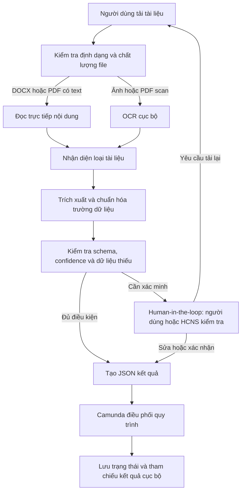

# Hệ thống OCR và tự động hóa biểu mẫu HCNS

[](https://www.python.org/)
[](https://www.paddleocr.ai/)
[](https://camunda.com/platform-7/)
[](#bảo-mật-dữ-liệu)

Đây là dự án OCR và Document AI chạy cục bộ cho biểu mẫu hành chính nhân sự. Hệ thống tiếp nhận tài liệu in ở dạng DOCX, PDF hoặc ảnh scan; nhận diện loại tài liệu, trích xuất dữ liệu có cấu trúc, chuẩn hóa thành JSON và chuyển các trường cần xác minh cho người dùng.

Dự án ưu tiên mô hình tự lưu trữ: dữ liệu, kết quả OCR và JSON được giữ trong môi trường cục bộ. Phạm vi hiện tại không bao gồm xử lý chữ viết tay.

## Luồng xử lý



## Năng lực đã triển khai

| Năng lực | Hiện trạng |
|---|---|
| Tiếp nhận tài liệu | DOCX, PDF có text, PDF scan, PNG và JPG/JPEG |
| Đọc tài liệu có text layer | Ưu tiên đọc trực tiếp DOCX/PDF để giảm lỗi OCR |
| OCR cục bộ | PaddleOCR và EasyOCR cho ảnh hoặc PDF scan |
| Phân loại tài liệu | Nhận diện theo nội dung và mốc nhận diện, không dựa vào tên file |
| Trích xuất theo biểu mẫu | Bộ phân tích riêng cho từng loại tài liệu và JSON Schema tương ứng |
| Chuẩn hóa dữ liệu | Ngày tháng, kiểu dữ liệu, trường bắt buộc và cấu trúc JSON |
| Evidence cho từng trường | Lưu trạng thái trường, confidence và nguồn trích xuất khi có |
| Human-in-the-loop | Xem tài liệu gốc, đối chiếu kết quả, xác nhận, sửa, yêu cầu tải lại hoặc từ chối |
| Điều phối nghiệp vụ | Camunda 7 với BPMN, External Task và User Task |
| Vận hành local/self-host | Dashboard, API và dữ liệu chạy trong môi trường cục bộ |

## Phạm vi tài liệu hiện tại

| Nhóm tài liệu | Trạng thái | Ghi chú |
|---|---|---|
| Đơn xin nghỉ phép | Đã kiểm chứng end-to-end | Có luồng Camunda và Human-in-the-loop trên tài liệu native |
| Đơn xin tăng ca | Đã kiểm chứng end-to-end | Có luồng Camunda và Human-in-the-loop trên tài liệu native |
| CV | Review-only | Có schema và màn hình đối chiếu; luôn cần người duyệt đối với scan |
| Hợp đồng thử việc | Review-only | Có schema và màn hình đối chiếu; chưa dùng để tự động tạo quyết định nghiệp vụ |
| Chứng chỉ IELTS | Review-only | Có schema và màn hình đối chiếu |
| CCCD mặt trước | Review-only | Chỉ trích xuất để kiểm tra nội bộ; không tự động phê duyệt |
| Hồ sơ HCNS khác | OCR cục bộ | Có thể nhận các nhóm hồ sơ phổ biến, nhưng chỉ tự động đi tiếp khi đã có schema và quy tắc kiểm tra phù hợp |

Không tuyên bố hỗ trợ chữ viết tay, CCCD mặt sau hoặc tài liệu chưa có schema nghiệp vụ.

## Luồng demo Camunda

Hai loại biểu mẫu đã được kiểm chứng có chung nguyên tắc vận hành:

1. Nhân viên tải Đơn xin nghỉ phép hoặc Đơn xin tăng ca trên Dashboard.
2. Hệ thống đọc nội dung, nhận diện biểu mẫu và tạo JSON theo schema.
3. Hồ sơ được đưa vào Camunda ở chế độ review: người nộp xác nhận hoặc chuyển HCNS.
4. HCNS đối chiếu tài liệu gốc với kết quả local, rồi chọn chấp nhận, yêu cầu tải lại hoặc từ chối.
5. Camunda lưu vết trạng thái quy trình; dữ liệu chi tiết vẫn ở local.

Chế độ demo hiện tại là **shadow mode**: mọi hồ sơ đều dừng ở bước con người kiểm tra, không tự tạo hiệu lực nghiệp vụ hoặc thay đổi dữ liệu nhân sự.

## Kết quả đánh giá hiện có

Các số liệu dưới đây là kết quả trên tập phát triển cục bộ, không phải cam kết chất lượng production. Tài liệu scan và các trường có confidence thấp vẫn cần người duyệt.

| Phạm vi đánh giá | Kết quả | Diễn giải |
|---|---:|---|
| Đơn nghỉ phép và đơn tăng ca native | 30/30 chọn đúng biểu mẫu | 15 Leave Request và 15 Overtime Request |
| Đơn nghỉ phép và đơn tăng ca native | 0/30 lỗi validation | Đủ điều kiện đi vào bước Human-in-the-loop |
| CV, hợp đồng thử việc và IELTS | 107/112 field exact match (95,54%) | Hợp đồng 42/42, CV 45/50, IELTS 20/20 |
| JSON Schema | 0 lỗi trên tập đánh giá nêu trên | Kiểm tra cấu trúc đầu ra trước khi chuyển bước |

## Cách baseline README được dùng trong runtime

README chỉ là tài liệu mô tả nên trước đây không thể dùng trực tiếp làm đầu vào
điểm số; nguồn có thể kiểm chứng là aggregate JSON đã seal. Phần nối dưới đây
đưa đúng artifact đó vào API local, không biến README thành nguồn sự thật mới.

Các số liệu `107/112` không còn chỉ là số ghi trong README. API local đọc
aggregate DATA-29 và inventory metadata qua `/benchmark/summary`, sau đó UI
hiển thị sáu card độc lập: CV, hợp đồng, IELTS, CCCD mặt trước, nghỉ phép và
tăng ca. Exact/presence chỉ lấy từ aggregate có Ground Truth sealed; inventory
chỉ dùng để đếm tài liệu local/prediction-only, không được dùng để tạo điểm.

CV, hợp đồng thử việc và IELTS đã được khóa ở template v2 với field `snake_case`.
Result v1 cũ vẫn đọc được qua compatibility projection thuần, không sửa file
private; kết quả mới phát ra v2. Mọi evidence hiện là display-only:
`decision=HOLD`, `promotionAllowed=false`, `containsRawFieldValues=false`.

Nếu API đã chạy trước khi thêm các tham số evidence, cần khởi động lại bằng
report và inventory tương ứng để dashboard đọc đúng baseline:

```powershell
.\apps\ocr_lab\api\start_dashboard.ps1 `
  -DataRoot "C:\private-data" `
  -BenchmarkReport "C:\tmp\bo10-dev-aggregate-data29-cv-residual-20260810-v3.json" `
  -BenchmarkManifest "C:\tmp\hcns-dataset-run-bo10-contract-cv-ielts-v2-20260805-inventory.json" `
  -ExternalDatasetInventory "C:\tmp\hcns-dataset-run-bo10-contract-cv-ielts-v2-20260805-inventory.json"
```

Các thước đo được dùng trong dự án gồm:

- **Classification accuracy**: tỷ lệ nhận diện đúng loại tài liệu.
- **Field exact match / field accuracy**: tỷ lệ trường trích xuất khớp hoàn toàn với dữ liệu đối chiếu.
- **Field presence / completeness**: tỷ lệ trường cần thiết có giá trị hợp lệ.
- **CER** và **WER**: lỗi theo ký tự và theo từ, dùng khi đánh giá OCR trên phần văn bản có nhãn đối chiếu.
- **JSON Schema errors**: số lỗi cấu trúc hoặc kiểu dữ liệu của đầu ra JSON.

## Công nghệ

- Python, FastAPI và Pydantic
- PaddleOCR, EasyOCR và các parser cho DOCX/PDF
- JSON Schema cho hợp đồng dữ liệu đầu ra
- React/Next.js cho giao diện local
- Camunda 7, BPMN, DMN, External Task và User Task
- Pytest và Node test cho kiểm thử hồi quy

## Chạy local

Yêu cầu: Python 3.10+, Node.js và môi trường OCR đã cài PaddleOCR. Camunda là tùy chọn nếu chỉ cần thử OCR; cần chạy thêm Camunda 7 để trình diễn workflow end-to-end.

```powershell
Set-Location .\hcns-automation-agent
.\apps\ocr_lab\api\start_dashboard.ps1 `
  -DataRoot "C:\duong-dan\private-data" `
  -PythonPath "C:\duong-dan\python.exe" `
  -TemplateOcrBackend paddle
```

Sau khi khởi động:

- Dashboard: `http://localhost:3000`
- Local API: `http://127.0.0.1:8765`
- Camunda: `http://localhost:8080/camunda`

Hướng dẫn trình diễn end-to-end nằm tại [docs/DEMO_CAMUNDA_HITL.md](docs/DEMO_CAMUNDA_HITL.md). Báo cáo minh chứng cho mentor nằm tại [docs/DEMO_CAMUNDA_HITL_REPORT.md](docs/DEMO_CAMUNDA_HITL_REPORT.md).

## Bảo mật dữ liệu

- Không upload tài liệu lên cloud trong luồng local.
- Không ghi OCR text, JSON chi tiết hoặc dữ liệu nhận dạng cá nhân vào Git.
- Camunda chỉ nhận metadata và tham chiếu kết quả cần thiết cho điều phối.
- Tài liệu scan, trường thiếu hoặc chưa đủ tin cậy được giữ ở trạng thái cần kiểm tra.

## Định hướng mở rộng

Những hạng mục dưới đây là hướng phát triển, chưa được trình bày như tính năng production:

- Deskew, denoise, rotation correction và kiểm tra chất lượng ảnh scan.
- Layout detection cho tài liệu nhiều cột, bảng biểu, chữ ký, con dấu và logo.
- Mở rộng OCR đa ngôn ngữ theo dữ liệu và phạm vi dự án.
- Annotation guideline, dataset, active learning và pipeline fine-tuning cho loại biểu mẫu mới.
- Tối ưu GPU inference và đóng gói bằng Docker, ONNX, Triton hoặc model serving.

## Tài liệu dự án

- [Trạng thái kỹ thuật hiện tại](docs/PROJECT_STATE.md)
- [Ghi chú đánh giá](docs/EVALUATION.md)
- [Hướng dẫn demo Camunda](docs/DEMO_CAMUNDA_HITL.md)
