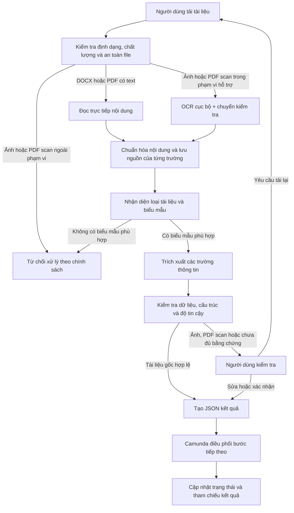

# Hồ sơ kỹ sư OCR / Document AI

## DATA-29 — Khôi phục các trường CV còn thiếu (2026-08-10)

DATA-29 là lần khôi phục bộ phân tích chỉ dành cho bộ phát triển, chạy trên năm
tài liệu CV hiện có. Thay đổi này không thêm dữ liệu, không đọc GroundTruth lúc
chạy, không mở lại DATA-24 hoặc DATA-27, không bật fallback và không đổi
schema/API. Bộ trích xuất CV gốc hiện giới hạn mục đến tiêu đề kế tiếp,
loại nhãn danh sách/nhóm khỏi `skills`, chuẩn hóa dấu và trong tiếng Việt, đồng
thời chuẩn hóa liên từ trong nội dung `desired_role`. Với CV scan, hệ thống
chỉ tự sửa một ký tự OCR khi cùng token đã xuất hiện ở mục khác của chính
tài liệu; toàn bộ scan vẫn ở `MANUAL_REVIEW`.

Bản tổng hợp riêng tư mới nhất của DATA-29: strict `107/112`, accepted
`112/112`, Contract `42/42`, CV `45/50`, IELTS `20/20`, độ đầy đủ áp dụng
(`applicable completeness`) `99/99`, phân loại `12/12`, lỗi schema `0`, chấp
nhận nhầm trường nhạy cảm `0`, hồi quy bộ phân tích `0` và scan được chuyển
kiểm tra thủ công `5/5`. Chỉ còn năm field CV ở mức accepted partial trong
`experience`. Cổng bộ phát triển DATA-20 là `PASS`, nhưng fallback vẫn tắt vì
mức cải thiện scan cố định là `3.3334pp`, thấp hơn ngưỡng cần thiết `10pp`.
Bản bàn giao chỉ gồm bản tổng hợp nằm tại:
`C:\tmp\data29-cv-residual-recovery-20260810.json`; prediction/OCR thô và
GroundTruth vẫn nằm ngoài Git.

Một hệ thống OCR và Document AI chạy cục bộ, tập trung vào tài liệu hành chính nhân sự dạng in: tiếp nhận file, đọc nội dung, nhận diện loại tài liệu, trích xuất trường thông tin, kiểm tra chất lượng và trả kết quả JSON để hệ thống nghiệp vụ có thể tự động điền biểu mẫu.

Dự án được xây dựng theo hướng tự lưu trữ, giữ dữ liệu trong môi trường kiểm soát và luôn chuyển các trường chưa đủ tin cậy cho người kiểm tra. Phạm vi hiện tại là tài liệu in, ảnh chụp và PDF scan; chưa xử lý chữ viết tay.

## Bài toán và luồng xử lý

Các trường có thể lưu kèm độ tin cậy, nguồn trích xuất, trang và tọa độ vùng chữ để người kiểm tra đối chiếu với tài liệu gốc. Kết quả chi tiết được lưu cục bộ; luồng nghiệp vụ chỉ nhận metadata và tham chiếu kết quả cần thiết.

## Năng lực kỹ thuật đã triển khai

| Năng lực | Cách triển khai trong dự án |
|---|---|
| Tiếp nhận tài liệu | DOCX, PDF có text, PDF scan và PNG/JPG/JPEG |
| OCR cục bộ | PaddleOCR và EasyOCR cho ảnh hoặc nội dung scan |
| Đọc tài liệu có text layer | Đọc trực tiếp DOCX và PDF để giảm phụ thuộc OCR |
| Phân loại tài liệu | Registry theo nội dung và mốc nhận diện, không phụ thuộc tên file |
| Bóc tách thông tin | Bộ phân tích theo loại tài liệu, ánh xạ trường và kiểm tra |
| Chuẩn hóa đầu ra | JSON Schema, trạng thái field, độ tin cậy và nguồn bằng chứng |
| Người kiểm tra trong vòng lặp | Giao diện xem tài liệu, trường kết quả, bằng chứng và chỉnh sửa |
| Luồng nghiệp vụ | BPMN/DMN, External Task, User Task, thử lại, chỉnh sửa và tải lại trên Camunda 7.13 |
| Chạy không kết nối mạng | Mô hình và dữ liệu được quản lý trong môi trường cục bộ/tự lưu trữ |

## Phạm vi tài liệu

| Nhóm | Loại tài liệu | Trạng thái |
|---|---|---|
| Đã kiểm chứng | Đơn xin nghỉ phép | DOCX/PDF gốc và luồng ảnh/PDF scan có kiểm tra |
| Đã kiểm chứng | Đơn xin tăng ca | DOCX/PDF gốc và luồng ảnh/PDF scan có kiểm tra |
| Đang thử nghiệm | CV | Kết quả chỉ dùng để người duyệt kiểm tra |
| Đang thử nghiệm | Hợp đồng thử việc | Kết quả chỉ dùng để người duyệt kiểm tra |
| Đang thử nghiệm | Chứng chỉ IELTS | Kết quả chỉ dùng để người duyệt kiểm tra |
| Đang thử nghiệm | CCCD mặt trước | Chỉ kiểm tra thủ công, chưa tự động chấp nhận trường nhạy cảm |

Không tuyên bố hỗ trợ chữ viết tay, CCCD mặt sau hoặc tài liệu chưa có schema/biểu mẫu riêng. Với tài liệu ngoài phạm vi, hệ thống từ chối an toàn thay vì ép tài liệu vào loại gần giống.

## Bằng chứng trên bộ phát triển hiện tại

DATA-17 là mốc chuẩn đã `SEALED`, bất biến và được giữ lại để đối chiếu.
DATA-29 là lần chạy lại mới nhất trên đúng 12 tài liệu hiện có; không thêm dữ
liệu, không đọc GroundTruth lúc chạy, không mở lại DATA-24 và không bật
fallback.

| Nhóm tài liệu | DATA-17 strict (nghiêm ngặt) | DATA-29 strict (nghiêm ngặt) | DATA-29 accepted (được chấp nhận) |
|---|---:|---:|---:|
| Hợp đồng | 40/42 | **42/42** | 42/42 |
| CV | 30/50 | **45/50** | 50/50 |
| IELTS/chứng chỉ | 20/20 | **20/20** | 20/20 |
| **Tổng** | **90/112** | **107/112** | **112/112** |

Các cổng DATA-29: độ đầy đủ áp dụng (`applicable completeness`) `99/99`, phân
loại `12/12`, lỗi schema `0`, chấp nhận nhầm trường nhạy cảm `0`, hồi quy bộ
phân tích `0`, và cả `5/5` tài liệu scan vẫn `MANUAL_REVIEW`. Năm field CV còn
lại là accepted partial (chấp nhận một phần) ở `experience`; fallback vẫn tắt vì
mức cải thiện scan `3,3334` điểm phần trăm chưa đạt ngưỡng `10` điểm phần trăm.

Có thể xem phần Dự đoán + GroundTruth của bộ phát triển tại
[`http://localhost:3000/workspace`](http://localhost:3000/workspace). DATA-24
chính thức và khả năng tổng quát hóa trên tập giữ lại vẫn `HOLD`; không có tài
liệu gốc, OCR, prediction hoặc GroundTruth nào được commit hay gửi lên cloud.

Các luồng công việc OCR khác (ví dụ CCCD/OCR-HO) được theo dõi riêng trong
[`docs/HANDOFF.md`](docs/HANDOFF.md) và không gộp chỉ số vào DATA-29.

## Công nghệ sử dụng

- Python 3.10+
- PaddleOCR và EasyOCR
- VietOCR cho đánh giá so sánh và tinh chỉnh theo dòng cục bộ tùy chọn
- Đọc trực tiếp OOXML/PDF
- JSON Schema và mô hình dữ liệu có kiểu
- TypeScript cho giao diện tải lên và kiểm tra
- Camunda 7.13 BPMN/DMN và External Task REST API
- Pytest, Ruff và mypy
- Lưu trữ cục bộ/riêng tư, không gửi tài liệu lên cloud trong luồng mặc định

## Định hướng mở rộng cho bài toán Document AI

Các hạng mục dưới đây là hướng phát triển tiếp theo khi có thêm dữ liệu và loại giấy tờ:

- Tiền xử lý ảnh scan: sửa nghiêng, khử nhiễu, sửa xoay, kiểm tra chất lượng và phối cảnh.
- Phân tích bố cục: vùng chữ, bảng biểu, nhiều cột, chữ ký, con dấu và logo.
- Mở rộng phân loại và trích xuất thông tin chính cho công văn, giấy giới thiệu, giấy chứng nhận và hồ sơ điện tử.
- Bổ sung ngôn ngữ theo dữ liệu thực tế của dự án; hiện chưa chốt một bộ ngôn ngữ đa ngữ cố định.
- Xây dựng hướng dẫn gán nhãn, quản lý phiên bản bộ dữ liệu, học chủ động và pipeline tinh chỉnh mô hình.
- Đóng gói suy luận cho GPU/tự lưu trữ bằng Docker, ONNX hoặc dịch vụ mô hình khi cần.

## Chạy thử cục bộ

Yêu cầu: Python 3.10+, Node.js/npm và một thư mục dữ liệu cục bộ do người vận hành quản lý.

~~~powershell
git clone https://github.com/tandung060604-prog/hcns-automation-agent.git
Set-Location hcns-automation-agent

python -m venv .venv
.\.venv\Scripts\Activate.ps1
python -m pip install --upgrade pip
python -m pip install -e ".[dev,easyocr]"

Set-Location apps\ocr_lab\web
npm ci
Set-Location ..\..\..

.\apps\ocr_lab\api\start_dashboard.ps1 -DataRoot "C:\path\to\private-data\ocr-documents" -PythonPath ".\.venv\Scripts\python.exe"
~~~

Mở http://localhost:3000, tải một tài liệu thuộc phạm vi hỗ trợ và xem bản xem trước, trường được trích xuất, độ tin cậy, bằng chứng và JSON. Tài liệu private do người dùng chỉ định được phép chạy local qua `private-data` root; raw document, OCR, prediction và PII không được commit vào Git.

## Kiểm thử

~~~powershell
python -m pytest -q
python -m ruff check src tests scripts
python -m mypy src
python scripts/check_repository.py
~~~

Các kiểm thử mặc định sử dụng dữ liệu mô phỏng. Gate/replay/localhost review cũng được phép dùng corpus private hiện có khi người dùng đã chỉ định; dữ liệu vẫn phải chạy local, ngoài Git và ngoài cloud.

## Bảo mật và vận hành

- Dữ liệu, trọng số mô hình, file tải lên và đầu ra OCR thật nằm ngoài Git.
- Corpus private hiện có được phép dùng cho gate/replay local theo chỉ định của người dùng; retention và quyền truy cập kế thừa manifest/private root tương ứng.
- Luồng mặc định không gửi tài liệu hoặc nội dung OCR lên cloud/API bên ngoài.
- Camunda chỉ nhận các biến scalar, trạng thái và tham chiếu; không nhận file gốc hoặc toàn bộ payload OCR.
- Các quyết định ảnh hưởng nghiệp vụ vẫn cần người có thẩm quyền phê duyệt.
- Hệ thống hiện phù hợp cho phát triển cục bộ, demo và môi trường thử nghiệm ưu tiên kiểm tra thủ công; chưa phải triển khai chính thức hoặc tự động phê duyệt hồ sơ.

## Tài liệu tham khảo

- [Kiến trúc hệ thống](docs/ARCHITECTURE.md)
- [Đánh giá OCR và Document AI](docs/EVALUATION.md)
- [Bảo mật dữ liệu](docs/DATA_SECURITY.md)
- [Người kiểm tra trong vòng lặp](docs/HUMAN_IN_THE_LOOP.md)
- [Quy trình Camunda](docs/WORKFLOWS.md)

## Giấy phép và đóng góp

Các thư viện phụ thuộc, bộ máy OCR, mô hình và bộ dữ liệu tuân theo giấy phép riêng của từng dự án. Khi thêm mô hình, bộ dữ liệu hoặc biểu mẫu, cần ghi rõ nguồn, phiên bản, giấy phép và cách kiểm thử tương ứng.
