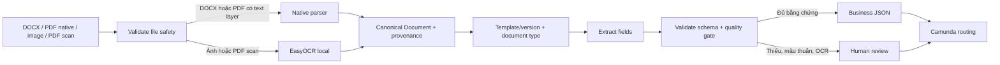

# HCNS Automation Agent

[](https://github.com/tandung060604-prog/hcns-automation-agent/actions/workflows/ci.yml)


> Nền tảng Intelligent Document Processing (IDP) cho tài liệu hành chính nhân sự
> tiếng Việt, kết hợp native parsing, OCR có provenance, quality gate, human review
> và Camunda orchestration.

## Trạng thái hiện tại

| Hạng mục | Trạng thái |
|---|---|
| Milestone | Template-first Phase 2 |
| Checkpoint mới nhất | `TF-P2-005` — 2026-08-02 |
| Workstream đang làm | `DATA-08` — independent contract review |
| Luồng mặc định | Closed-set Template-first cho 2 biểu mẫu HCNS |
| OCR mặc định | EasyOCR `vi-greedy` cho ảnh và PDF scan |
| Runtime | Local-only, API/dashboard bind loopback |
| PII | Private by default; không commit dữ liệu thật, Ground Truth hoặc model weights |
| Production deployment | Chưa nằm trong kế hoạch hiện tại |

README này là điểm vào nhanh cho sản phẩm. Số liệu chi tiết, policy và lịch sử
checkpoint nằm trong [Project State](docs/PROJECT_STATE.md), [Backlog](docs/BACKLOG.md)
và [Handoff](docs/HANDOFF.md).

## 1. MVP đang chạy: Template-first

MVP mặc định dùng **closed-set document processing**. Một nghiệp vụ chỉ được mở khi
đã có đủ template/version, schema, parser, validator và regression test. Pipeline
generic IDP/OCR cũ vẫn được giữ trong repository cho tương thích, benchmark và mở rộng,
nhưng không tự ép tài liệu lạ vào một template đã biết.

Hai template đang được mở trong MVP:

| Biểu mẫu HCNS | Template | Document type | Cách đọc ưu tiên |
|---|---|---|---|
| Đơn xin nghỉ phép | `leave-request-v1` | `LEAVE_REQUEST` | DOCX native OOXML |
| Đơn xin tăng ca | `overtime-request-v1` | `OVERTIME_REQUEST` | DOCX native OOXML |

### Cách đọc đúng ma trận định dạng

Trong README này, `DOCX` là định dạng Word; không dùng “docs” như một tên định dạng.
`PDF native` là PDF có text layer, còn `PDF scan` là PDF dạng ảnh cần OCR.

| Đầu vào | Bộ đọc | Classification | Required-field exact match | Chính sách chất lượng |
|---|---|---:|---:|---|
| DOCX | Native OOXML | 10/10 | 90/90 | Native parser; đủ bằng chứng mới được tiếp tục |
| PDF native | Native PDF parser | 10/10 | 90/90 | Không gọi OCR |
| Ảnh PNG/JPG/JPEG | EasyOCR `vi-greedy` | 10/10 | 86/90 (95,56%) | Luôn `MANUAL_REVIEW` |
| PDF scan | EasyOCR `vi-greedy` | 10/10 | 82/90 (91,11%) | Luôn `MANUAL_REVIEW` |

Các số liệu trên là **metric của bộ UAT Template-first**, không phải số loại tài liệu
hay số template. `90/90` là số lần kiểm tra required field; `10/10` là số item dùng
cho classification ở mỗi định dạng. Bộ integrity của lần chạy mới nhất có 30 file,
30 reference và 0 stale reference; report chỉ lưu aggregate metrics, không lưu raw
field values. Xem [báo cáo Template-first Phase 1](docs/TEMPLATE_FIRST_PHASE1_REPORT.md)
và [Project State](docs/PROJECT_STATE.md) để biết cách tính và nguồn dữ liệu.

### Kết quả backend OCR

UAT đầy đủ đã chọn EasyOCR `vi-greedy` làm backend mặc định cho ảnh và PDF scan.
PaddleOCR vẫn được giữ làm rollback explicit qua biến môi trường
`HCNS_TEMPLATE_OCR_BACKEND=paddle`; các parser native cho DOCX và PDF native không
bị thay đổi.

- Schema error: `0`.
- OCR routing: `20/20` `MANUAL_REVIEW`.
- False `AUTO_CONTINUE`: `0`.
- CPU p95: khoảng `23,5 giây/ảnh` và `22,6 giây/PDF scan`.
- EasyOCR model cache local: khoảng `93,99 MiB`.

Đây là kết quả chạy local trên dữ liệu synthetic/UAT được quản lý; không phải cam kết
production latency. Paddle candidate route đã được đánh giá nhưng không đạt promotion
gate và không được promote. Chi tiết nằm trong checkpoint `TF-P2-004` và `TF-P2-005`.

## 2. Luồng xử lý end-to-end

Nguyên tắc chính là **native parsing trước, OCR sau**. Raw file, OCR text và PII đầy đủ
ở local/private storage; Camunda chỉ nhận trạng thái, ID và `resultReference`.



Quality gate không tự suy đoán field thiếu. Field không có bằng chứng giữ `null`;
template không được hỗ trợ trả `REJECT_UNSUPPORTED`; file hỏng hoặc không an toàn trả
`TECHNICAL_ERROR`; thiếu required field, mâu thuẫn hoặc OCR không đủ chắc chắn trả
`MANUAL_REVIEW`.

## 3. Những gì đã hoàn tất và những gì còn mở

| Workstream | Trạng thái | Ý nghĩa hiện tại |
|---|---|---|
| `TF-P2-005` Template-first | **DONE / default** | Hai template, version governance, UAT bốn định dạng, dashboard local và preview evidence |
| `TF-P2-004` Paddle OCR fidelity | **SUPERSEDED** | Candidate Paddle không đạt gate; quyết định backend chuyển sang `TF-P2-005` |
| Backend selection | **DONE** | EasyOCR `vi-greedy` được promote; Paddle chỉ còn rollback explicit |
| `DATA-00..DATA-05` external dataset | **DONE / HOLD** | 13 tài liệu / 17 trang, 13/13 processed, 12/13 folder-derived classification match; chưa promotion |
| `DATA-06` certificate Ground Truth | **IN_PROGRESS** | Còn cần independent reviewer xác nhận và seal trước benchmark field-level |
| `DATA-07` review UI | **DONE** | UI/API loopback cho 12 case synthetic / 16 trang / 86 field; prediction-blind, chưa phải promotion approval |
| `DATA-08` contract review | **IN_PROGRESS** | 4 case hợp đồng DOCX/PDF, 14 field/case (56 field); queue hiện 0/56, chưa được `SEALED` |
| `OCR-HO-V2-001..003` CCCD held-out | **REVIEW / SHADOW_REVIEW_ONLY** | Evaluate-once đã chạy trên 14 ảnh hợp lệ; strict exact 50,00%, không đạt promotion gate |
| Camunda User Task / deployment | **PLANNED** | BPMN/DMN và worker hiện ở mức shadow/dry-run; chưa có production deployment |

External dataset được map vào **generic IDP**, không được coi là template-first v1.
Promotion đang `HOLD` vì chưa có Ground Truth độc lập và corpus 17 trang thấp hơn
benchmark minimum 30 trang. `DATA-08` chỉ review bốn case hợp đồng canonical; ảnh hợp
đồng thực tế và hai PNG derivative đang bị loại khỏi scope. CCCD/held-out cũng là
workstream riêng, không làm thay đổi MVP Template-first mặc định.

CCCD held-out đã hoàn tất evaluate-once cho 14 tài liệu hợp lệ (112 field): strict
exact match `50,00%`, ASCII exact match `50,89%`, CER `80,71%`, field presence `86,61%`
và accepted precision `95,45%`. Kết quả vẫn là `SHADOW_REVIEW_ONLY`; không có candidate
nào được promote.

## 4. Chạy dashboard local

Yêu cầu: Python 3.10+, Node.js/npm và một private data root do người vận hành quản lý.
Không đưa tài liệu thật vào repository.

```powershell
git clone https://github.com/tandung060604-prog/hcns-automation-agent.git
Set-Location hcns-automation-agent

python -m venv .venv
.\.venv\Scripts\Activate.ps1
python -m pip install --upgrade pip
python -m pip install -e ".[dev,easyocr]"

Set-Location apps\ocr_lab\web
npm ci
Set-Location ..\..\..

.\apps\ocr_lab\api\start_dashboard.ps1 `
  -DataRoot "C:\path\to\private-data\paddleocr-hr-baseline" `
  -PythonPath ".\.venv\Scripts\python.exe"
```

Mở `http://localhost:3000`, tải một DOCX/PDF/ảnh thuộc hai template, kiểm tra preview,
field, quality action và JSON, rồi xóa session local khi không còn cần. Hướng dẫn OCR
Lab chi tiết nằm tại [`apps/ocr_lab`](apps/ocr_lab/README.md).

Không bật held-out hoặc external-dataset review trong phiên demo mặc định. Hai luồng
đó chỉ dùng khi có private root và quyền review phù hợp; xem [Handoff](docs/HANDOFF.md)
trước khi chạy.

## 5. Kiểm thử và quality gates

Các test mặc định dùng fixture synthetic; không cần Camunda server, model weights hoặc
tài liệu thật.

```powershell
python -m pytest -q
python -m ruff check src tests scripts
python -m mypy src
python scripts/check_repository.py
```

Checkpoint `DATA-07` gần nhất đã ghi nhận `pytest` 249 passed cùng 16 subtests, cùng
Ruff, mypy, compileall, repository hygiene và `git diff --check` pass. Web build và
render tests cũng pass; một lint error của Dashboard được ghi nhận là WIP không liên
quan đến review scope. Kết quả chi tiết theo từng checkpoint nằm trong
[Project State](docs/PROJECT_STATE.md);
không suy ra production accuracy từ unit test hoặc fixture synthetic.

## 6. Bản đồ repository và tài liệu

```text
src/hcns_agent/          domain, application, ports và adapters
schemas/                 JSON Schema và template registry contracts
apps/ocr_lab/            dashboard + API chạy local
camunda/                 BPMN/DMN và worker contract tham chiếu
tests/                   unit, contract, architecture và UAT tests
scripts/                 validator và repository quality checks
docs/                    kiến trúc, security, evaluation, workflow và checkpoint
```

Phân biệt rõ các lớp tài liệu:

- `README.md`: định hướng sản phẩm, trạng thái hiện tại và quick start.
- `docs/`: quyết định, policy, acceptance criteria và bằng chứng kỹ thuật; đây không
  phải là tập input runtime.
- `docs/weekly-reports/`: báo cáo và screenshot/PDF minh họa; đây là evidence của
  phiên chạy, không phải thêm template hay thêm loại document được hỗ trợ.
- Private data roots: raw document, prediction, Ground Truth và model cache; không
  track trong Git.

Xem [Documentation Map](docs/README.md) để chọn đúng tài liệu:

- [Architecture](docs/ARCHITECTURE.md) — boundary domain/application/adapter.
- [Evaluation](docs/EVALUATION.md) — metric, benchmark và promotion gate.
- [Data Security](docs/DATA_SECURITY.md) — PII, storage và provenance.
- [Workflows](docs/WORKFLOWS.md) — orchestration và trạng thái review.
- [Human-in-the-loop](docs/HUMAN_IN_THE_LOOP.md) — correction và escalation.
- [Camunda MVP V2 plan](docs/CAMUNDA_MVP_V2_INTEGRATION_PLAN.md) — kế hoạch tích hợp.

## 7. An toàn dữ liệu và giới hạn

- Không commit dataset, raw upload, OCR output thật, Ground Truth riêng tư, model
  weights hoặc secret.
- Không gửi tài liệu HCNS lên cloud/API nếu chưa có phê duyệt rõ ràng.
- Không đưa raw file, raw OCR hoặc full PII vào Camunda process variables.
- Không tự động hóa quyết định tuyển dụng, sa thải, lương, kỷ luật hoặc phúc lợi.
- Mọi action ghi HRM/BPM cần policy, idempotency key và human approval.
- `AUTO_CONTINUE` hiện không mở cho nguồn OCR; human review là policy mặc định.
- Runtime hiện local-only; Railway production-readiness và deployment side effect
  không nằm trong kế hoạch hiện tại.

Đọc [Data Security](docs/DATA_SECURITY.md) trước khi chạy với dữ liệu thật. Các số liệu
trong README được ghi theo report aggregate và checkpoint đã lưu; raw PII không thuộc
phạm vi repository.

## Giấy phép và đóng góp

Dependency, OCR backend và model tuân theo license riêng của từng dự án. Khi thêm model,
dataset hoặc template, cần ghi rõ nguồn, version, license, schema/parser pairing và
promotion gate tương ứng. Trước khi tạo commit, chạy các quality gates ở trên và kiểm tra
không có dữ liệu thật trong diff.
