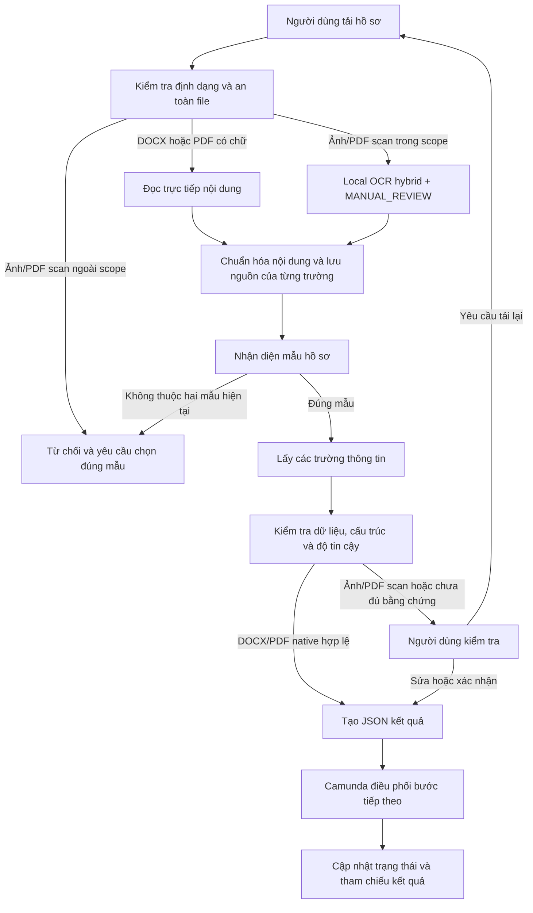

# HCNS Automation Agent

[](https://github.com/tandung060604-prog/hcns-automation-agent/actions/workflows/ci.yml)


> Hệ thống đọc và xử lý hồ sơ hành chính nhân sự bằng AI, ưu tiên giữ dữ liệu trên
> máy nội bộ, kiểm tra kết quả trước khi chuyển cho người duyệt và quy trình nghiệp vụ.

Tính đến **06/08/2026**, luồng hai biểu mẫu HCNS đã chạy qua Template-first và
Camunda 7.13 local. M4 đã hoàn tất dry-run 10/10; M5 đang `PARKED` ngoài
workstream DATA-17/18 và chưa có production side effect. DATA-17 đã bổ sung
benchmark development-only cho CV, Contract và IELTS/chứng chỉ trên 12 tài liệu
với 112 field GroundTruth đã khóa.

### Cập nhật 06/08/2026 — DATA-18 đến DATA-21

- DATA-18 khôi phục section CV scan theo geometry/column; DATA-19 khóa semantic
  Contract theo ranh giới Bên A/Bên B; DATA-20 thêm completeness, safety và
  regression gates. Schema/API không đổi và scan vẫn luôn `MANUAL_REVIEW`.
- Development aggregate vẫn `90/112` strict; Contract `40/42`, CV `30/50`,
  IELTS/chứng chỉ `20/20`. Accepted text và semantic match chỉ là metric bổ sung,
  không thay thế strict EM.
- DATA-21 đã thêm runner benchmark PaddleOCR-VL local với model pin
  `PaddleOCR-VL-1.6` (runtime registry `PaddleOCR-VL-1.6-0.9B`), model/runtime
  hash, latency/memory/failure report và raw artifact private ngoài Git.
- Rerun được duyệt bằng CPU window 600 giây; GPU chưa dùng được vì Paddle wheel
  hiện tại CPU-only. Native worker thoát mã `1` sau khi nạp weight, nên DATA-21
  giữ `HOLD`, quality metrics chưa có, fallback/promotion vẫn tắt.
- Không mở lại evaluate-once cũ, không thay GroundTruth, không upload tài liệu/OCR
  lên cloud. DATA-22 vẫn `BLOCKED` cho tới khi có corpus mới kèm quyền sử dụng,
  retention và lineage.

## Sản phẩm này làm gì?

HCNS Automation Agent nhận một hồ sơ như đơn nghỉ phép, đơn tăng ca, CV, hợp đồng
hoặc giấy tờ nhân sự; sau đó:

1. kiểm tra file có đúng định dạng và an toàn hay không;
2. đọc trực tiếp nội dung nếu file đã có chữ, hoặc dùng OCR nếu là ảnh/PDF scan;
3. nhận diện loại hồ sơ và lấy ra các trường cần thiết;
4. kiểm tra dữ liệu có đủ, đúng mẫu và có bằng chứng hay không;
5. tự chuyển kết quả đủ tin cậy sang bước tiếp theo, hoặc đưa trường chưa chắc chắn
   cho người dùng kiểm tra;
6. tạo JSON gọn để hệ thống quy trình Camunda có thể tiếp nhận.

Bản MVP (phiên bản nhỏ nhất đã chạy được) đang tập trung vào hai biểu mẫu chuẩn do
doanh nghiệp cung cấp:

| Biểu mẫu đang chạy | Mã kỹ thuật | Kết quả hệ thống trả về |
|---|---|---|
| Đơn xin nghỉ phép | `LEAVE_REQUEST` | Các trường thông tin, lỗi kiểm tra và hướng xử lý |
| Đơn xin tăng ca | `OVERTIME_REQUEST` | Các trường thông tin, lỗi kiểm tra và hướng xử lý |

Đây là cách tiếp cận có chủ đích: chỉ tự động xử lý những mẫu đã được khai báo,
kiểm thử và quản lý phiên bản; tài liệu lạ không bị ép vào một mẫu gần giống.

## Đã làm được gì?

### Bốn loại file đã được kiểm thử

| File người dùng đưa vào | Cách hệ thống đọc | Kết quả thử nghiệm mới nhất |
|---|---|---:|
| DOCX (Word) | Đọc trực tiếp đoạn văn/bảng trong file | Nhận diện đúng 10/10; trường bắt buộc đúng 90/90 |
| PDF có chữ | Đọc trực tiếp lớp chữ của PDF | Nhận diện đúng 10/10; trường bắt buộc đúng 90/90 |
| Ảnh PNG/JPG/JPEG | OCR local theo scope development; CV/IELTS được đọc bằng route hybrid và luôn `MANUAL_REVIEW` | DATA-17: IELTS 20/20 strict |
| PDF scan | OCR local cho CV/Contract/IELTS trong route development; native PDF có text vẫn dùng parser | DATA-17: CV scan review-only |

Các kết quả Template-first là kiểm thử chấp nhận tại máy local trên bộ dữ liệu của hai
biểu mẫu. DATA-17 là một development aggregate độc lập, không phải evaluate-once và
không phải tuyên bố production quality. Toàn bộ lần chạy DATA-17 có 0 lỗi JSON Schema;
5/5 tài liệu ảnh/PDF scan được giữ `MANUAL_REVIEW`.

### Những phần sản phẩm đã chạy thật

| Phần sản phẩm | Kết quả hiện tại |
|---|---|
| Giao diện local trên máy | Có thể tải file, xem bản xem trước cạnh kết quả, xem từng trường và JSON |
| Nhận diện mẫu | Nhận diện hai phiên bản đơn nghỉ phép/tăng ca đã đăng ký |
| Đọc nhiều định dạng | DOCX/PDF có chữ native; DATA-17 dùng OCR hybrid local cho CV scan và IELTS |
| Kiểm tra chất lượng | Thiếu trường thông tin, sai mẫu, mâu thuẫn hoặc OCR chưa chắc chắn đều cần người kiểm tra |
| Lưu trữ | File gốc, thông tin cá nhân, kết quả OCR và file mô hình nằm ngoài Git, trong vùng local/private |
| Kết nối quy trình | BPMN/DMN, External Task worker, User Task, correction/re-upload và audit đã smoke trên Camunda 7.13 local; M5 pilot còn chờ chốt gate |

## Tiến độ hiện tại

| Hạng mục dễ hiểu | Đã làm được | Trạng thái |
|---|---|---|
| MVP hai biểu mẫu HCNS | Đã có mẫu chuẩn, bộ trường, bộ đọc, kiểm tra và dashboard local | **Đang dùng làm luồng mặc định** |
| Chọn công cụ OCR | Template-first dùng EasyOCR `vi-greedy`; DATA-17 dùng hybrid EasyOCR `vi+en`/PaddleOCR theo family | **Hoàn tất, review-only** |
| DATA-17 CV/Contract/IELTS | 12 tài liệu / 112 field; strict 90/112 (80,36%), accepted text 104/112 (92,86%) | **Development HOLD; chưa promote** |
| Màn hình người duyệt dữ liệu | Đã có màn hình local để mở nguồn và xác nhận từng trường, không hiển thị dự đoán OCR | **Hoàn tất** |
| Rà soát hợp đồng | Contract đạt 40/42 strict; field còn lệch được hiển thị kèm evidence trên DATA-13 | **Review thủ công** |
| OCR CCCD | Đã đánh giá một lần trên 14 ảnh hợp lệ; độ khớp trường 50%, chưa đủ an toàn để tự động dùng | **Chỉ kiểm tra thủ công, chưa dùng trong môi trường thật** |
| Điều phối quy trình nhân sự | M4 closed-set shadow đã pass 10/10 scenario; M5 có runbook authorization cho pilot local/isolated | **M5-CAM-001 READY** |

### Trạng thái Camunda M5

- Closed set đúng sáu loại: `LEAVE_REQUEST`, `OVERTIME_REQUEST`, `CV`, `CERTIFICATE`, `EMPLOYMENT_CONTRACT`, `IDENTITY_DOCUMENT` (CCCD mặt trước).
- Template mới: `probation-contract-v1`, `cv-v1`, `ielts-certificate-v1`, `vietnam-citizen-id-front-v1`; tất cả review-first và fail-closed.
- Timesheet đã gỡ khỏi code, schema, API, dashboard và active tests; artifact private cũ chỉ giữ ngoài manifest active.
- M4 dry-run 10/10 và test Camunda 37/37 là bằng chứng kỹ thuật lịch sử; chưa có cohort thật, auto-decision hoặc HRIS write.
- Safety giữ `autoContinueEnabled=false`, raw-value exposure 0, side effect thật 0, duplicate result 0; HRIS/notification chỉ `SIMULATED`.
- Chạy shadow leave/overtime ngay sau khi owner chốt cohort/retention/rollback. Bốn family mới chỉ mở sau gate >=15 tài liệu (CCCD front hiện 14).

Runbook: [docs/CAMUNDA_M5_SHADOW_PILOT_RUNBOOK.md](docs/CAMUNDA_M5_SHADOW_PILOT_RUNBOOK.md).

### DATA-17 — OCR hybrid development comparison

DATA-17 dùng 12 tài liệu thuộc ba family Contract, CV và IELTS/chứng chỉ với
GroundTruth chính thức đã khóa (112 field). Kết quả development-only hiện tại:

| Family | Strict exact | Accepted text |
|---|---:|---:|
| Contract | 40/42 (95,24%) | 40/42 (95,24%) |
| CV | 30/50 (60%) | 44/50 (88%) |
| IELTS/chứng chỉ | 20/20 (100%) | 20/20 (100%) |
| **Tổng** | **90/112 (80,36%)** | **104/112 (92,86%)** |

OCR chạy hoàn toàn local: EasyOCR `vi+en` cho CV scan và PaddleOCR local cho
IELTS layout/pattern. Tất cả ảnh/PDF scan đều có `recommendedAction=MANUAL_REVIEW`;
không có `UNSUPPORTED_NO_OCR` hoặc false auto-continue. Report/marker nằm trong
private root và ghi `evaluateOnceArtifactTouched=false`; evaluate-once cũ không
bị mở lại.

### Cách hiểu các con số

- **Nhận diện đúng 10/10**: trong 10 file kiểm thử, hệ thống nhận đúng loại mẫu.
- **Trường bắt buộc đúng 90/90**: 90 lần kiểm tra trường thông tin đều khớp dữ liệu chuẩn.
- **12 tài liệu/112 field**: split DATA-17 đã khóa GroundTruth để so sánh development-only;
  chưa đủ điều kiện để promote sang production.
- **50% trên CCCD**: kết quả hiện tại chỉ dùng để tìm lỗi và cho người duyệt xem lại,
  không phải cam kết hệ thống tự đọc CCCD chính xác.

## Kỹ thuật được sử dụng

| Kỹ thuật | Dùng để làm gì trong sản phẩm |
|---|---|
| Python 3.10+ | Xây luồng xử lý file, đọc tài liệu, kiểm tra dữ liệu và dịch vụ local |
| TypeScript web dashboard | Giao diện tải file, xem bản xem trước và kiểm tra kết quả |
| Native parsing | Đọc trực tiếp nội dung DOCX/PDF có chữ, nên nhanh và ít sai hơn OCR |
| PaddleOCR PP-OCRv5 | Detector/recognizer local cho IELTS trong DATA-17; mọi kết quả scan vẫn `MANUAL_REVIEW` |
| EasyOCR `vi+en` | Recognizer local cho CV scan trong DATA-17; không tự thay thế review decision |
| VietOCR | Công cụ từng dùng trong luồng OCR cũ/CCCD; hiện giữ ở legacy và benchmark, không phải mặc định của MVP |
| JSON Schema | Kiểm tra JSON (dữ liệu dạng máy đọc được) có đủ trường và đúng kiểu dữ liệu |
| Provenance | Lưu dấu vết trường thông tin lấy từ trang, vùng ảnh hoặc nguồn nào để người duyệt đối chiếu |
| Human-in-the-loop | Đưa trường thiếu hoặc chưa chắc chắn cho con người xác nhận |
| Camunda 7.13 | Điều phối các bước xử lý, phê duyệt, thử lại và trạng thái quy trình |
| Pytest, Ruff, mypy | Kiểm tra hành vi, chất lượng code và kiểu dữ liệu |

### Một số từ khóa cần hiểu

- **IDP**: viết tắt của Intelligent Document Processing, tức là tự động đọc, hiểu và kiểm tra tài liệu.
- **Native parsing**: đọc trực tiếp chữ trong file Word/PDF, không cần nhận dạng hình ảnh.
- **OCR**: nhận dạng chữ từ ảnh hoặc PDF scan.
- **Provenance**: thông tin cho biết một giá trị được lấy từ đâu để có thể kiểm tra lại.
- **Human review**: người dùng xác nhận kết quả trước khi hệ thống dùng tiếp.
- **Quality gate**: bộ điều kiện quyết định kết quả được đi tiếp, cần người kiểm tra hay bị từ chối.
- **Camunda**: công cụ điều phối quy trình; nó không tự đọc file thay cho pipeline IDP.
- **Ground Truth**: dữ liệu chuẩn do người có trách nhiệm xác nhận, dùng để chấm kết quả thử nghiệm.
- **Synthetic**: dữ liệu giả lập dùng để kiểm thử, không phải hồ sơ thật của nhân viên.
- **Local-only/private**: dữ liệu thật chỉ chạy trên máy hoặc vùng lưu trữ được cấp quyền,
  không tự gửi lên cloud và không commit vào Git.

## Luồng xử lý thực tế



Hệ thống không tự đoán trường bị thiếu. Với DOCX/PDF có chữ và dữ liệu hợp lệ, kết quả
có thể đi tiếp theo quy định của mẫu. Với ảnh/PDF scan, kết quả hiện luôn cần người kiểm tra.
Tài liệu không thuộc hai mẫu hiện tại bị từ chối thay vì bị đoán sang mẫu gần nhất.

## Vì sao luồng MVP dùng EasyOCR thay VietOCR?

Đây là quyết định theo phạm vi, dữ liệu và kết quả kiểm thử; không có nghĩa VietOCR bị
xóa khỏi toàn bộ dự án.

- **VietOCR thuộc luồng cũ/CCCD**: trước đây VietOCR được dùng làm bộ nhận dạng hoặc
  bộ kiểm chứng trong pipeline OCR tổng quát. Luồng đó vẫn được giữ để benchmark và
  review thủ công, nhưng các kết quả trước đây chưa đạt mức để tự động dùng trong môi
  trường thật.
- **EasyOCR được chọn riêng cho MVP hai biểu mẫu**: sau khi thử trên đúng bộ DOCX,
  PDF native, ảnh và PDF scan của hai mẫu, EasyOCR `vi-greedy` đạt 86/90 trên ảnh và
  82/90 trên PDF scan. Cả bốn định dạng đều nhận diện đúng 10/10; JSON Schema có 0 lỗi;
  20/20 trường hợp OCR đều chuyển cho người kiểm tra và không có OCR sai nào tự động
  đi tiếp.
- **VietOCR chưa có kết quả được promote trong cùng route Template-first**: phép thử
  VietOCR full-page trước đó làm metric giảm nên không đưa vào runtime Template-first.
  Vì vậy chúng ta không thể tuyên bố VietOCR tốt hơn hoặc kém hơn EasyOCR một cách
  tuyệt đối; chỉ có thể nói EasyOCR là lựa chọn có bằng chứng phù hợp nhất cho MVP hiện tại.
- **Quyết định có thể mở lại**: nếu sau này có bộ dữ liệu, phiên bản model và phép thử
  cùng điều kiện chứng minh VietOCR tốt hơn mà vẫn giữ được quality gate, chúng ta có thể
  đánh giá lại. Hiện tại VietOCR không bị xóa, chỉ không phải backend mặc định.

Chi tiết về các lần thử và promotion gate nằm trong [Evaluation](docs/EVALUATION.md) và
[Project State](docs/PROJECT_STATE.md).

## Chạy thử trên máy local

Yêu cầu: Python 3.10+, Node.js/npm và một thư mục dữ liệu riêng do người vận hành quản lý.

```powershell
git clone https://github.com/tandung060604-prog/hcns-automation-agent.git
Set-Location hcns-automation-agent

python -m venv .venv
.\.venv\Scripts\Activate.ps1
python -m pip install --upgrade pip
python -m pip install -e ".[dev,easyocr]"

Set-Location apps\ocr_lab\web
npm ci
Set-Location ..\..\..

.\apps\ocr_lab\api\start_dashboard.ps1 `
  -DataRoot "C:\path\to\private-data\paddleocr-hr-baseline" `
  -PythonPath ".\.venv\Scripts\python.exe"
```

Mở `http://localhost:3000`, tải một DOCX/PDF/PNG/JPG thuộc hai biểu mẫu, xem bản xem trước,
các trường và JSON. Xóa phiên local khi không còn cần kết quả. Hướng dẫn chi tiết nằm tại
[`apps/ocr_lab`](apps/ocr_lab/README.md).

### Profile localhost mặc định (LOCAL-SCOPE-001)

Localhost dùng profile `mentor-safe`: chỉ giữ luồng upload đang active và
Template-first sessions (DOCX/PDF native cho HCNS; OCR ảnh/PDF scan chỉ cho
CCCD/chứng chỉ). Các panel `held-out`, Ground Truth queue, Shadow UAT, DATA-08,
DATA-12 và DATA-13 không hiển thị mặc định để tránh trộn dữ liệu lịch sử vào
luồng demo. Việc này chỉ là lọc giao diện; private artifact, Ground Truth và
endpoint loopback không bị xóa.

Các cờ `VITE_SHOW_HELDOUT`, `VITE_SHOW_GROUND_TRUTH_REVIEW`,
`VITE_SHOW_EXTERNAL_DATASET_REVIEW` và `VITE_SHOW_OCR_HO_SHADOW_UAT` chỉ được
bật trong phiên quan sát riêng, sau đó phải restart web dev server. Mỗi task mới
đọc `docs/PROJECT_STATE.md`, `docs/HANDOFF.md` và `docs/BACKLOG.md`, chọn một
task `READY`, cập nhật evidence rồi mới mở task kế tiếp.

Để xác nhận line ID prediction-blind cho OCR-HO-V2, bật thêm
`VITE_SHOW_OCR_HO_DIAGNOSTIC_GT=true`. Tab `Prediction-blind GT` chỉ hiển thị
ảnh nguồn, line ID và ba field cần nhập; tab `Shadow UAT` cũ chỉ dành cho audit
nội bộ baseline/candidate và không dùng để tạo Ground Truth.

### OCR-HO-V2-014 (candidate 11.10.0, shadow-only)

Vòng phát triển mới nhất chạy trên 15 tài liệu CCCD development, dùng detector
line-aware và bốn recognizer hiện có. Kết quả so với baseline 11.9.1:

| Metric | 11.9.1 | 11.10.0 |
|---|---:|---:|
| Field Exact | 60.83% | 63.33% |
| ASCII match | 62.50% | 69.17% |
| CER | 42.09% | 30.62% |
| DER | 11.46% | 16.60% |
| Field presence | 95.83% | 95.83% |

Full-name ASCII đạt 93.33% (ROI 100%); place-of-origin ASCII 40% (ROI
86.67%); place-of-residence ASCII 6.67% (ROI 66.67%). Vì DER tăng, còn exact
regression và residence ROI chưa đủ, `developmentRegressionGate` và
`heldoutReadinessGate` đều **HOLD**. Candidate không auto-accept và mọi field
vẫn `MANUAL_REVIEW`/`SHADOW_REVIEW_ONLY`.

Replay hoàn tất 212 jobs; warning telemetry: EasyOCR scalar overflow 90,
`torch.load(weights_only=False)` 2, torch nested-tensor 1, VietOCR invalid-divide
0. Ground Truth và overlay 15 tài liệu tiếp tục local-only; chỉ seal sau khi người
duyệt xác nhận đủ line ID trong localhost.

Để quan sát riêng OCR-HO trên localhost, truyền private root chứa report và
session (không commit thư mục này):

```powershell
.\apps\ocr_lab\api\start_dashboard.ps1 `
  -DataRoot "C:\path\to\private-data\paddleocr-hr-baseline" `
  -OcrHoShadowRoot "C:\path\to\private-data\paddleocr-hr-baseline-archive-YYYYMMDD" `
  -PythonPath ".\.venv\Scripts\python.exe"
```

Dùng đúng script này cho mỗi lần cập nhật localhost; không chạy trực tiếp
`serve_dashboard_api.py`. Script tự kiểm tra process đang giữ port 8765,
khởi động lại nếu shadow root sai, rồi health-check số tài liệu trước khi báo
localhost sẵn sàng.

Form Prediction-blind tự lưu bản nháp local khi chuyển tài liệu. `DRAFT SAVED`
chỉ nghĩa là dữ liệu đã giữ lại; Ground Truth chỉ hoàn tất khi đủ ba assertion
và trạng thái chuyển thành `LINES CHECKED`.

Mở `http://localhost:3000`; khi hoàn tất mapping, giữ `linesChecked=false` cho
đến khi đã kiểm tra đủ 15 tài liệu. Lexicon địa chính, engine thứ năm và
fine-tune chưa được bật.

## Kiểm thử và mức độ sẵn sàng

Các test mặc định dùng dữ liệu giả lập (synthetic), không cần tài liệu thật, file mô hình hoặc
Camunda server:

```powershell
python -m pytest -q
python -m ruff check src tests scripts
python -m mypy src
python scripts/check_repository.py
```

Checkpoint Template-first trước đó ghi nhận 249 test Python và 16 subtests, cùng Ruff,
mypy, compileall, repository hygiene và `git diff --check` pass. M4-CAM-006 bổ sung
63 targeted Camunda tests pass, dry-run 10/10, Ruff/mypy và hygiene pass. Đây là bằng
chứng cho chất lượng kỹ thuật của phiên bản hiện tại, không phải tuyên bố hệ thống đã
sẵn sàng tự động hóa mọi loại hồ sơ trong môi trường thật.

## README, tài liệu và ảnh/PDF khác nhau thế nào?

- **README.md**: giải thích sản phẩm, kết quả đã làm và cách chạy nhanh.
- **`docs/`**: tài liệu chi tiết về kiến trúc, bảo mật, cách đo chất lượng và các checkpoint.
- **`docs/weekly-reports/`**: báo cáo, screenshot và PDF dùng làm bằng chứng của các phiên
  chạy; chúng không phải template mới hay loại file runtime mới.
- **Private data root**: nơi chứa file thật, Ground Truth, kết quả OCR và file mô hình; không
  đưa vào Git.

Đọc thêm trong [Documentation Map](docs/README.md):

- [Architecture](docs/ARCHITECTURE.md) — cách chia các phần của hệ thống.
- [Evaluation](docs/EVALUATION.md) — cách đo và cách đọc kết quả.
- [Data Security](docs/DATA_SECURITY.md) — cách bảo vệ PII và dữ liệu nguồn.
- [Workflows](docs/WORKFLOWS.md) — các trạng thái xử lý và review.
- [Human-in-the-loop](docs/HUMAN_IN_THE_LOOP.md) — cách con người sửa và xác nhận kết quả.
- [Project State](docs/PROJECT_STATE.md) — tiến độ và bằng chứng mới nhất.

## Giới hạn hiện tại

- MVP mới mở hai biểu mẫu nghỉ phép và tăng ca đã được quản lý phiên bản.
- Ảnh và PDF scan đã OCR được nhưng vẫn bắt buộc người kiểm tra.
- DATA-17 đã có development comparison cho CV/Contract/IELTS (90/112 strict,
  104/112 accepted); chưa dùng để tuyên bố chất lượng production.
- OCR CCCD chưa đạt mức an toàn để tự động chấp nhận.
- Camunda hiện chỉ được xác nhận ở local/isolated shadow runtime; chưa có public
  endpoint, production deployment hoặc HRIS write thật.
- Hệ thống không tự động quyết định tuyển dụng, sa thải, lương, kỷ luật hoặc phúc lợi.

## An toàn dữ liệu

- Không commit dataset, file tải lên, kết quả OCR thật, Ground Truth riêng tư, file mô hình
  hoặc secret.
- Không gửi tài liệu HCNS lên cloud/API nếu chưa có phê duyệt rõ ràng.
- Không đưa raw file, raw OCR hoặc full PII vào Camunda process variables.
- Mọi action ghi HRM/BPM cần policy, idempotency key và human approval.

Đọc [Data Security](docs/DATA_SECURITY.md) trước khi chạy với dữ liệu thật.

## Giấy phép và đóng góp

Dependency, OCR backend và model tuân theo license riêng của từng dự án. Khi thêm model,
dataset hoặc template, cần ghi rõ nguồn, version, license và cách kiểm thử tương ứng.
Trước khi tạo commit, chạy các quality gates ở trên và kiểm tra không có dữ liệu thật trong diff.

## DATA-17 OCR scope (2026-08-06)

The private development route permits local OCR for active Contract, CV and
IELTS/chứng chỉ image/PDF-scan documents. Native DOCX/PDF text continues to use
the shared parser. Scan outputs are never auto-accepted: they remain
`MANUAL_REVIEW` with field provenance/evidence. The comparison is development-only;
it does not alter the sealed GroundTruth or the historical evaluate-once artifact.
