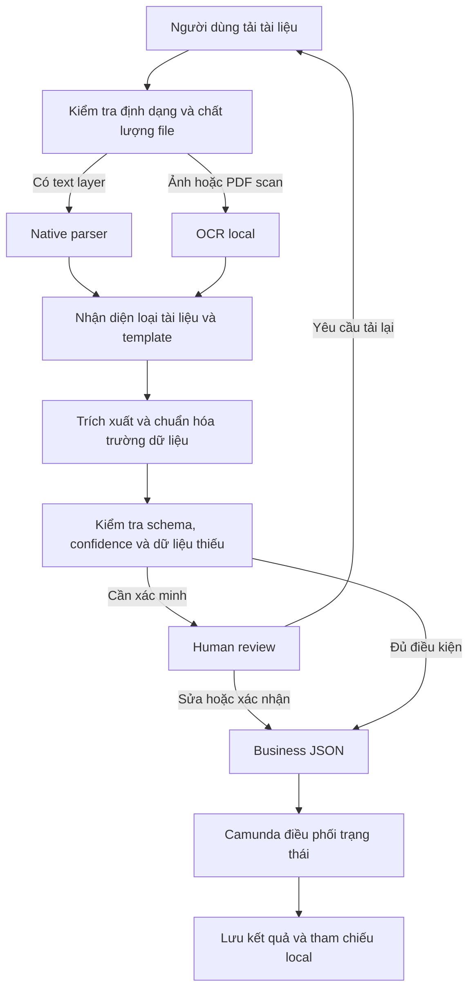

# VinHRIS — Cổng tác nghiệp tài liệu Hành chính - Nhân sự

[](https://www.python.org/)
[](https://www.paddleocr.ai/)
[](https://camunda.com/platform-7/)
[](#an-toàn-dữ-liệu)
[](https://github.com/tandung060604-prog/hcns-automation-agent/actions/workflows/ci.yml)

VinHRIS là hệ thống Document AI chạy local, hỗ trợ tiếp nhận hồ sơ HCNS, đọc nội
dung, nhận diện biểu mẫu, trích xuất dữ liệu có cấu trúc và đưa các trường chưa
chắc chắn cho người dùng kiểm tra. Camunda 7 điều phối trạng thái quy trình; file
gốc, OCR text và dữ liệu chi tiết vẫn được giữ trong môi trường nội bộ.

> **Trạng thái sản phẩm:** MVP local-first đang hoạt động ở **shadow mode**.
> Hệ thống hỗ trợ demo end-to-end và đánh giá kỹ thuật, nhưng chưa tự tạo quyết
> định nhân sự hoặc ghi dữ liệu vào HRIS production.

## Giá trị chính

- Giảm nhập liệu lặp lại từ DOCX, PDF, ảnh scan và các biểu mẫu HCNS phổ biến.
- Ưu tiên native parser cho tài liệu có text; chỉ dùng OCR khi file thực sự cần.
- Gắn trạng thái, confidence và evidence vào từng trường để dễ đối chiếu.
- Luôn giữ con người trong vòng quyết định với xác nhận, chỉnh sửa, tải lại hoặc từ chối.
- Chỉ chuyển metadata và mã tham chiếu cần thiết sang Camunda, không đẩy file gốc vào workflow.

## Trạng thái hiện tại

| Thành phần | Trạng thái | Ý nghĩa thực tế |
|---|---|---|
| Universal document intake | Hoạt động | Nhận TXT, DOCX, PDF, XLSX, PPTX, PNG và JPG/JPEG |
| Template-first extraction | Hoạt động | Chọn schema theo loại biểu mẫu và xuất Business JSON có cấu trúc |
| OCR local | Hoạt động | PaddleOCR hoặc EasyOCR cho ảnh và PDF scan |
| Dashboard VinHRIS | Hoạt động | Upload, xem bản gốc, evidence, kết quả và hàng đợi review |
| Camunda 7 + Human-in-the-loop | Hoạt động ở shadow mode | Điều phối External Task/User Task, không tạo side effect nghiệp vụ thật |
| Kết quả local/idempotency | Đã gia cố | Ghi kết quả an toàn khi nhiều request chạy đồng thời |
| API dashboard | Chỉ local | Chỉ chấp nhận loopback Host và giới hạn kích thước request |
| Chất lượng scan nhạy cảm | Review-only | Confidence thấp hoặc scan chưa chắc chắn luôn cần người duyệt |

## Cập nhật mới nhất — 12/08/2026

- **An toàn khi xử lý đồng thời:** result store dùng file lock đa tiến trình, tránh
  hai request cùng ghi đè index hoặc tạo kết quả xung đột cho một idempotency key.
- **Biên API local rõ ràng hơn:** dashboard từ chối Host không phải loopback và
  trả `413` cho Camunda JSON body rỗng hoặc vượt giới hạn 2 MB.
- **Khởi tạo OCR ổn định:** PaddleOCR và EasyOCR lazy backend chỉ được khởi tạo
  một lần khi nhiều request đầu tiên đến cùng lúc.
- **CI chạy đúng toàn bộ test:** pipeline chuyển sang `pytest`, không còn bỏ sót
  test viết theo pytest style; fixture tạm hoạt động trên cả Windows và Linux.
- **Web contract đồng bộ giao diện:** rendered tests đã bám theo metadata và nội
  dung tiếng Việt hiện tại của VinHRIS.
- **Repository gọn và an toàn hơn:** hygiene checker chỉ kiểm tra file Git đang
  theo dõi; `.worktrees/`, `output/` và `tmp/` không bị quét hoặc đưa vào commit.

Chi tiết kỹ thuật và lịch sử xác minh nằm trong
[PROJECT_STATE](docs/PROJECT_STATE.md) và [HANDOFF](docs/HANDOFF.md).

## Luồng xử lý



## Phạm vi tài liệu

| Nhóm tài liệu | Mức hỗ trợ | Chính sách hiện tại |
|---|---|---|
| Đơn xin nghỉ phép | End-to-end | Template-first, Camunda và Human-in-the-loop |
| Đơn xin tăng ca | End-to-end | Template-first, Camunda và Human-in-the-loop |
| CV | Review-only | Có schema và evidence; scan luôn cần người duyệt |
| Hợp đồng thử việc | Review-only | Không tự tạo quyết định nghiệp vụ |
| Chứng chỉ IELTS | Review-only | Trích xuất có schema và đối chiếu thủ công |
| CCCD mặt trước | Review-only | Chỉ dùng cho kiểm tra nội bộ, không tự phê duyệt |
| Hồ sơ chưa có schema | Intake/OCR | Không tự động đi tiếp cho đến khi có rule phù hợp |

Chưa tuyên bố hỗ trợ chữ viết tay, CCCD mặt sau hoặc tự động hóa quyết định
tuyển dụng, sa thải, lương, kỷ luật và phúc lợi.

## Bằng chứng chất lượng hiện có

Các số liệu dưới đây đến từ tập đánh giá local đã khóa, không phải cam kết chất
lượng production. Trạng thái promotion hiện vẫn là `HOLD` và
`promotionAllowed=false`.

| Phạm vi đánh giá | Kết quả | Diễn giải |
|---|---:|---|
| Leave + Overtime native | 30/30 chọn đúng template | 15 Leave Request và 15 Overtime Request |
| Leave + Overtime native | 0/30 lỗi validation | Đủ điều kiện chuyển đến bước Human review |
| Contract + CV + IELTS | 107/112 field exact match | Contract 42/42, CV 45/50, IELTS 20/20 |
| JSON Schema | 0 lỗi | Kiểm tra cấu trúc trước khi chuyển workflow |

Dashboard chỉ hiển thị metric từ aggregate evidence đã seal. Inventory chỉ dùng
để đếm tài liệu local, không được dùng để tự tạo điểm số. Kết quả template v1 cũ
vẫn đọc được qua compatibility projection; kết quả mới phát ra theo contract v2.

## Chạy local

### Yêu cầu

- Python 3.10+
- Node.js 22+
- PaddleOCR hoặc EasyOCR nếu cần xử lý ảnh/PDF scan
- Camunda 7.13 nếu cần demo workflow end-to-end

### Cài đặt

```powershell
python -m venv .venv
.\.venv\Scripts\Activate.ps1
python -m pip install -e ".[dev,paddle]"

Push-Location .\apps\ocr_lab\web
npm ci
Pop-Location
```

### Khởi động dashboard và API

```powershell
.\apps\ocr_lab\api\start_dashboard.ps1 `
  -DataRoot "C:\duong-dan\private-data" `
  -PythonPath ".\.venv\Scripts\python.exe" `
  -TemplateOcrBackend paddle
```

Sau khi khởi động:

- VinHRIS Dashboard: `http://localhost:3000`
- Local API: `http://127.0.0.1:8765`
- Camunda: `http://localhost:8080/camunda`

Hướng dẫn thao tác đầy đủ: [Demo Camunda + HITL](docs/DEMO_CAMUNDA_HITL.md).

## Kiểm thử

```powershell
python -m pytest -q
python -m ruff check src tests scripts `
  apps/ocr_lab/api/canonical_phase_metrics.py `
  apps/ocr_lab/api/local_server_security.py `
  apps/ocr_lab/api/phase14_review_store.py `
  apps/ocr_lab/api/upload_safety.py
python -m mypy src
python scripts/check_repository.py

Push-Location .\apps\ocr_lab\web
npm test
npm run lint
Pop-Location
```

Checkpoint gần nhất: Python `527 passed`; web rendered-contract `14/14 passed`;
Ruff, mypy, compileall và repository hygiene đều pass. Web lint còn warning kỹ
thuật nhưng không có error.

## An toàn dữ liệu

- Không upload tài liệu HCNS lên cloud trong runtime local hiện tại.
- Không commit dataset, file upload, model weights, OCR output thật, secret hoặc PII.
- API dashboard chỉ nhận loopback Host; request Camunda được giới hạn kích thước.
- Camunda chỉ nhận scalar metadata và opaque result reference, không nhận raw Business JSON.
- Result store dùng idempotency key và khóa ghi để tránh kết quả trùng/xung đột.
- Trường thiếu, confidence thấp hoặc tài liệu scan luôn được chuyển sang Human review.
- Mọi action có thể tác động HRM/BPM cần policy cho phép và human approval.

## Kiến trúc repository

```text
src/hcns_agent/        Domain, application services, ports và adapters
apps/ocr_lab/api/      Local API và cầu nối Camunda
apps/ocr_lab/web/      Giao diện VinHRIS
camunda/               BPMN, DMN và cấu hình workflow
schemas/               JSON Schema cho output contract
tests/                 Contract, integration và regression tests
scripts/               Công cụ đánh giá và repository checks
docs/                  Kiến trúc, vận hành, tiến độ và bằng chứng
```

Nguyên tắc kiến trúc: native parser trước OCR, domain không phụ thuộc Camunda SDK,
Business JSON không đi qua process variables và mọi nhánh không chắc chắn phải
đi qua Human-in-the-loop.

## Tài liệu dành cho mentor và đội phát triển

- [Tổng quan tài liệu](docs/README.md)
- [Trạng thái kỹ thuật mới nhất](docs/PROJECT_STATE.md)
- [Kiến trúc hệ thống](docs/ARCHITECTURE.md)
- [Human-in-the-loop](docs/HUMAN_IN_THE_LOOP.md)
- [Phương pháp và metric đánh giá](docs/EVALUATION.md)
- [Hướng dẫn demo Camunda](docs/DEMO_CAMUNDA_HITL.md)
- [Báo cáo demo cho mentor](docs/DEMO_CAMUNDA_HITL_REPORT.md)
- [Handoff cho phiên phát triển tiếp theo](docs/HANDOFF.md)

## Giới hạn và hướng phát triển

Các hạng mục sau chưa được xem là tính năng production:

- Chữ viết tay và CCCD mặt sau.
- Tự động đưa ra quyết định nhân sự hoặc ghi trực tiếp vào HRIS.
- Tối ưu scan phức tạp: deskew, denoise, rotation và layout nhiều cột/bảng biểu.
- Promotion OCR cho các family đang ở trạng thái `HOLD`.
- Đóng gói production bằng Docker/GPU serving và quan sát vận hành hoàn chỉnh.
