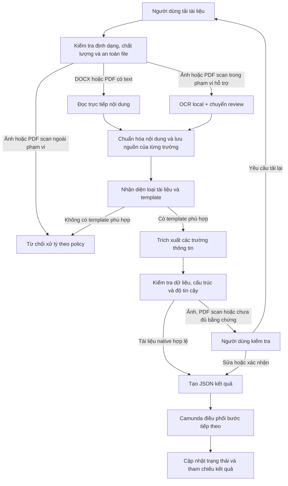

# OCR / Document AI Engineer Portfolio

## DATA-29 CV residual recovery (2026-08-10)

DATA-29 is a development-only parser recovery on the existing five CV
documents. It adds no data, does not read GroundTruth at runtime, does not
reopen DATA-24 or DATA-27, does not enable fallback, and does not change the
schema/API. Native CV extraction now bounds sections at the next heading,
removes list/category labels from skills, normalizes standalone Vietnamese
ampersands, and normalizes a title conjunction in desired-role text. Scan
skills use a one-character self-document OCR repair only when the same token
appears in another section; scans remain `MANUAL_REVIEW`.

Fresh private DATA-29 aggregate: strict `107/112`, accepted `112/112`,
Contract `42/42`, CV `45/50`, IELTS `20/20`, applicable completeness `99/99`,
classification `12/12`, schema errors `0`, sensitive false acceptance `0`,
parser regression `0`, and scan manual review `5/5`. The only remaining CV
partials are five experience fields. DATA-20 development gate is `PASS`, but
fallback remains disabled because fixed-scan improvement is `3.3334pp`, below
the required `10pp`. Aggregate-only handoff:
`C:\tmp\data29-cv-residual-recovery-20260810.json`; raw prediction/OCR and
GroundTruth remain outside Git.

Một hệ thống OCR và Document AI chạy local, tập trung vào tài liệu hành chính nhân sự dạng in: tiếp nhận file, đọc nội dung, nhận diện loại tài liệu, trích xuất trường thông tin, kiểm tra chất lượng và trả kết quả JSON để hệ thống nghiệp vụ có thể tự động điền form.

Dự án được xây dựng theo hướng có thể self-host, giữ dữ liệu trong môi trường kiểm soát và luôn chuyển các trường chưa đủ tin cậy cho người kiểm tra. Phạm vi hiện tại là tài liệu in, ảnh chụp và PDF scan; chưa xử lý chữ viết tay.

## Bài toán và luồng xử lý

Các trường có thể lưu kèm độ tin cậy, nguồn trích xuất, trang và tọa độ vùng chữ để người kiểm tra đối chiếu với tài liệu gốc. Kết quả chi tiết được lưu local; workflow chỉ nhận metadata và tham chiếu kết quả cần thiết.

## Năng lực kỹ thuật đã triển khai

| Năng lực | Cách triển khai trong dự án |
|---|---|
| Tiếp nhận tài liệu | DOCX, PDF có text, PDF scan và PNG/JPG/JPEG |
| OCR local | PaddleOCR và EasyOCR cho ảnh hoặc nội dung scan |
| Đọc tài liệu có text layer | Native parsing cho DOCX và PDF để giảm phụ thuộc OCR |
| Phân loại tài liệu | Registry theo nội dung và anchor, không phụ thuộc tên file |
| Bóc tách thông tin | Parser theo loại tài liệu, field mapping và validation |
| Chuẩn hóa output | JSON Schema, trạng thái field, confidence và provenance |
| Human-in-the-loop | Giao diện xem tài liệu, trường kết quả, evidence và chỉnh sửa |
| Workflow nghiệp vụ | BPMN/DMN, External Task, User Task, retry, correction và re-upload trên Camunda 7.13 |
| Chạy offline | Model và dữ liệu được quản lý trong môi trường local/self-hosted |

## Phạm vi tài liệu

| Nhóm | Loại tài liệu | Trạng thái |
|---|---|---|
| Đã kiểm chứng | Đơn xin nghỉ phép | Native DOCX/PDF và luồng ảnh/PDF scan có review |
| Đã kiểm chứng | Đơn xin tăng ca | Native DOCX/PDF và luồng ảnh/PDF scan có review |
| Đang thử nghiệm | CV | Kết quả chỉ dùng để người duyệt kiểm tra |
| Đang thử nghiệm | Hợp đồng thử việc | Kết quả chỉ dùng để người duyệt kiểm tra |
| Đang thử nghiệm | Chứng chỉ IELTS | Kết quả chỉ dùng để người duyệt kiểm tra |
| Đang thử nghiệm | CCCD mặt trước | Chỉ review thủ công, chưa tự động chấp nhận trường nhạy cảm |

Không tuyên bố hỗ trợ chữ viết tay, CCCD mặt sau hoặc tài liệu chưa có schema/template riêng. Với tài liệu ngoài phạm vi, hệ thống fail-closed thay vì ép tài liệu vào loại gần giống.

## Kết quả kiểm thử tiêu biểu

- Phân loại hai mẫu tài liệu chính xác **10/10** trên bộ kiểm thử native.
- Các trường bắt buộc đạt **90/90 exact match** trên bộ kiểm thử native.
- **0 lỗi JSON Schema** trong regression test được ghi nhận.
- Ảnh và PDF scan đã có OCR local nhưng vẫn chuyển qua người kiểm tra; confidence không được dùng một mình để tự động chấp nhận dữ liệu.
- Camunda local đã được kiểm tra với các luồng review, correction, re-upload, retry và idempotent replay.

Các con số trên là bằng chứng kỹ thuật của bộ dữ liệu kiểm thử hiện tại, không phải cam kết chất lượng production cho mọi loại giấy tờ.

### Benchmark theo định dạng tài liệu

| Định dạng | Classification | Required-field exact match | Schema errors | Kết quả xử lý |
|---|---:|---:|---:|---|
| DOCX | 10/10 | 90/90 (100%) | 0 | Native |
| PDF có text | 10/10 | 90/90 (100%) | 0 | Native |
| Ảnh camera | 6/6 | 31/54 (57,41%) | 0 | 6/6 chuyển review |
| PDF tạo từ ảnh scan | 6/6 | 31/54 (57,41%) | 0 | 6/6 chuyển review |

### Benchmark field extraction theo loại tài liệu

DATA-17 là baseline đã sealed và giữ nguyên. DATA-26 là development replay
riêng, dùng parser recovery và line refinement VietOCR cục bộ cho scan CV;
không sửa GroundTruth/evaluate-once cũ và không phải kết quả production.

| Nhóm tài liệu | DATA-17 strict | DATA-26 strict | DATA-26 accepted |
|---|---:|---:|---:|
| Hợp đồng | 40/42 (95,24%) | **42/42 (100%)** | 42/42 |
| CV | 30/50 (60%) | **40/50 (80%)** | 50/50 |
| IELTS/chứng chỉ | 20/20 (100%) | **20/20 (100%)** | 20/20 |
| **Tổng** | **90/112 (80,36%)** | **102/112 (91,07%)** | **112/112** |

DATA-26 gate development: applicable completeness `99/99`, classification
`12/12`, schema errors `0`, sensitive false acceptance `0`, parser regression
`0`, scan `5/5 MANUAL_REVIEW`. Fallback remains disabled: fixed scan strict
improvement is `3,33pp`, below the required `10pp` promotion threshold.

DATA-27A audit of the existing private pool is complete. After SHA-256/history
and lineage exclusion, only 1 fresh Contract, 1 fresh CV and 0 fresh IELTS
files remain, so the original independent `10/10/5` held-out split is blocked
without adding eligible data or explicitly changing the policy. DATA-27D
therefore delivers the DATA-26 development result only; held-out generalization
remains `HOLD`. All documents, OCR, predictions and GroundTruth stay outside
Git and are processed locally.

DATA-28 local-review handoff is available at
[`http://localhost:3000/workspace`](http://localhost:3000/workspace) with the
private external-dataset review flag enabled. The local Prediction + GT view
exposes all 12 development documents (Contract 3, CV 5, IELTS 4) and 112
field comparisons. Current strict exact is `102/112`; accepted text is
`112/112`; the remaining strict gap is CV accepted-partial/over-extraction in
`experience` (5), `skills` (4) and `desired_role` (1). Contract and IELTS have
no remaining strict field gap on this development replay. The five scan/image
documents remain `MANUAL_REVIEW`; DATA-24 and DATA-27 held-out are untouched.

### Benchmark OCR trên 77 crop dòng tiếng Việt đã được xác nhận

Đây là benchmark so sánh recognizer trên cùng crop và cùng bộ text tham chiếu.
VietOCR line refinement chỉ là tùy chọn chạy local cho development scan replay,
không phải backend mặc định và không tự động chuyển scan khỏi `MANUAL_REVIEW`.

| Backend/profile | Exact Match | CER | WER |
|---|---:|---:|---:|
| Paddle raw | 25,97% | 28,39% | 63,56% |
| EasyOCR profile tốt nhất | 7,79% | 41,49% | — |
| VietOCR sequence-to-sequence | **42,86%** | **15,59%** | **32,20%** |

Exact Match là so sánh nghiêm ngặt sau chuẩn hóa Unicode và khoảng trắng; CER/WER dùng khoảng cách chỉnh sửa trên ký tự/từ. Các kết quả OCR scan vẫn cần human review, không tự động chấp nhận chỉ vì confidence cao.

### Trạng thái OCR CCCD local — OCR-HO-V2 / DATA-HO-014

CCCD được đánh giá riêng trên development set gồm **15 tài liệu / 120 field**. Candidate hiện tại là **11.10.2**, so với baseline **11.9.1**; các metric CCCD không gộp với CV, Contract, IELTS hoặc DATA-17.

| Metric | Candidate development replay |
|---|---:|
| Field Exact | 63,33% |
| ASCII match | 69,17% |
| CER | 32,02% |
| DER | 16,21% (41/253) |
| Field presence | 95,83% |
| ROI fullName / origin / residence | 53,33% / 60,00% / 66,67% |

Development regression và held-out readiness đều **HOLD**. CCCD vẫn shadow-only, mọi field nhạy cảm và địa chỉ đều `MANUAL_REVIEW`; không có production promotion, automatic acceptance hoặc mở held-out mới.

Các chẩn đoán 018E/018F chỉ đọc aggregate artifact đã seal. Trong cohort mà automatic region mapping thành công, recognizer disagreement là `291/375 = 77,6%`; token mismatch là `11`, line-order mismatch là `72`. Đây là bằng chứng attribution, chưa phải căn cứ để đổi selector hoặc runtime. Ground Truth, prediction raw và artifact evaluate-once thật được giữ ngoài Git.

Chi tiết checkpoint và quyết định gate nằm trong [OCR-HO-V2 handoff](docs/HANDOFF.md) và [backlog](docs/BACKLOG.md). Next READY là review owner trước khi cân nhắc bất kỳ selector counterfactual nào.

## Công nghệ sử dụng

- Python 3.10+
- PaddleOCR và EasyOCR
- VietOCR cho benchmark và line refinement local tùy chọn
- Native OOXML/PDF parsing
- JSON Schema và typed data models
- TypeScript cho giao diện upload và review
- Camunda 7.13 BPMN/DMN và External Task REST API
- Pytest, Ruff và mypy
- Local/private storage, không gửi tài liệu lên cloud trong luồng mặc định

## Định hướng mở rộng theo bài toán Document AI

Các hạng mục dưới đây là hướng phát triển tiếp theo khi có thêm dữ liệu và loại giấy tờ:

- Tiền xử lý ảnh scan: deskew, denoise, sửa xoay, kiểm tra chất lượng và phối cảnh.
- Phân tích layout: vùng chữ, bảng biểu, nhiều cột, chữ ký, con dấu và logo.
- Mở rộng classification và key information extraction cho công văn, giấy giới thiệu, giấy chứng nhận và hồ sơ điện tử.
- Bổ sung ngôn ngữ theo dữ liệu thực tế của dự án; hiện chưa chốt một bộ ngôn ngữ đa ngữ cố định.
- Xây dựng annotation guideline, dataset versioning, active learning và pipeline fine-tune.
- Đóng gói inference cho GPU/self-hosted deployment bằng Docker, ONNX hoặc model serving khi cần.

## Chạy thử local

Yêu cầu: Python 3.10+, Node.js/npm và một thư mục dữ liệu local do người vận hành quản lý.

~~~powershell
git clone https://github.com/tandung060604-prog/hcns-automation-agent.git
Set-Location hcns-automation-agent

python -m venv .venv
.\.venv\Scripts\Activate.ps1
python -m pip install --upgrade pip
python -m pip install -e ".[dev,easyocr]"

Set-Location apps\ocr_lab\web
npm ci
Set-Location ..\..\..

.\apps\ocr_lab\api\start_dashboard.ps1 -DataRoot "C:\path\to\private-data\ocr-documents" -PythonPath ".\.venv\Scripts\python.exe"
~~~

Mở http://localhost:3000, tải một tài liệu thuộc phạm vi hỗ trợ và xem preview, field extraction, confidence, evidence và JSON. Không đưa tài liệu thật hoặc output chứa PII vào Git.

## Kiểm thử

~~~powershell
python -m pytest -q
python -m ruff check src tests scripts
python -m mypy src
python scripts/check_repository.py
~~~

Các test mặc định sử dụng dữ liệu synthetic, không cần tài liệu thật, model weights hoặc Camunda server.

## Bảo mật và vận hành

- Dữ liệu, model weights, file upload và output OCR thật nằm ngoài Git.
- Luồng mặc định không gửi tài liệu hoặc nội dung OCR lên cloud/API bên ngoài.
- Camunda chỉ nhận các biến scalar, trạng thái và reference; không nhận raw file hoặc full OCR payload.
- Các quyết định ảnh hưởng nghiệp vụ vẫn cần human approval.
- Hệ thống hiện phù hợp cho local development, demo và môi trường thử nghiệm review-first; chưa phải triển khai production hoặc tự động phê duyệt hồ sơ.

## Tài liệu tham khảo

- [Kiến trúc hệ thống](docs/ARCHITECTURE.md)
- [Đánh giá OCR và Document AI](docs/EVALUATION.md)
- [Bảo mật dữ liệu](docs/DATA_SECURITY.md)
- [Human-in-the-loop](docs/HUMAN_IN_THE_LOOP.md)
- [Quy trình Camunda](docs/WORKFLOWS.md)

## Giấy phép và đóng góp

Dependency, OCR backend, model và dataset tuân theo license riêng của từng dự án. Khi thêm model, dataset hoặc template, cần ghi rõ nguồn, version, license và cách kiểm thử tương ứng.
