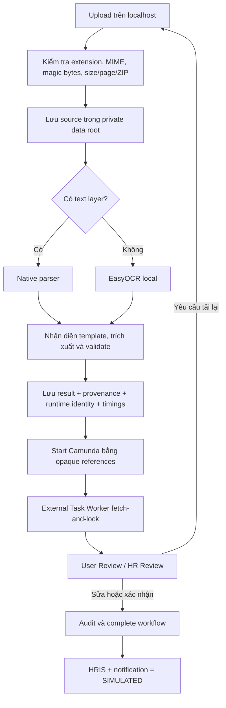
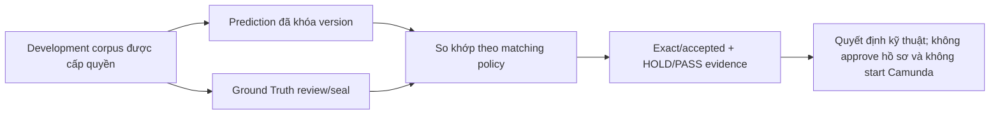

# VinHRIS — Cổng tác nghiệp tài liệu Hành chính - Nhân sự

[](https://www.python.org/)
[](https://www.jaided.ai/easyocr/)
[](https://camunda.com/platform-7/)
[](#an-toàn-dữ-liệu)
[](https://github.com/tandung060604-prog/hcns-automation-agent/actions/workflows/ci.yml)

VinHRIS là hệ thống Document AI chạy local, hỗ trợ tiếp nhận hồ sơ HCNS, đọc nội
dung, nhận diện biểu mẫu, trích xuất dữ liệu có cấu trúc và đưa các trường chưa
chắc chắn cho người dùng kiểm tra. Camunda 7 điều phối trạng thái quy trình; file
gốc, OCR text và dữ liệu chi tiết vẫn được giữ trong môi trường nội bộ.

> **Trạng thái ngày 21/08/2026:** local shadow đã có pipeline Template-first +
> EasyOCR, dashboard đối chiếu DATA-31 và replay R7. Product/HR owner đã chấp
> nhận gate này cho mục đích review/demo local; formal promotion gate trong report
> vẫn là `HOLD` (`104/109 strict`, `108/109 accepted`, `109/109 present`). Đây chưa
> phải production: chưa có đăng nhập, RBAC, notification thật hoặc HRIS side effect.

## Giá trị chính

- Giảm nhập liệu lặp lại từ DOCX, PDF, ảnh scan và các biểu mẫu HCNS phổ biến.
- Ưu tiên native parser cho tài liệu có text; chỉ dùng OCR khi file thực sự cần.
- Gắn trạng thái, confidence và evidence vào từng trường để dễ đối chiếu.
- Luôn giữ con người trong vòng quyết định với xác nhận, chỉnh sửa, tải lại hoặc từ chối.
- Chỉ chuyển metadata và mã tham chiếu cần thiết sang Camunda, không đẩy file gốc vào workflow.

## Output hiện có

Với một tài liệu hợp lệ, hệ thống tạo kết quả JSON theo schema gồm loại tài liệu,
field đã chuẩn hóa, confidence, validation, evidence/provenance và action khuyến
nghị. Output còn có template/parser/OCR version, thời gian từng stage, source/result
reference nội bộ, User Task/HR Task và review audit trong Camunda local shadow.

Hệ thống **chưa** có tài khoản User/HR/Admin, biểu mẫu HCNS điền trực tiếp trên
web, notification inbox, email/SMS, cập nhật HRIS thật hoặc quyết định nhân sự tự
động. Các phần này thuộc [kế hoạch website](Plan.md).

## Trạng thái hiện tại

| Thành phần | Trạng thái | Ý nghĩa thực tế |
|---|---|---|
| Universal document intake | Hoạt động | Nhận TXT, DOCX, PDF, XLSX, PPTX, PNG và JPG/JPEG |
| Template-first extraction | Hoạt động | CV/Hợp đồng nhận DOCX, PDF; IELTS/CCCD nhận PDF, PNG, JPG/JPEG theo manifest |
| OCR local | Hoạt động | PaddleOCR hoặc EasyOCR cho ảnh và PDF scan |
| Dashboard VinHRIS | Hoạt động local | Điều hướng product-first cho Intake, Human Review, Evidence và Camunda; diagnostic nâng cao vẫn nằm trong cùng workspace |
| Camunda 7 + Human-in-the-loop | Hoạt động ở shadow mode | Điều phối External Task/User Task, không tạo side effect nghiệp vụ thật |
| Kết quả local/idempotency | Đã gia cố | Ghi kết quả an toàn khi nhiều request chạy đồng thời |
| API dashboard | Chỉ local | Bind loopback, CORS chỉ cho localhost; chưa có authentication/RBAC |
| Chất lượng scan nhạy cảm | Review-only | Confidence thấp hoặc scan chưa chắc chắn luôn cần người duyệt |
| Website User/HR/Admin | Chưa có | Hai cột vai trò hiện chỉ là demo UI, chưa xác thực danh tính hoặc quyền |
| HRIS/notification | Mô phỏng | External handlers trả `SIMULATED`; không gửi notification thật |
| Production deploy | Chưa đóng gói | Chưa có Compose, HTTPS gateway, production database/API và backup/restore |

### Nếu người khác có link thì có dùng được không?

Không ở cấu hình hiện tại. API bind vào `127.0.0.1`, kiểm tra loopback Host và chỉ
cho frontend `http://localhost:3000`; người ở máy khác không thể dùng chỉ bằng một
URL. Không đổi host sang `0.0.0.0` hoặc mở port trực tiếp vì hệ thống chưa có
authentication/RBAC. Demo cho partner sau này phải đặt sau HTTPS và access
allowlist có thời hạn; xem [Plan.md](Plan.md).

## Cập nhật mới nhất — 21/08/2026

Review R7 đã chốt phần đối chiếu Contract/CV/IELTS trên DATA-31. Runtime hiện tại
là `Template-first + EasyOCR`, parser `structured-hr/family-layout/2.2.8` và
matching policy `2.1.0`. Corpus DATA-31 gồm 13 tài liệu (4 Contract, 5 CV, 4
IELTS), với 109 field được đo và 17 field `OUT_OF_SCOPE`; source, Ground Truth,
Prediction và report chỉ nằm trong private storage.

Các thay đổi R7 quan trọng:

- `job_title` dùng role title trước, professional title làm fallback khi role
  title không có; parser không hard-code theo từng tài liệu.
- CV native giữ đúng phần mềm khi dòng `Phần mềm` không có label riêng.
- Replay private giữ `104/109 strict`, `108/109 accepted`, `109/109 present`;
  không có schema error, parser regression hoặc sensitive false acceptance.
- Owner đã chấp nhận kết quả này cho local shadow/demo. Report vẫn giữ `HOLD` để
  không biến quyết định nghiệp vụ thành tuyên bố production quality.
- CAM-001 chưa mở lại; Camunda vẫn chỉ được dùng sau quality gate chính thức và
  một lần kiểm tra E2E riêng có human review.

Các khoảng trống production vẫn còn:

1. **Identity và authorization:** thêm login/logout, session, owner scoping và
   RBAC `USER | HR_REVIEWER | ADMIN`. Role gửi từ trình duyệt không phải bằng chứng quyền.
2. **Tách App khỏi Lab:** `/workspace` đang trộn upload nghiệp vụ, queue Camunda,
   Ground Truth, DATA-29 và diagnostic; product flow phải tách khỏi `/lab` có bảo vệ.
3. **Production composition:** launcher mới khởi động API + web, chưa khởi động
   Camunda/worker thành một stack có healthcheck, startup order và shutdown thống nhất.
4. **Resource gate:** local API dùng `ThreadingHTTPServer`, trong khi visual OCR
   chậm và tốn RAM; production cần job bất đồng bộ và worker concurrency ban đầu `1`.
5. **Product data/side effect:** chưa có database user/document/notification/audit;
   HRIS và notification thật vẫn phải giữ đóng.

- **Một parser chuẩn cho ba họ tài liệu:** upload Template-first và bộ đối chiếu
  DATA-31 cùng gọi `structured-hr/family-layout/2.2.8` cho Contract, CV và IELTS;
  test delegation báo lỗi nếu hai luồng tách thành thuật toán khác nhau.
- **Workspace dễ đọc hơn:** giao diện dùng một hệ navy/trắng với accent cyan,
  tách rõ tổng quan nền tảng, ba nhóm tài liệu, quality evidence, quy trình local
  shadow, hàng đợi review và vùng tiếp nhận; API, private storage và Camunda policy
  không thay đổi.
- **Đối chiếu file hiện tại ngay sau upload:** màn hình thống nhất hiển thị tài
  liệu nguồn ở bên trái và Prediction, Ground Truth, confidence/evidence cùng
  badge `EXACT`, `ACCEPTED`, `MISMATCH`, `MISSING` hoặc `NEEDS_REVIEW` ở bên phải.
- **Kết luận rõ ràng:** mỗi lần đối chiếu có tổng số field đúng/sai và quyết định
  `HOLD`/`PASS`. `PASS` chỉ nói về phép so khớp file hiện tại; không tự phê duyệt
  nghiệp vụ và không mở promotion.
- **Metric mở được toàn bộ tài liệu nguồn:** DATA-31 hiển thị đủ 13 tài liệu của
  replay R7, chia thành Contract `4`, CV `5`, IELTS `4`. DATA-29 vẫn được giữ như
  historical baseline và không bị ghi đè.
- **Replay R7:** DATA-31 đạt `104/109 strict`, `108/109 accepted`, `109/109
  present`; bốn accepted partial còn lại được owner chấp nhận cho local shadow,
  nhưng chưa được nâng thành promotion gate chính thức.
- **Metadata thuật toán có thể kiểm tra:** template/parser version, intake parser,
  OCR backend/version/model/device/profile, matching policy và thời gian xử lý
  được hiển thị cùng kết quả.
- **Đối chiếu đúng policy:** chi tiết từng tài liệu đọc matching policy `2.1.0`
  được pin trong report R7, nên Prediction ↔ Ground Truth tái tạo được cùng cách
  chấm DATA-31.
- **Explorer không trộn session upload:** khu vực evidence chỉ hiển thị source
  thuộc DATA-29; session upload vẫn được giữ private cho màn kết quả và Camunda.
- **Camunda cho ba họ tài liệu mới:** CV, hợp đồng thử việc và IELTS có thể đi từ
  kết quả upload vào local shadow workflow, bắt buộc Human Review và không tạo
  side effect HRIS/notification thật.
- **Hiệu năng PDF scan sau PDF-001:** 30 warm run aggregate-only trên tài liệu
  được cấp quyền cho thấy total p50/p95 là `9,378/12,532 giây`, OCR p50/p95 là
  `7,918/10,945 giây`, peak RSS p95 `1,694 GB`, không có failure. So với
  baseline PERF-001 `67,5 giây` p95, đây là cải thiện rõ rệt; scan vẫn luôn
  `MANUAL_REVIEW` và chưa phải production gate.

Các cập nhật hardening ngày 12/08/2026 vẫn được giữ nguyên:

- **An toàn khi xử lý đồng thời:** result store dùng file lock đa tiến trình, tránh
  hai request cùng ghi đè index hoặc tạo kết quả xung đột cho một idempotency key.
- **Biên API local rõ ràng hơn:** dashboard từ chối Host không phải loopback và
  trả `413` cho Camunda JSON body rỗng hoặc vượt giới hạn 2 MB.
- **Khởi tạo OCR ổn định:** PaddleOCR và EasyOCR lazy backend chỉ được khởi tạo
  một lần khi nhiều request đầu tiên đến cùng lúc.
- **CI chạy đúng toàn bộ test:** pipeline chuyển sang `pytest`, không còn bỏ sót
  test viết theo pytest style; fixture tạm hoạt động trên cả Windows và Linux.
- **Web contract đồng bộ giao diện:** rendered tests đã bám theo metadata và nội
  dung tiếng Việt hiện tại của VinHRIS.
- **Repository gọn và an toàn hơn:** hygiene checker chỉ kiểm tra file Git đang
  theo dõi; `.worktrees/`, `output/` và `tmp/` không bị quét hoặc đưa vào commit.

Chi tiết kỹ thuật và lịch sử xác minh nằm trong
[PROJECT_STATE](docs/PROJECT_STATE.md) và [HANDOFF](docs/HANDOFF.md).

## Luồng đang vận hành

### Luồng nghiệp vụ local/shadow



### Luồng lab/evidence — không phải bước nghiệp vụ



Ground Truth và DATA-29 phục vụ đánh giá thuật toán. Người dùng vận hành bình
thường không phải nhập Ground Truth để nộp hồ sơ.

## Phạm vi tài liệu

| Nhóm tài liệu | Mức hỗ trợ | Chính sách hiện tại |
|---|---|---|
| Đơn xin nghỉ phép | Local shadow E2E | Template-first, Camunda và hai điểm Human Review |
| Đơn xin tăng ca | Local shadow E2E | Có nhánh xác nhận nhanh hoặc chuyển HR |
| CV | Local shadow E2E | DOCX/PDF; upload → extraction → Camunda → Human Review |
| Hợp đồng thử việc | Local shadow E2E | DOCX/PDF; không tự tạo quyết định nghiệp vụ |
| Chứng chỉ IELTS | Local shadow E2E | PDF/PNG/JPG/JPEG; ảnh đi qua OCR local và luôn cần người duyệt |
| CCCD mặt trước | Review-only | Chỉ dùng cho kiểm tra nội bộ, không tự phê duyệt |
| Hồ sơ chưa có schema | Intake/OCR | Không tự động đi tiếp cho đến khi có rule phù hợp |

Chưa tuyên bố hỗ trợ chữ viết tay, CCCD mặt sau hoặc tự động hóa quyết định
tuyển dụng, sa thải, lương, kỷ luật và phúc lợi.

## Bằng chứng chất lượng hiện có

Các số liệu dưới đây đến từ tập đánh giá local đã khóa, không phải cam kết chất
lượng production. Trạng thái promotion hiện vẫn là `HOLD` và
`promotionAllowed=false`.

| Phạm vi đánh giá | Kết quả | Diễn giải |
|---|---:|---|
| Leave + Overtime native | 30/30 chọn đúng template | 15 Leave Request và 15 Overtime Request |
| Leave + Overtime native | 0/30 lỗi validation | Đủ điều kiện chuyển đến bước Human review |
| DATA-31 · R7 Template-first + EasyOCR | 104/109 strict; 108/109 accepted; 109/109 present | 4 Contract, 5 CV, 4 IELTS; owner accepted local shadow, formal promotion `HOLD` |
| Contract + CV · parser chuẩn hiện tại | 87/92 exact; 92/92 accepted | Historical subset trước DATA-31; không dùng làm gate mới |
| DATA-29 · full offline hybrid replay | 107/112 exact; 112/112 accepted | Contract 42/42, CV 45/50, IELTS 20/20; matching policy 2.0.0 |
| IELTS · DATA-31 R7 | 20/20 exact; 20/20 accepted | Template-first + EasyOCR; parser `structured-hr/family-layout/2.2.8` |
| ALG-002 safety/quality checks | OCR 29/30; applicable 99/99 | Schema errors, parser regressions, sensitive false acceptance và residual replay process đều 0 |
| 13 tài liệu DATA-31 đang show | 104/109 strict; 108/109 accepted | Dashboard hiển thị đúng 4 Contract, 5 CV và 4 IELTS từ private R7 artifacts |
| Latency native warm p95 | DOCX 285 ms; PDF text 158 ms | 30 run/input class, local CPU 8 GB |
| Latency visual warm p95 | Ảnh 28,5 s; PDF scan mới 12,532 s | PDF-001 đã giảm scan p95; ảnh và production gate vẫn HOLD |
| JSON Schema | 0 lỗi | Kiểm tra cấu trúc trước khi chuyển workflow |

Dashboard chỉ hiển thị metric từ aggregate evidence đã seal; không được đổi nhãn
baseline hybrid thành kết quả EasyOCR hiện tại. Inventory chỉ dùng để đếm tài
liệu local, không được dùng để tự tạo điểm số. Kết quả template v1 cũ vẫn đọc
được qua compatibility projection; kết quả mới phát ra theo contract v2 và parser
`structured-hr/family-layout/2.2.8`.

Co-resident benchmark API + scan từng thất bại khi EasyOCR cần thêm khoảng 1,20 GB
RAM. PDF-001 dùng child process riêng theo batch tối đa năm mẫu để giới hạn
memory; gate 30/30 pass nhưng điều này không có nghĩa visual OCR đã sẵn sàng chạy
nhiều job song song.

## Chạy local

### Yêu cầu

- Python 3.10+
- Node.js 22+
- EasyOCR cho luồng Template-first mặc định; PaddleOCR chỉ cần khi dùng rollback
- Camunda 7.13 nếu cần demo workflow end-to-end

### Cài đặt

```powershell
python -m venv .venv
.\.venv\Scripts\Activate.ps1
$env:PYTHONUTF8 = "1" # cần thiết nếu đường dẫn repo có ký tự tiếng Việt
python -m pip install -e ".[dev,easyocr]"

# Chỉ cài thêm khi cần rollback sang PaddleOCR
python -m pip install -e ".[paddle]"

Push-Location .\apps\ocr_lab\web
npm ci
Pop-Location
```

### Khởi động các tiến trình

Một demo Camunda đầy đủ cần ba tiến trình độc lập:

1. Camunda 7.13 đã chạy và đã deploy BPMN/DMN trong `camunda/`.
2. Launcher bên dưới khởi động local API và web.
3. External Task Worker chạy ở terminal riêng và dùng cùng private data root.

```powershell
.\apps\ocr_lab\api\start_dashboard.ps1 `
  -DataRoot "C:\duong-dan\private-data" `
  -PythonPath ".\.venv\Scripts\python.exe"
```

Launcher mặc định chọn EasyOCR và chỉ báo sẵn sàng khi package của backend đang
chọn khả dụng. Dùng `-TemplateOcrBackend paddle` khi cần rollback rõ ràng. Mục
**System / Algorithm Version** trên workspace đọc trực tiếp `/health` để hiển thị
Template-first profile, OCR backend và parser/version của sáu template.

Sau khi khởi động:

- VinHRIS Dashboard: `http://localhost:3000`
- Local API: `http://127.0.0.1:8765`
- Camunda welcome: `http://localhost:8080/camunda/app/`
- Camunda Tasklist: `http://localhost:8080/camunda/app/tasklist/default/`
- Camunda Cockpit: `http://localhost:8080/camunda/app/cockpit/default/`

Hướng dẫn thao tác đầy đủ: [Demo Camunda + HITL](docs/DEMO_CAMUNDA_HITL.md).

Dashboard launcher đặt `HCNS_CAMUNDA_PRIVATE_ROOT` bằng đúng `DataRoot`. Worker
phải dùng cùng thư mục để giải tham chiếu UUID mà không đưa file hoặc field value
vào Camunda:

```powershell
$env:CAMUNDA_REST_URL = "http://127.0.0.1:8080/engine-rest"
$env:CAMUNDA_WORKER_ID = "hcns-local-shadow"
$env:HCNS_CAMUNDA_PRIVATE_ROOT = "C:\duong-dan\private-data"
$env:HCNS_TEMPLATE_OCR_BACKEND = "easyocr"
hcns-agent-camunda-worker
```

Launcher **không** tự khởi động Camunda hoặc worker; repository cũng chưa có một
Docker Compose production để quản lý startup/health/shutdown của toàn stack.

### Demo nhanh cho user hoặc mentor

1. Mở `http://localhost:3000/workspace?qa=real-only#upload`.
2. Mở vùng **DATA-31 · R7 · 13 tài liệu · 4 Contract · 5 CV · 4 IELTS**.
3. Chọn bộ lọc Contract, CV hoặc IELTS rồi mở một tài liệu trong nhóm.
4. Kiểm tra source ở giữa và Prediction ↔ Ground Truth theo từng field bên phải.
5. Đối chiếu điểm riêng của file với aggregate R7 phía trên; `OUT_OF_SCOPE` nằm
   ngoài mẫu số và không được tính là Ground Truth giả.

DATA-31 source, Ground Truth, Prediction và report đều ở private local, không
commit vào Git. DATA-29 vẫn là historical development corpus; hai bộ không được
trộn vào cùng aggregate.

## Kiểm thử

```powershell
python -m pytest -q
python -m ruff check src tests scripts `
  apps/ocr_lab/api/canonical_phase_metrics.py `
  apps/ocr_lab/api/local_server_security.py `
  apps/ocr_lab/api/phase14_review_store.py `
  apps/ocr_lab/api/upload_safety.py
python -m mypy src
python scripts/check_repository.py

Push-Location .\apps\ocr_lab\web
npm test
npm run lint
Pop-Location
```

Checkpoint đã ghi nhận trên baseline trước review: Python `546 passed`, frontend
rendered-contract `14/14`, mypy pass 90 source files và ESLint 0 error/23 warning
nền. Lần review ngày 14/08/2026 chạy lại subset trọng yếu Template/Camunda/API/
upload/architecture đạt `112/112` trong 18,68 giây. Full local suite cần timeout
dài hơn 120 giây; CI vẫn là gate chính thức cho merge.

Camunda 7.13 local shadow đã hoàn tất một CV và một IELTS qua HR Review với
incident bằng 0, HRIS/notification mô phỏng và `autoContinueEnabled=false`.
Contract còn chờ một tài liệu do người dùng upload vào private root; DATA-29
không được dùng thay cho acceptance này.

## An toàn dữ liệu

- Không upload tài liệu HCNS lên cloud trong runtime local hiện tại.
- Không commit dataset, file upload, model weights, OCR output thật, secret hoặc PII.
- API dashboard chỉ nhận loopback Host, CORS chỉ cho `localhost:3000`; không mở port ra LAN/Internet.
- Camunda chỉ nhận scalar metadata và opaque result reference, không nhận raw Business JSON.
- Result store dùng idempotency key và khóa ghi để tránh kết quả trùng/xung đột.
- Trường thiếu, confidence thấp hoặc tài liệu scan luôn được chuyển sang Human review.
- Mọi action có thể tác động HRM/BPM cần policy cho phép và human approval.

## Kiến trúc repository

```text
src/hcns_agent/        Domain, application services, ports và adapters
apps/ocr_lab/api/      Local API và cầu nối Camunda
apps/ocr_lab/web/      Giao diện VinHRIS
camunda/               BPMN, DMN và cấu hình workflow
schemas/               JSON Schema cho output contract
tests/                 Contract, integration và regression tests
scripts/               Công cụ đánh giá và repository checks
docs/                  Kiến trúc, vận hành, tiến độ và bằng chứng
```

Nguyên tắc kiến trúc: native parser trước OCR, domain không phụ thuộc Camunda SDK,
Business JSON không đi qua process variables và mọi nhánh không chắc chắn phải
đi qua Human-in-the-loop.

## Tài liệu dành cho mentor và đội phát triển

- [Kế hoạch website, RBAC và deployment chi phí thấp](Plan.md)
- [Tổng quan tài liệu](docs/README.md)
- [Trạng thái kỹ thuật mới nhất](docs/PROJECT_STATE.md)
- [Kiến trúc hệ thống](docs/ARCHITECTURE.md)
- [Human-in-the-loop](docs/HUMAN_IN_THE_LOOP.md)
- [Phương pháp và metric đánh giá](docs/EVALUATION.md)
- [Hướng dẫn demo Camunda](docs/DEMO_CAMUNDA_HITL.md)
- [Demo đối chiếu CV/Contract/IELTS trên localhost](docs/DEMO_LOCAL_COMPARISON.md)
- [Báo cáo demo cho mentor](docs/DEMO_CAMUNDA_HITL_REPORT.md)
- [Handoff cho phiên phát triển tiếp theo](docs/HANDOFF.md)

## Giới hạn và hướng phát triển

Các hạng mục sau chưa được xem là tính năng production:

- Login/logout, session, owner authorization và RBAC `USER | HR_REVIEWER | ADMIN`.
- Biểu mẫu HCNS điền trên app, notification inbox và quản trị tài khoản.
- Production API/database, encrypted storage lifecycle, backup/restore và audit đầy đủ.
- Một stack deploy có HTTPS, healthcheck, resource limit và worker concurrency `1`.
- Chữ viết tay và CCCD mặt sau.
- Tự động đưa ra quyết định nhân sự hoặc ghi trực tiếp vào HRIS.
- Tối ưu scan phức tạp: deskew, denoise, rotation và layout nhiều cột/bảng biểu.
- Promotion OCR cho các family đang ở trạng thái `HOLD`.
- DATA-31 là development corpus local shadow; `104/109 strict` không chứng minh
  chất lượng production và không tự mở CAM-001 hay side effect HRIS.

Mốc sản phẩm tiếp theo ưu tiên một vertical slice `leave-request-v1`: đăng nhập →
User điền biểu mẫu có cấu trúc → submit idempotent → Camunda → HR review →
notification in-app. Sau khi đạt authorization, audit, retention và resource gate
mới mở upload public hoặc thêm loại biểu mẫu. Không đặt GPU làm điều kiện mặc định;
chỉ bổ sung acceleration sau khi đo được nhu cầu.

Deployment chi phí thấp và Git workflow được chốt trong [Plan.md](Plan.md): demo
partner có thời hạn trên máy hiện có sau access allowlist; staging trên một VPS x86
4 vCPU/8 GB bằng Docker Compose. Vercel/Cloudflare chỉ phù hợp frontend; cPanel hoặc
Railway free không phù hợp để chạy trọn Camunda + OCR worker liên tục.
