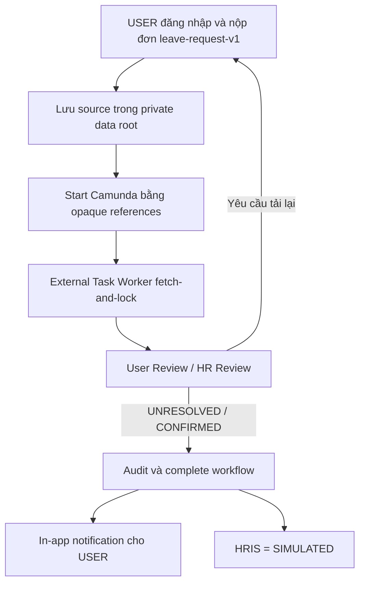
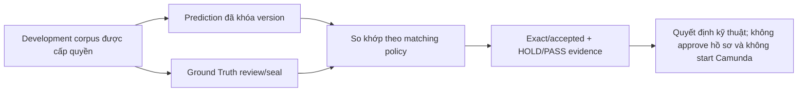

# VinHRIS — Cổng tác nghiệp tài liệu Hành chính - Nhân sự

[](https://www.python.org/)
[](https://www.jaided.ai/easyocr/)
[](https://camunda.com/platform-7/)
[](#an-toàn-dữ-liệu)
[](https://github.com/tandung060604-prog/hcns-automation-agent/actions/workflows/ci.yml)

VinHRIS là hệ thống Document AI chạy local, hỗ trợ tiếp nhận hồ sơ HCNS, đọc nội
dung, nhận diện biểu mẫu, trích xuất dữ liệu có cấu trúc và đưa các trường chưa
chắc chắn cho người dùng kiểm tra. Camunda 7 điều phối trạng thái quy trình; file
gốc, OCR text và dữ liệu chi tiết vẫn được giữ trong môi trường nội bộ.

> **Trạng thái ngày 14/08/2026:** MVP demo theo [Plan.md §1.1](Plan.md) đã chạy
> end-to-end với login, RBAC `USER | HR_REVIEWER | ADMIN`, in-app notification và
> tải bản DOCX/PDF. Toàn bộ dữ liệu vẫn ở local/self-hosted; chưa mở production
> multi-user, chưa có HRIS thật (chỉ `SIMULATED`) và chưa deploy public.

## Giá trị chính

- Giảm nhập liệu lặp lại từ DOCX, PDF, ảnh scan và các biểu mẫu HCNS phổ biến.
- Ưu tiên native parser cho tài liệu có text; chỉ dùng OCR khi file thực sự cần.
- Gắn trạng thái, confidence và evidence vào từng trường để dễ đối chiếu.
- Luôn giữ con người trong vòng quyết định với xác nhận, chỉnh sửa, tải lại hoặc từ chối.
- Chỉ chuyển metadata và mã tham chiếu cần thiết sang Camunda, không đẩy file gốc vào workflow.

## MVP demo (Plan.md §1.1) — 7/7 tiêu chí đạt

Demo end-to-end trên máy local với synthetic accounts và synthetic documents:

1. Admin tạo tài khoản `USER` và `HR_REVIEWER`; gán role; thay đổi có audit. ✅
2. `USER` đăng nhập, điền đơn nghỉ phép theo `leave-request-v1`, nộp. ✅
3. Camunda tạo process và task (User Task/HR Task theo BPMN hiện có). ✅
4. `HR_REVIEWER` đăng nhập, thấy đúng task được giao, duyệt đơn. ✅
5. `USER` nhận in-app notification `"Đã duyệt"`. ✅
6. Người lạ hoặc sai role không truy cập được hồ sơ (401/403, horizontal access). ✅
7. `USER` xem được timeline và tải bản DOCX/PDF của đơn khi cần. ✅

Ví dụ thực tế đã chạy: đơn nghỉ phép nộp → User Review `UNRESOLVED` → HR Review
tạo đúng → HR `CONFIRMED` → process COMPLETED → user nhận notification "Đã duyệt";
người lạ nhận `401`, user khác truy cập hồ sơ nhận `403`.

## Biểu mẫu hỗ trợ (từ `main`)

Template-first đã unify Contract / CV / IELTS. File mẫu tải được trong dashboard:

- `apps/ocr_lab/web/public/templates/cv-v2.docx`
- `apps/ocr_lab/web/public/templates/probation-contract-v2.docx`
- `apps/ocr_lab/web/public/templates/leave-request-v1.docx`
- `apps/ocr_lab/web/public/templates/overtime-request-v1.docx`
- IELTS: PDF/ảnh scan qua OCR (không có blank DOCX; dùng bộ DATA-31 / upload thật)

## Cài đặt và chạy local

### Yêu cầu

- Python 3.10+
- Node.js 22+
- EasyOCR cho luồng Template-first mặc định; PaddleOCR chỉ cần khi dùng rollback
- Camunda 7.13 (bản `run-latest` không cần login) để demo workflow end-to-end

### Cài đặt

```powershell
python -m venv .venv
.\.venv\Scripts\Activate.ps1
$env:PYTHONUTF8 = "1" # cần thiết nếu đường dẫn repo có ký tự tiếng Việt
python -m pip install -e ".[dev,easyocr]"

# Chỉ cài thêm khi cần rollback sang PaddleOCR
python -m pip install -e ".[paddle]"

Push-Location .\apps\ocr_lab\web
npm ci
Pop-Location
```

### Khởi động các tiến trình

Một demo Camunda đầy đủ cần ba tiến trình độc lập:

1. Camunda 7.13 đã chạy và đã deploy BPMN/DMN trong `camunda/` (deployment hiện
   tại `hr_document_agent_mvp_v2:14`, phiên bản BPMN `2.4.0-shadow`).
2. Launcher bên dưới khởi động local API và web.
3. External Task Worker chạy ở terminal riêng và dùng cùng private data root.

Windows:

```powershell
.\apps\ocr_lab\api\start_dashboard.ps1 `
  -DataRoot "C:\duong-dan\private-data" `
  -PythonPath ".\.venv\Scripts\python.exe"
```

Linux:

```bash
bash scripts/start_dashboard_linux.sh "$HOME/private-data"
```

Launcher mặc định chọn EasyOCR và chỉ báo sẵn sàng khi package của backend đang
chọn khả dụng. Dùng `-TemplateOcrBackend paddle` (hoặc
`HCNS_TEMPLATE_OCR_BACKEND=paddle` trên Linux) khi cần rollback rõ ràng.

Sau khi khởi động:

- VinHRIS Dashboard: `http://localhost:3000/workspace`
- Local API: `http://127.0.0.1:8765`
- Camunda Tasklist: `http://localhost:8080/camunda`

Worker dùng cùng thư mục để giải tham chiếu UUID mà không đưa file hoặc field
value vào Camunda:

```powershell
$env:CAMUNDA_REST_URL = "http://127.0.0.1:8080/engine-rest"
$env:CAMUNDA_WORKER_ID = "hcns-local-shadow"
$env:HCNS_CAMUNDA_PRIVATE_ROOT = "C:\duong-dan\private-data"
$env:HCNS_TEMPLATE_OCR_BACKEND = "easyocr"
hcns-agent-camunda-worker
```

Launcher **không** tự khởi động Camunda hoặc worker; repository chưa có Docker
Compose production để quản lý startup/health/shutdown của toàn stack.

### Chạy local một lệnh (Linux)

```bash
python run_all_in_one.py --data-root "$HOME/private-data"
```

Khởi động API (kèm OCR), web dashboard, Camunda worker; `--with-camunda` tự bật
Camunda engine qua Docker khi chưa chạy. Tắt toàn bộ bằng `Ctrl+C`.

### Deploy công khai qua Cloudflare Tunnel (free, HTTPS)

Không cần tài khoản, không phải mở port. Mỗi service nhận một URL
`https://*.trycloudflare.com` ngẫu nhiên — mọi người ở đâu cũng truy cập được:

```bash
docker start camunda || docker run -d --name camunda -p 8080:8080 camunda/camunda-bpm-platform:run-latest
python deploy_public.py
```

Đợi ~2 phút, mở link `VinHRIS Dashboard` in ra terminal. URL **đổi mỗi lần**
chạy (bản chất quick tunnel); cần URL cố định thì dùng Cloudflare named tunnel
với tài khoản + domain. Tắt bằng `Ctrl+C` (hoặc `pkill -f deploy_public.py`).

#### Môi trường mới hỗ trợ deploy

| Biến | Mặc định | Ý nghĩa |
|---|---|---|
| `VITE_API_BASE` | `http://127.0.0.1:8765` | API URL mà web gọi (frontend) |
| `VITE_CAMUNDA_URL` | `http://127.0.0.1:8080` | Camunda base (frontend) |
| `HCNS_API_ALLOWED_HOSTS` | *(rỗng)* | Allowlist Host header của API; hỗ trợ `*.trycloudflare.com`; mặc định chỉ loopback |
| `HCNS_API_CORS_ORIGINS` | *(rỗng)* | Allowlist CORS origin; hỗ trợ wildcard `https://*.trycloudflare.com`; mặc định chỉ localhost |

Các biến `HCNS_*` rỗng mặc định giữ nguyên hành vi an toàn cũ (loopback-only);
`deploy_public.py` tự set chúng khi chạy.

### Demo nhanh MVP (7 tiêu chí)

1. Mở `http://localhost:3000/workspace` — trang yêu cầu đăng nhập (auth gate).
2. Đăng nhập `admin/admin123` → tạo tài khoản User và HR (tab Admin).
3. Đăng nhập `user/user123` → điền đơn nghỉ phép (employeeName, startDate,
   endDate, reason) → nộp.
4. Đăng nhập `hr/hr123` → mở task được giao → `CONFIRMED`.
5. Về `user/user123` → xem notification `"Đã duyệt"` và timeline; tải DOCX/PDF.
6. Thử đường ngoài: chưa đăng nhập → `401`; user khác mở hồ sơ → `403`.

Tài khoản demo: `admin/admin123`, `hr/hr123`, `user/user123` (pass ≥ 6 ký tự).

Hướng dẫn thao tác đầy đủ: [Demo Camunda + HITL](docs/DEMO_CAMUNDA_HITL.md).

## Trạng thái hiện tại

| Thành phần | Trạng thái | Ý nghĩa thực tế |
|---|---|---|
| Universal document intake | Hoạt động | Nhận TXT, DOCX, PDF, XLSX, PPTX, PNG và JPG/JPEG |
| Template-first extraction | Hoạt động | CV/Hợp đồng nhận DOCX, PDF; IELTS/CCCD nhận PDF, PNG, JPG/JPEG theo manifest |
| OCR local | Hoạt động | PaddleOCR hoặc EasyOCR cho ảnh và PDF scan |
| Dashboard VinHRIS | Hoạt động local | Auth gate, upload, queue role-aware, notification, timeline, admin |
| Camunda 7 + Human-in-the-loop | Hoạt động ở shadow mode | External Task/User Task với ISO timestamp; không tạo side effect HRIS thật |
| Kết quả local/idempotency | Đã gia cố | Ghi kết quả an toàn khi nhiều request chạy đồng thời |
| API dashboard | Chỉ local | Bind loopback, CORS allow localhost/127.0.0.1 × 3000/4173; chưa mở LAN |
| Login/RBAC | MVP local | Session + owner scoping + `USER | HR_REVIEWER | ADMIN`; role do server chứng thực |
| Notification in-app | Hoạt động | Inbox + đánh dấu đã đọc; chưa có email/SMS |
| HRIS | Mô phỏng | External handler trả `SIMULATED`; không ghi HRIS thật |
| Production deploy | Chưa đóng gói | Chưa có Compose, HTTPS gateway, production database/API và backup/restore |

### Nếu người khác có link thì có dùng được không?

Không ở cấu hình hiện tại. API bind vào `127.0.0.1`, kiểm tra loopback Host và
CORS chỉ cho `localhost`/`127.0.0.1`; người ở máy khác không thể dùng chỉ bằng
một URL. Không đổi host sang `0.0.0.0` hoặc mở port trực tiếp. Demo cho partner
sau này phải đặt sau HTTPS và access allowlist có thời hạn; xem [Plan.md](Plan.md).

## Cập nhật mới nhất — 14/08/2026 (nhánh `feat/mvp-leave-request-end-to-end`)

- **BPMN deploy v14, fix lỗi "UNRESOLVED không tạo HR Review":** task listener cũ
  set `reviewedAt = String(Instant.now())` (epoch millis) trong khi worker yêu cầu
  ISO-8601 → business error `DOCUMENT_INPUT_INVALID` → process terminate. Đổi cả
  hai task listener (User Review/HR Review) sang `new Date().toISOString()`; flow
  UNRESOLVED → HR Review đã verify chạy đúng.
- **MVP demo UI:** `MvpDemoPanel` — login, nộp đơn leave-request-v1, queue theo
  role, notification inbox, timeline, tải DOCX/PDF, admin quản lý users + audit,
  trạng thái hệ thống (API/Camunda) và 5 bước demo.
- **Auth gate cho toàn bộ `/workspace`:** chưa đăng nhập chỉ thấy màn đăng nhập;
  session lưu localStorage key `mvp-demo-session`, khôi phục sau khi reload.
- **CORS mở đúng nguồn dev:** cho phép cả `localhost:3000` và `127.0.0.1:3000`
  (plus 4173 cho preview), theo `Origin` header thay vì fix cứng một host.
- **Export DOCX/PDF:** đơn nghỉ phép render theo template `hcns format` và tải
  về từ màn kết quả; kiểm tra quyền theo owner/role trước khi phục vụ.

## Luồng đang vận hành

### Luồng nghiệp vụ local/shadow



### Luồng lab/evidence — không phải bước nghiệp vụ



Ground Truth và DATA-29 phục vụ đánh giá thuật toán. Người dùng vận hành bình
thường không phải nhập Ground Truth để nộp hồ sơ.

## Phạm vi tài liệu

| Nhóm tài liệu | Mức hỗ trợ | Chính sách hiện tại |
|---|---|---|
| Đơn xin nghỉ phép | MVP E2E qua app | Template-first, Camunda, hai điểm Human Review, DOCX/PDF export |
| Đơn xin tăng ca | Local shadow E2E | Có nhánh xác nhận nhanh hoặc chuyển HR |
| CV | Local shadow E2E | DOCX/PDF; upload → extraction → Camunda → Human Review |
| Hợp đồng thử việc | Local shadow E2E | DOCX/PDF; không tự tạo quyết định nghiệp vụ |
| Chứng chỉ IELTS | Local shadow E2E | PDF/PNG/JPG/JPEG; ảnh đi qua OCR local và luôn cần người duyệt |
| CCCD mặt trước | Review-only | Chỉ dùng cho kiểm tra nội bộ, không tự phê duyệt |
| Hồ sơ chưa có schema | Intake/OCR | Không tự động đi tiếp cho đến khi có rule phù hợp |

Chưa tuyên bố hỗ trợ chữ viết tay, CCCD mặt sau hoặc tự động hóa quyết định
tuyển dụng, sa thải, lương, kỷ luật và phúc lợi.

## Bằng chứng chất lượng hiện có

Các số liệu dưới đây đến từ tập đánh giá local đã khóa, không phải cam kết chất
lượng production. Trạng thái promotion hiện vẫn là `HOLD` và
`promotionAllowed=false`.

| Phạm vi đánh giá | Kết quả | Diễn giải |
|---|---:|---|
| Leave + Overtime native | 30/30 chọn đúng template | 15 Leave Request và 15 Overtime Request |
| Leave + Overtime native | 0/30 lỗi validation | Đủ điều kiện chuyển đến bước Human review |
| Contract + CV + IELTS · DATA-29 | 107/112 field exact | Contract 42/42, CV 45/50, IELTS 20/20 |
| DATA-29 accepted | 112/112 field accepted | Matching policy v2; decision `HOLD`, không promotion |
| 12 tài liệu đang show | 107/112 exact, 112/112 accepted | Toàn bộ 3 Contract, 5 CV và 4 IELTS từ chính DATA-29 |
| Latency native warm p95 | DOCX 285 ms; PDF text 158 ms | 30 run/input class, local CPU 8 GB |
| Latency visual warm p95 | Ảnh 28,5 s; PDF scan 67,5 s | Chủ yếu nằm ở EasyOCR; chưa đạt gate mở rộng |
| JSON Schema | 0 lỗi | Kiểm tra cấu trúc trước khi chuyển workflow |
| MVP demo (Plan.md §1.1) | 7/7 criteria pass | Login, submit, Camunda task, HR duyệt, notification, 401/403, export |

Dashboard chỉ hiển thị metric từ aggregate evidence đã seal. Kết quả template v1
cũ vẫn đọc được qua compatibility projection; kết quả mới phát ra theo contract v2.

Co-resident benchmark API + scan từng thất bại khi EasyOCR cần thêm khoảng 1,20 GB
RAM; isolated scan pass 30/30. Vì vậy result store ghi đồng thời an toàn không có
nghĩa là visual OCR đã sẵn sàng chạy nhiều job song song.

## Kiểm thử

```powershell
python -m pytest -q
python -m ruff check src tests scripts `
  apps/ocr_lab/api/canonical_phase_metrics.py `
  apps/ocr_lab/api/local_server_security.py `
  apps/ocr_lab/api/phase14_review_store.py `
  apps/ocr_lab/api/upload_safety.py
python -m mypy src
python scripts/check_repository.py

Push-Location .\apps\ocr_lab\web
npm test
npm run lint
Pop-Location
```

Checkpoint đã ghi nhận trên baseline trước review: Python `546 passed`, frontend
rendered-contract `14/14`, mypy pass 90 source files và ESLint 0 error/23 warning
nền. Full local suite cần timeout dài hơn 120 giây; CI vẫn là gate chính thức cho
merge.

## An toàn dữ liệu

- Không upload tài liệu HCNS lên cloud trong runtime local hiện tại.
- Không commit dataset, file upload, model weights, OCR output thật, secret hoặc PII.
- API dashboard chỉ nhận loopback Host, CORS chỉ cho `localhost`/`127.0.0.1`; không mở port ra LAN/Internet.
- Camunda chỉ nhận scalar metadata và opaque result reference, không nhận raw Business JSON.
- Result store dùng idempotency key và khóa ghi để tránh kết quả trùng/xung đột.
- Trường thiếu, confidence thấp hoặc tài liệu scan luôn được chuyển sang Human review.
- Mọi action có thể tác động HRM/BPM cần policy cho phép và human approval.
- Session/login có owner scoping và RBAC; role không tin tưởng từ trình duyệt.

## Kiến trúc repository

```text
src/hcns_agent/        Domain, application services, ports và adapters
apps/ocr_lab/api/      Local API, bridge Camunda và MVP store/docs
apps/ocr_lab/web/      Giao diện VinHRIS (Dashboard + MvpDemoPanel)
camunda/               BPMN, DMN và cấu hình workflow
schemas/               JSON Schema cho output contract
tests/                 Contract, integration và regression tests
scripts/               Công cụ đánh giá, launcher và repository checks
docs/                  Kiến trúc, vận hành, tiến độ và bằng chứng
```

Nguyên tắc kiến trúc: native parser trước OCR, domain không phụ thuộc Camunda SDK,
Business JSON không đi qua process variables và mọi nhánh không chắc chắn phải
đi qua Human-in-the-loop.

## Tài liệu dành cho mentor và đội phát triển

- [Kế hoạch website, RBAC và deployment chi phí thấp](Plan.md)
- [Tổng quan tài liệu](docs/README.md)
- [Trạng thái kỹ thuật mới nhất](docs/PROJECT_STATE.md)
- [Kiến trúc hệ thống](docs/ARCHITECTURE.md)
- [Human-in-the-loop](docs/HUMAN_IN_THE_LOOP.md)
- [Phương pháp và metric đánh giá](docs/EVALUATION.md)
- [Hướng dẫn demo Camunda](docs/DEMO_CAMUNDA_HITL.md)
- [Demo đối chiếu CV/Contract/IELTS trên localhost](docs/DEMO_LOCAL_COMPARISON.md)
- [Báo cáo demo cho mentor](docs/DEMO_CAMUNDA_HITL_REPORT.md)
- [Handoff cho phiên phát triển tiếp theo](docs/HANDOFF.md)

## Giới hạn và hướng phát triển

Các hạng mục sau chưa được xem là tính năng production:

- Sản phẩm nhiều người dùng: account lifecycle hoàn chỉnh, reset password, MFA.
- Notification email/SMS; hiện chỉ có in-app inbox.
- Production API/database, encrypted storage lifecycle, backup/restore và audit đầy đủ.
- Một stack deploy có HTTPS, healthcheck, resource limit và worker concurrency `1`.
- Chữ viết tay và CCCD mặt sau.
- Tự động đưa ra quyết định nhân sự hoặc ghi trực tiếp vào HRIS.
- Tối ưu scan phức tạp: deskew, denoise, rotation và layout nhiều cột/bảng biểu.
- Promotion OCR cho các family đang ở trạng thái `HOLD`.
- DATA-29 là development corpus; `107/112` không chứng minh chất lượng
  trên tài liệu HCNS thật và không được dùng làm tuyên bố production-ready.

Mốc sản phẩm tiếp theo là vertical slice `leave-request-v1` đang chạy ở mức MVP
trên máy local. Sau khi đạt authorization production, audit, retention và resource
gate mới mở upload public hoặc thêm loại biểu mẫu. Không đặt GPU làm điều kiện mặc
định; chỉ bổ sung acceleration sau khi đo được nhu cầu.

Deployment chi phí thấp và Git workflow được chốt trong [Plan.md](Plan.md): demo
partner có thời hạn trên máy hiện có sau access allowlist; staging trên một VPS x86
4 vCPU/8 GB bằng Docker Compose. Vercel/Cloudflare chỉ phù hợp frontend; cPanel hoặc
Railway free không phù hợp để chạy trọn Camunda + OCR worker liên tục.
