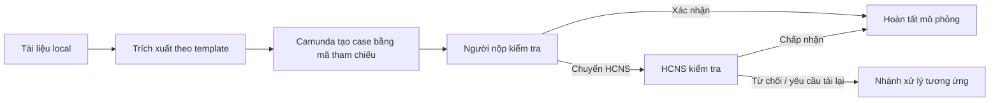

# Báo cáo demo OCR → Camunda → Human-in-the-Loop

**Trạng thái:** Mẫu chờ bằng chứng ảnh

**Phạm vi demo:** Đơn xin nghỉ phép và Đơn xin tăng ca, chạy local.

**Nguyên tắc dữ liệu:** File gốc, OCR text và JSON chi tiết chỉ được xử lý trên máy local.
Camunda chỉ điều phối bằng mã tham chiếu; các bước cập nhật hồ sơ/thông báo trong demo là mô phỏng.

## 1. Mục tiêu

Chứng minh hai luồng end-to-end:

1. Leave Request: trích xuất → người nộp kiểm tra → HCNS kiểm tra → chấp nhận → hoàn tất.
2. Overtime Request: trích xuất → người nộp xác nhận → hoàn tất theo nhánh nhanh.

## 2. Môi trường thực hiện

| Thành phần | Vai trò | Trạng thái khi quay |
|---|---|---|
| Dashboard local | Chọn file, trích xuất, xem xét local, đưa case vào Camunda | Điền sau demo |
| Camunda Tasklist | Danh sách công việc con người | Điền sau demo |
| Camunda Cockpit Runtime | Quan sát node BPMN đang active | Điền sau demo |
| External Task worker | Hoàn thành audit và service task mô phỏng | Điền sau demo |

## 3. Case A — Leave Request qua hai bước HITL

### A.1. Sẵn sàng hệ thống

**Kỳ vọng:** Dashboard local hoạt động, worker đang chạy, Tasklist sạch các case demo cũ.

**Nhận xét:** Điền sau khi nhận ảnh.

### A.2. Trích xuất tài liệu Leave Request

**Thao tác:** Chọn một Leave Request mới, bấm `Trích xuất tài liệu`.

**Kỳ vọng:** Hệ thống nhận `LEAVE_REQUEST`, có trạng thái xử lý thành công, confidence và nút
`Đưa vào Camunda`.

**Nhận xét:** Điền sau khi nhận ảnh.

### A.3. Case xuất hiện ở bước người nộp xác nhận

**Thao tác:** Bấm `Đưa vào Camunda`, mở Cockpit Runtime và instance mới nhất.

**Kỳ vọng:** Node `Người nộp xác nhận dữ liệu` đang active.

**Nhận xét:** Điền sau khi nhận ảnh.

### A.4. Người nộp chuyển case sang HCNS

**Thao tác:** Trong Hàng đợi HITL, đối chiếu local và bấm `Chuyển HCNS`.

**Kỳ vọng:** Case chuyển sang cột HCNS; Cockpit active tại `HCNS kiểm tra dữ liệu`.

**Nhận xét:** Điền sau khi nhận ảnh.

### A.5. HCNS kiểm tra và chấp nhận

**Thao tác:** HCNS bấm `Kiểm tra local`, đối chiếu bản gốc/kết quả rồi bấm `Chấp nhận`.

**Kỳ vọng:** Worker hoàn thành các bước mô phỏng, không gọi HRIS hoặc email thật.

**Nhận xét:** Điền sau khi nhận ảnh.

### A.6. Case kết thúc

**Kỳ vọng:** Task biến mất khỏi hàng đợi; Cockpit Runtime không còn instance của case.

**Kết luận Case A:** Điền sau demo.

## 4. Case B — Overtime Request, nhánh xác nhận nhanh

### B.1. Trích xuất và khởi tạo case

**Thao tác:** Chọn Overtime Request mới, trích xuất và bấm `Đưa vào Camunda`.

**Kỳ vọng:** Loại tài liệu là `OVERTIME_REQUEST`; Cockpit active tại `Người nộp xác nhận dữ liệu`.

**Nhận xét:** Điền sau khi nhận ảnh.

### B.2. Người nộp xác nhận và case kết thúc

**Thao tác:** Trong Hàng đợi HITL, người nộp chọn `Xác nhận chính xác`.

**Kỳ vọng:** Không tạo task HCNS; worker hoàn tất nhánh mô phỏng và case rời runtime.

**Kết luận Case B:** Điền sau demo.

## 5. Tổng kết bằng chứng

| Case | Nhánh đã chứng minh | Bằng chứng | Trạng thái |
|---|---|---|---|
| A — Leave Request | Hai điểm HITL: người nộp → HCNS → chấp nhận | S1-A, S2-A, S3-A, S4-A, S5-A | Chờ demo |
| B — Overtime Request | Xác nhận nhanh bởi người nộp | S1-B, S2-B, S5-B | Chờ demo |

## 6. Kết luận

Sau khi thay các placeholder bằng ảnh đã kiểm tra, báo cáo này sẽ chứng minh rằng:

- tài liệu được xử lý local trước khi vào workflow;
- người nộp và HCNS có trách nhiệm khác nhau trong Human-in-the-Loop;
- Camunda hiển thị được trạng thái runtime tại các điểm chờ con người;
- case hoàn tất sẽ không còn trên Runtime, đúng với cơ chế Camunda;
- không đưa PII, JSON trích xuất hoặc file nguồn vào process variables.

---

## Hướng dẫn hoàn thiện báo cáo

1. Gửi ảnh theo checkpoint trong `DEMO_CAMUNDA_HITL.md`.
2. Người hỗ trợ kiểm tra từng ảnh trước khi chuyển bước tiếp theo.
3. Khi đủ ảnh, chép ảnh đã duyệt vào `docs/evidence/` với đúng tên `S0-A`, `S1-A`…
4. Thay các đường dẫn `PLACEHOLDER_*` trong báo cáo bằng tên file ảnh thực tế.
5. Điền phần `Nhận xét` và `Kết luận` bằng quan sát đã xác minh, không dùng dữ liệu cá nhân.
