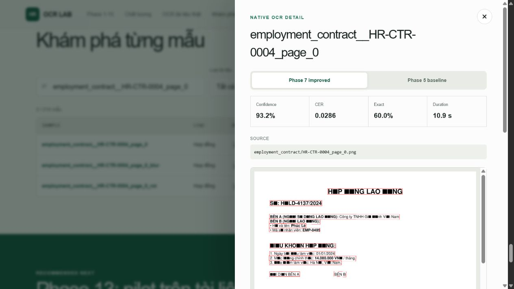
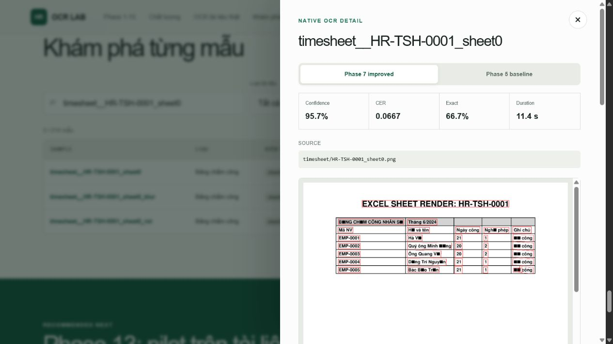
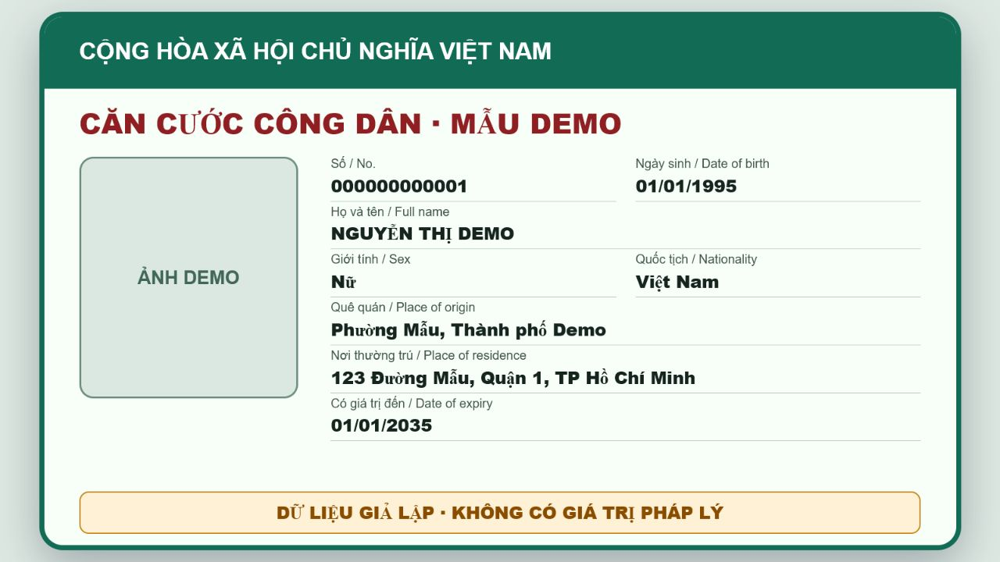

# Báo cáo tiến độ 4 ngày — Vietnamese HR Document Intelligence

> **Phạm vi:** OCR/IDP tài liệu hành chính nhân sự tiếng Việt, chạy local và
> chuẩn bị tích hợp Camunda 7.13. **Trạng thái:** đã có prototype end-to-end;
> chưa đủ bằng chứng để promote production.

## 1. Kết quả đã hoàn thành

| Ngày | Kết quả chính |
|---|---|
| 1 | Dựng baseline PaddleOCR local trên CPU; hoàn tất bộ synthetic 38 tài liệu/114 ảnh HR và tổng 214 ảnh thử nghiệm. Sinh Native OCR JSON, visualization, CER/WER/Exact Match và báo cáo có thể tái lập. |
| 2 | Xây OCR Lab tại `http://localhost:3000/#upload`: nhận PNG/JPG/PDF/DOCX/XLSX, ưu tiên native extraction cho tài liệu có text layer, giữ bounding box/provenance, tải Native/Canonical/IDP/Business JSON và hỗ trợ Human Review. |
| 3 | Tách bài toán nhận dạng tiếng Việt ở cấp crop; benchmark PaddleOCR, EasyOCR và VietOCR. Khóa crop/model/policy bằng SHA-256, chạy prediction ẩn trước Ground Truth và giữ mọi bất đồng ở `needs_review`. |
| 4 | Mở rộng sang năm họ hồ sơ HCNS, bổ sung parser hợp đồng/quyết định, văn bằng và bảng chấm công nhiều dòng. Hoàn tất Ground Truth held-out 18/18 tài liệu; xác định lỗi contract TIMESHEET và sửa trong Phase 17. Tạo Camunda 7 External Task/DMN shadow scaffolding, chưa ghi HRIS thật. |

**Bằng chứng định lượng.** Trên **114 ảnh HR synthetic**, PP-OCRv5 enhanced đạt
CER **8,27%**, WER **48,36%**, Field Exact Match **41,2%**, Field Presence
**94,3%**, thời gian trung bình **7,3 giây/ảnh CPU**. Đây là regression
development, không phải chất lượng production. Trên **309 crop từ 15 tài liệu
scan có quyền sử dụng**, VietOCR `vgg_seq2seq` đạt Exact Match **30,74%**,
CER **18,19%**, DER **1,28%**; fallback LODO tăng Exact Match lên **44,34%**
nhưng làm mất hai dòng primary vốn đúng, nên vẫn `SHADOW_REVIEW_ONLY`.

<table>
  <tr>
    <td width="50%"></td>
    <td width="50%"></td>
  </tr>
  <tr>
    <td><b>Hợp đồng synthetic tốt nhất:</b> CER 2,86%, Field Exact 60%, confidence 93,2%.</td>
    <td><b>Bảng chấm công synthetic tốt nhất:</b> CER 6,67%, Field Exact 66,7%, confidence 95,7%.</td>
  </tr>
</table>

## 2. Kỹ thuật đang sử dụng

Luồng hiện tại là:

```text
Validate file
→ native parse hoặc Paddle detector
→ VietOCR primary + Transformer verifier
→ Canonical Document + provenance
→ classify document family/subtype
→ parser field/table
→ validation + quality gate
→ PASS / REVIEW / REJECT
→ versioned Business JSON / resultReference
```

- **Native-first:** PDF có text, DOCX và XLSX được đọc trực tiếp; ảnh/PDF scan
  mới dùng OCR.
- **Evidence-first:** mỗi field giữ trang, dòng, bounding box/cell và model
  provenance; không tự điền dữ liệu không có bằng chứng.
- **Benchmark mù:** prediction được niêm phong trước khi người dùng xác nhận
  Ground Truth; held-out chỉ đánh giá một lần, không chỉnh threshold sau khi xem.
- **Versioned policy:** model hash, crop profile, metric spec và
  `RecognitionPolicy` được khóa; automatic fallback vẫn tắt.
- **Human-in-the-loop:** OCR Lab cho phép đối chiếu ảnh gốc, sửa Ground Truth,
  tải JSON; trạng thái review tiếp tục đúng sau F5.



CCCD phía trên là dữ liệu giả lập, dùng để kiểm tra route `IDENTITY_CARD` và JSON
8 trường. Với tài liệu định danh thật, họ tên/địa chỉ/dấu tiếng Việt vẫn là nhóm
lỗi trọng yếu; confidence cao không được xem là bằng chứng đúng.

## 3. Blocker và rủi ro hiện tại

1. **Recognizer tiếng Việt chưa đạt gate:** lỗi mất dấu/thay ký tự còn xuất hiện
   trên scan thật; fallback tăng tổng Exact Match nhưng vẫn có false switch.
2. **Held-out đa loại còn yếu:** Phase 16 trên 18 tài liệu thật đạt classification
   77,78%, Field Exact Match 13,00%, completeness 28,00%; quyết định
   `NOT_PROMOTED`.
3. **TIMESHEET cũ mất cấu trúc bảng:** prediction Phase 16 không mang `tables`;
   Phase 17 đã sửa contract/parser nhưng bắt buộc đánh giá trên held-out mới,
   không được tái sử dụng tập đã tiêu thụ.
4. **Camunda mới ở shadow mode:** BPMN/DMN, External Task client và mock adapter
   đã có; chưa deploy production, chưa kết nối HRIS thật.
5. **Hiệu năng local:** lần đầu nạp model có thể mất hơn một phút; cần đo lại
   p50/p95 trên máy mục tiêu sau khi chốt model.

## 4. Bước tiếp theo

1. Thu thập tập `paddleocr-hr-heldout-v2` tối thiểu 15 tài liệu mới, có quyền sử
   dụng và đủ năm họ: CV; đơn/biểu mẫu; hợp đồng/quyết định; bằng cấp/chứng chỉ;
   phiếu nhân viên/bảng chấm công.
2. Khóa manifest SHA-256 → chạy prediction ẩn → xác nhận Ground Truth chỉ từ tài
   liệu gốc → evaluate-once bằng Phase 17; báo riêng classification macro F1,
   Field Exact, completeness và row/cell metrics TIMESHEET.
3. Chỉ promote theo từng family/subtype khi không làm mất dòng primary đúng và
   không tăng false acceptance; nếu chưa đạt, tiếp tục `needs_review`.
4. Sau khi OCR vượt gate, chạy Camunda 7.13 local dry-run end-to-end với
   `resultReference`, retry/idempotency và User/HR Review; HRIS vẫn dùng mock.

**Tài liệu số liệu:** `docs/EVALUATION.md`, `docs/PROJECT_STATE.md`; model/policy:
`config/phase14_6_benchmark_lock.json`, `config/phase17_parser_lock.json`; giao
diện: `apps/ocr_lab`.
