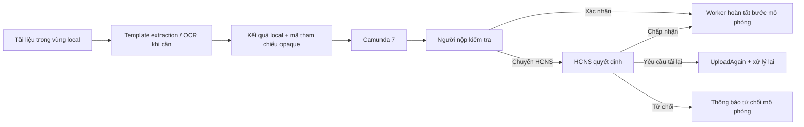
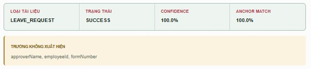
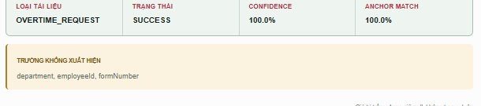
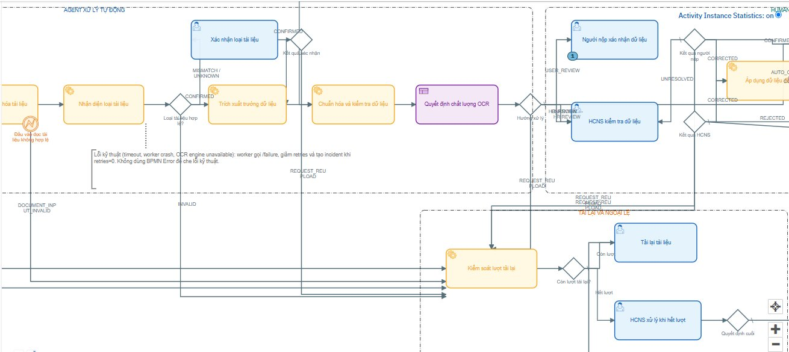
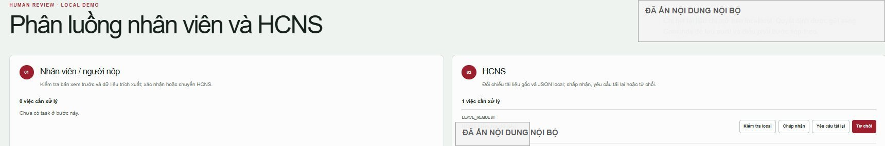
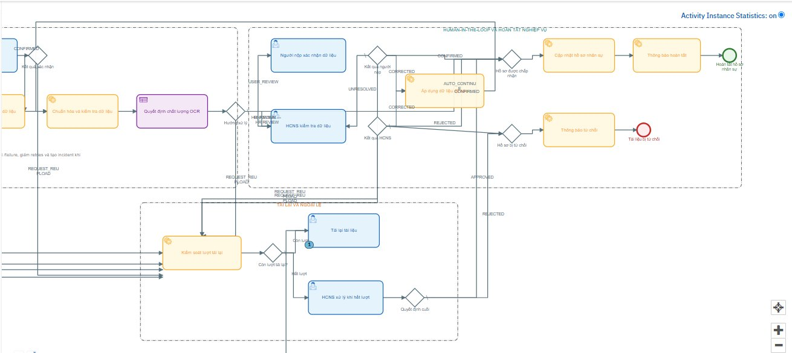
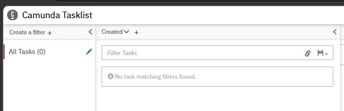
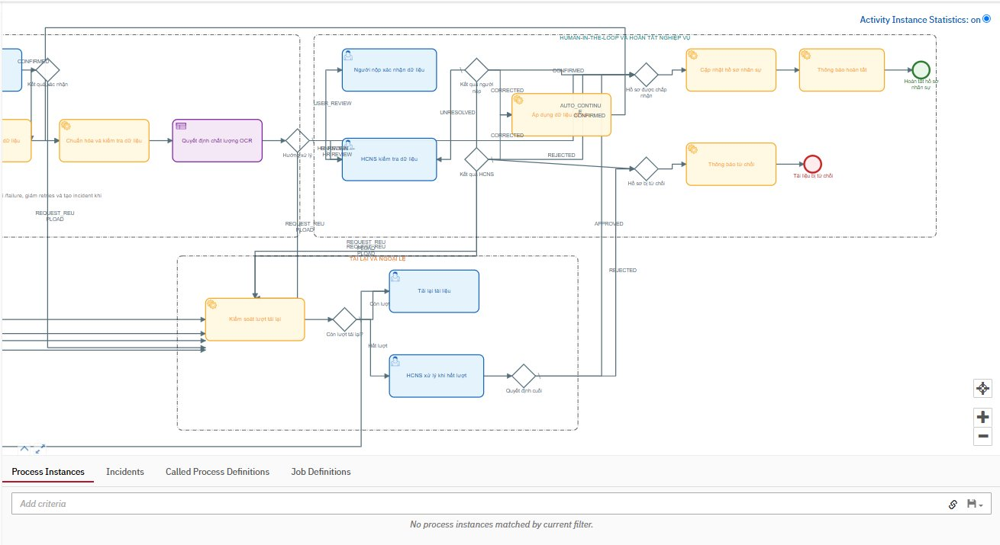

# Báo cáo Mentor — Demo Camunda Human-in-the-Loop

**Phạm vi:** kiểm chứng luồng xử lý tài liệu HCNS chạy local cho Đơn xin nghỉ phép và Đơn xin tăng ca.

**Trạng thái:** hoàn thành demo bốn nhánh nghiệp vụ. Báo cáo có kèm ảnh chụp ở các mốc chính để
đối chiếu trực quan. Các ảnh đã được cắt chọn và che thông tin nhận diện/nội dung nội bộ; tài liệu
gốc, ảnh đầy đủ, nội dung OCR, JSON trích xuất và mã tham chiếu vẫn được giữ ở vùng private local.

## 1. Tóm tắt cho Mentor

Hệ thống đã trình diễn thành công chuỗi xử lý từ trích xuất tài liệu đến quyết định của con người và
điều phối Camunda. Bốn nhánh nghiệp vụ đã được chạy riêng biệt, mỗi case kết thúc với Tasklist
trống và không còn process instance runtime.

| Nhánh | Quyết định | Kết quả quan sát |
|---|---|---|
| Leave Request qua hai vai trò | Người nộp chuyển HCNS, HCNS chấp nhận | Hoàn tất theo nhánh thành công |
| Overtime Request nhánh nhanh | Người nộp xác nhận chính xác | Hoàn tất, không tạo task HCNS |
| Yêu cầu tải lại | HCNS yêu cầu tải lại, nộp tham chiếu local mới, Người nộp xác nhận | Hoàn tất sau khi quay lại UserReview |
| Từ chối | Người nộp chuyển HCNS, HCNS từ chối | Hoàn tất theo nhánh từ chối |

## 2. Kiến trúc và nguyên tắc dữ liệu

- File nguồn, OCR text và JSON đầy đủ chỉ nằm trên máy local.
- Camunda nhận mã tham chiếu opaque và dữ liệu điều phối tối thiểu, không nhận file hoặc PII thô.
- External Task worker xử lý audit và các service task sau quyết định của người dùng.
- `UpdateHRIS` và `Notify*` trong demo là mô phỏng; không ghi vào HRIS hoặc gửi email thật.

## 3. Bằng chứng trực quan của phiên demo

Các ảnh dưới đây là ảnh chụp từ phiên demo local ngày 11/08/2026. Chúng được dùng để chứng minh
trạng thái hệ thống và sự di chuyển của token trong Camunda; không dùng để công bố nội dung hồ sơ
hay dữ liệu cá nhân.

### 3.1. Nhận diện và trích xuất trước khi vào workflow

*Hình 1 — Leave Request được nhận diện đúng loại, trạng thái `SUCCESS`, confidence và anchor match
đều hiển thị 100% trong phiên demo.*

*Hình 2 — Overtime Request được nhận diện thành công trước khi tạo human task. Các trường thiếu là
trường không xuất hiện trong biểu mẫu, không phải lỗi workflow.*

### 3.2. Token dừng ở bước Human-in-the-Loop

*Hình 3 — Cockpit hiển thị instance đang chạy và token tại `UserReview`; người nộp có thể xác nhận
hoặc chuyển case sang HCNS.*

*Hình 4 — Sau khi người nộp chuyển HCNS, dashboard phân luồng hiển thị một việc cần xử lý cho HCNS,
với các quyết định chấp nhận, yêu cầu tải lại hoặc từ chối.*

### 3.3. Nhánh yêu cầu tải lại

*Hình 5 — Khi HCNS yêu cầu tải lại, token được điều phối đến `UploadAgain`. Sau khi có kết quả local
mới, workflow quay lại `UserReview`, không bỏ qua bước xác nhận của người nộp.*

### 3.4. Xác nhận hoàn tất

*Hình 6 — Sau quyết định cuối cùng, Tasklist hiển thị `All Tasks (0)`.*

*Hình 7 — Cockpit Runtime không còn process instance khớp với bộ lọc sau khi case hoàn tất. Đây là
hành vi mong đợi của màn Runtime, không phải lỗi mất lịch sử.*

## 4. Kết quả theo kịch bản

### 4.1. Leave Request — kiểm tra hai cấp

1. Hệ thống nhận diện và trích xuất Leave Request ở local.
2. Camunda tạo task `UserReview` cho Người nộp.
3. Người nộp chọn chuyển HCNS (`UNRESOLVED`).
4. Worker ghi audit và điều phối sang `HRReview`.
5. HCNS kiểm tra kết quả local, chọn chấp nhận (`CONFIRMED`).
6. Worker hoàn tất audit, cập nhật/thông báo mô phỏng và kết thúc process.

**Ý nghĩa:** chứng minh Human-in-the-Loop có hai vai trò độc lập trong nhánh phê duyệt.

### 4.2. Overtime Request — nhánh xác nhận nhanh

1. Hệ thống nhận diện và trích xuất Overtime Request ở local.
2. Camunda tạo task `UserReview`.
3. Người nộp xác nhận kết quả (`CONFIRMED`).
4. Worker hoàn tất nhánh thành công mà không tạo task HCNS.

**Ý nghĩa:** workflow chỉ gọi HCNS khi cần review, không đưa thêm bước thủ công không cần thiết.

### 4.3. Overtime Request — yêu cầu tải lại

1. Người nộp chuyển case sang HCNS.
2. HCNS chọn yêu cầu tải lại (`REQUEST_REUPLOAD`).
3. Worker ghi audit, đăng ký lượt tải lại và tạo task `UploadAgain`.
4. Một kết quả trích xuất local mới được tạo; task nhận mã tham chiếu mới và loại tài liệu khai báo.
5. Worker chạy lại pipeline và đưa case trở lại `UserReview`.
6. Người nộp xác nhận kết quả thay thế; process hoàn tất.

**Ý nghĩa:** chứng minh workflow có vòng lặp xử lý lại, không bỏ qua review sau khi tài liệu thay đổi.

### 4.4. Leave Request — từ chối có kiểm soát

1. Người nộp chuyển case sang HCNS.
2. HCNS chọn từ chối (`REJECTED`).
3. Worker ghi audit và hoàn tất nhánh `NotifyRejected` mô phỏng.
4. Process kết thúc mà không đi qua cập nhật hồ sơ mô phỏng.

**Ý nghĩa:** tách rõ nhánh từ chối khỏi nhánh thành công, tránh side effect không phù hợp.

## 5. Bằng chứng vận hành đã quan sát

| Điểm kiểm chứng | Bằng chứng trong phiên demo |
|---|---|
| Trích xuất local | Loại tài liệu hiển thị đúng trước khi đưa case vào Camunda |
| Điều phối workflow | Cockpit hiển thị token tại `UserReview`, `HRReview` và `UploadAgain` theo từng case |
| Human task | Tasklist/Hàng đợi HITL hiển thị đúng vai trò đang cần xử lý |
| Hoàn tất | Sau quyết định cuối, Tasklist không còn task và Cockpit Runtime không còn instance chạy |
| Bảo vệ dữ liệu | Chỉ mã tham chiếu được dùng trong Camunda; không version ảnh hoặc dữ liệu HCNS trong repository |

Cockpit trong môi trường demo là màn Runtime. Vì thế, sau khi case Complete, instance biến mất khỏi
Runtime; trạng thái không còn instance chạy là hành vi mong đợi, không phải lỗi workflow.

## 6. Liên hệ với chất lượng trích xuất

Demo workflow xác minh **điều phối và kiểm soát của con người**, không thay thế benchmark OCR.
Theo [trạng thái dự án](PROJECT_STATE.md), tập local được duyệt gồm 30 tài liệu native (15 Leave
Request, 15 Overtime Request) đã được kiểm tra với template/parser hiện tại: chọn đúng template
30/30, không có lỗi validation và đủ điều kiện đi tiếp 30/30.

Kết quả này không được diễn giải là CER/WER cho tài liệu scan hoặc là chứng nhận sẵn sàng production.
Mọi tài liệu scan/OCR vẫn cần đánh giá độc lập và review của con người theo policy.

## 7. Giới hạn hiện tại

- Phân vai trên dashboard là role switch phục vụ demo local, chưa phải cơ chế xác thực/phân quyền production.
- Bước `UploadAgain` hiện được hoàn thành qua Camunda Tasklist bằng mã tham chiếu local; chưa có nút upload
  gắn trực tiếp vào task trên dashboard.
- Nhánh lỗi kỹ thuật như timeout, retry cạn lượt hoặc OCR runtime failure chưa thuộc bốn case nghiệp vụ trên.
- Không có hệ thống HRIS/email thật trong demo.

## 8. Đề xuất phát triển tiếp theo

1. Gắn thao tác tải lại tài liệu vào dashboard để người dùng không cần mở Camunda Tasklist ở nhánh `UploadAgain`.
2. Thêm phân quyền thực tế cho vai trò Người nộp và HCNS.
3. Tạo dashboard lịch sử workflow local để xem các case đã hoàn tất mà không dựa vào Cockpit Runtime.
4. Xây dựng kịch bản resilience riêng cho retry, lỗi OCR và giới hạn số lượt tải lại.
5. Tách benchmark OCR scan theo CER, WER và field accuracy trước khi xem xét production readiness.

## 9. Kết luận

Demo đã chứng minh workflow có thể điều phối tài liệu Leave/Overtime từ xử lý local đến các quyết
định Human-in-the-Loop, bao phủ nhánh thành công, nhánh nhanh, tải lại và từ chối. Hệ thống hiện
phù hợp để tiếp tục hoàn thiện UX, phân quyền và benchmark OCR; chưa được tuyên bố là production-ready.
