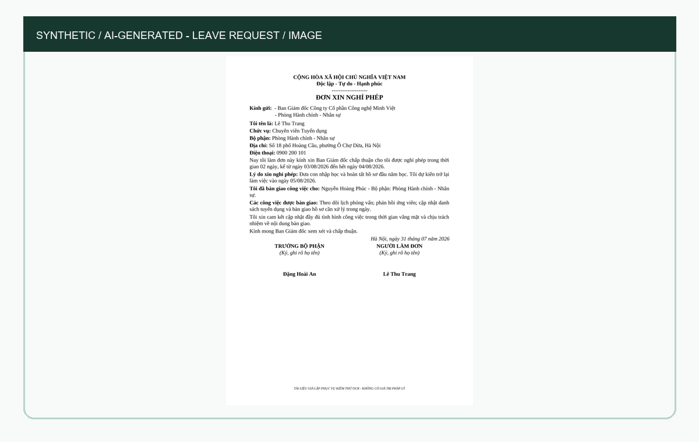
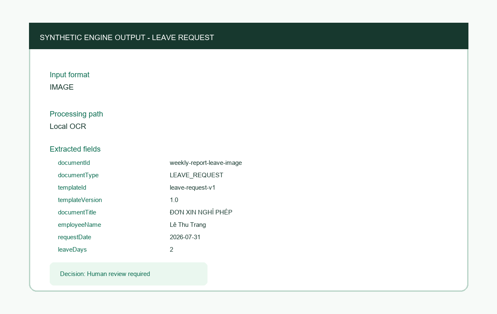
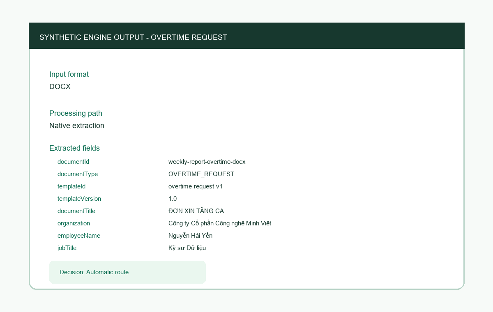
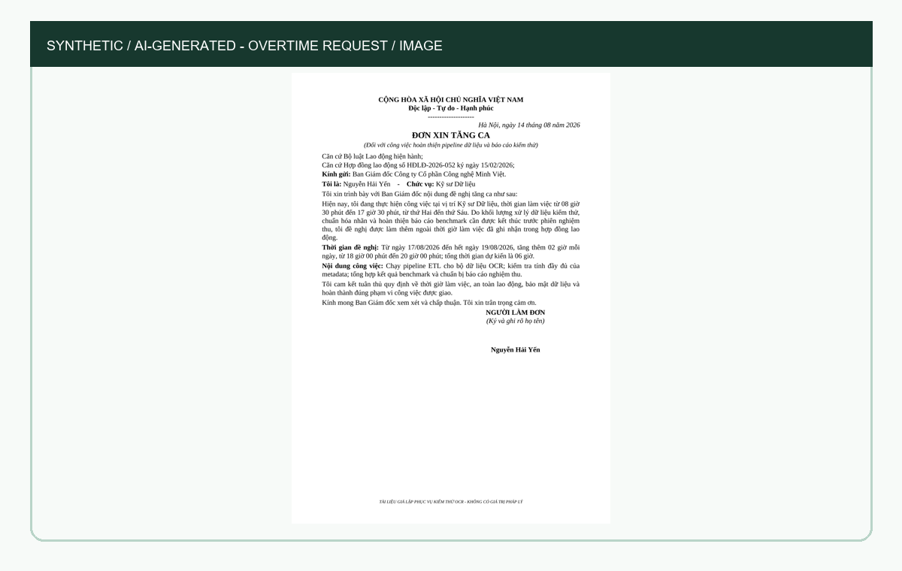
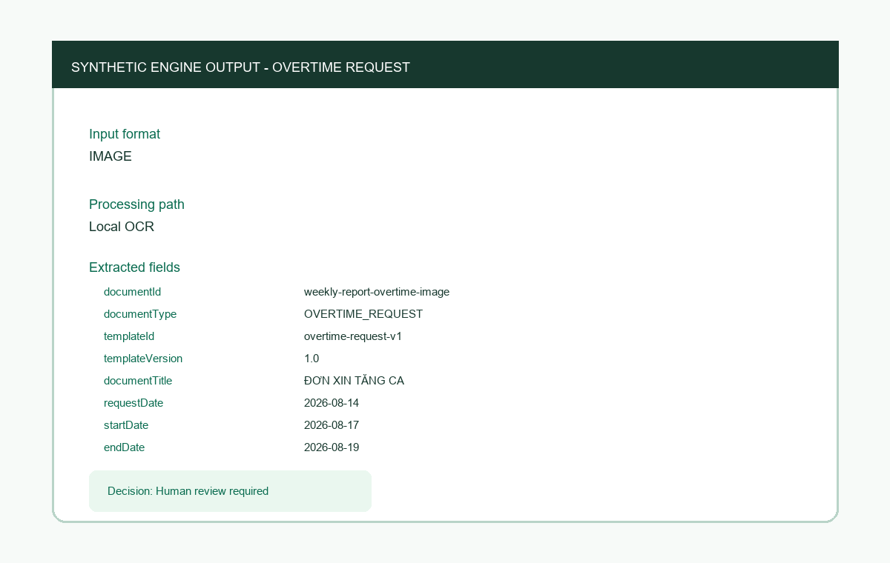
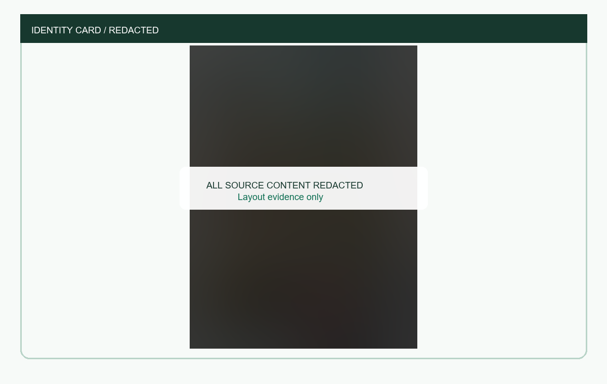
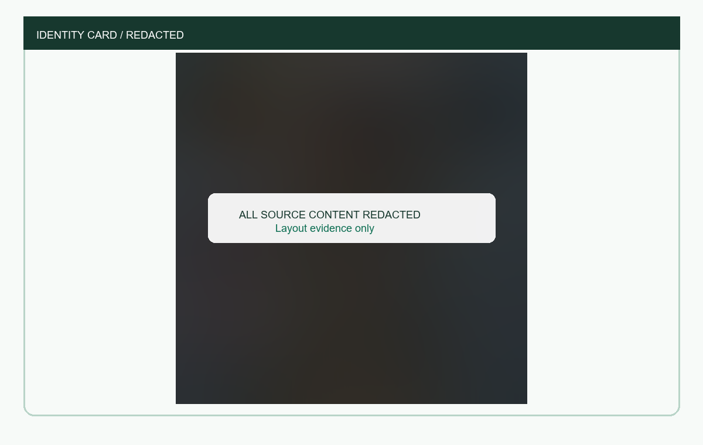
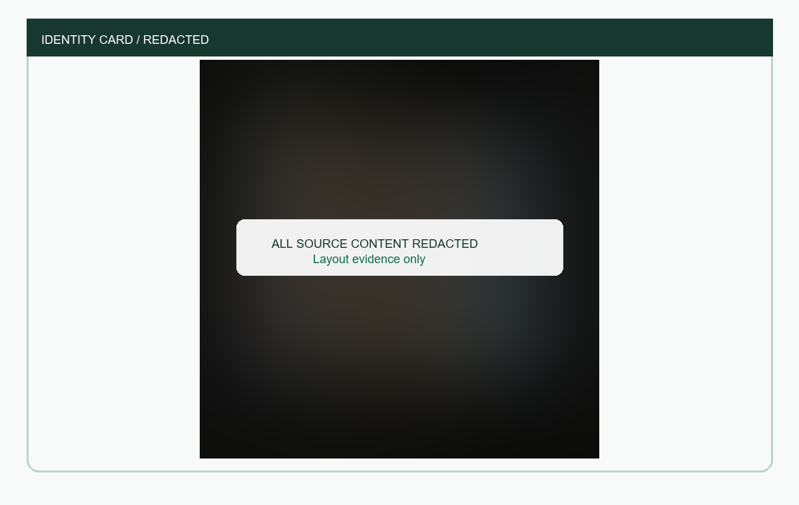
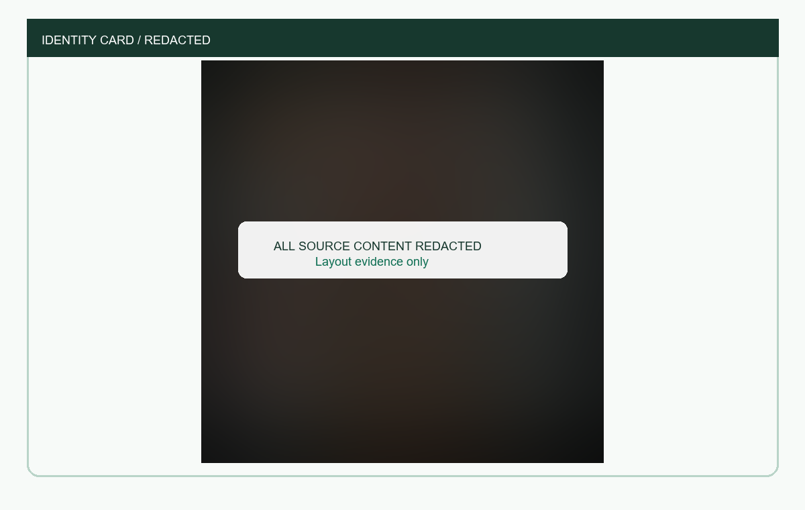

# Weekly Product Report - 2026-W31

## Tóm tắt điều hành

HCNS Automation Agent đã có luồng xử lý theo hai biểu mẫu hành chính nhân sự đã biết: đơn nghỉ phép và đơn tăng ca. Hệ thống nhận DOCX, PDF và ảnh scan, ưu tiên đọc trực tiếp dữ liệu có sẵn trong file, sau đó trả JSON kèm nguồn bằng chứng và quyết định có cần người kiểm tra hay không.

Trong tuần này, một vùng tải tài liệu đa định dạng và bản xem trước đã được tích hợp vào website local. DOCX và PDF có lớp chữ đạt 100% trên bộ kiểm thử đã phê duyệt. Ảnh và PDF scan chưa đạt ngưỡng chất lượng, vì vậy kết quả OCR vẫn cần người kiểm tra.

## Tình trạng theo quyết định

| Hạng mục | Trạng thái | Bằng chứng |
|---|---|---|
| DOCX của hai biểu mẫu | Sẵn sàng local | 10/10 phân loại, 90/90 trường bắt buộc |
| PDF có lớp chữ | Sẵn sàng local | 10/10 phân loại, 90/90 trường bắt buộc |
| Ảnh camera và PDF scan | Shadow review | 6/6 xử lý và phân loại, 31/54 field required |
| Tự động chuyển tiếp kết quả OCR | Chưa mở | Không có trường hợp ảnh/scan bị chuyển tiếp tự động sai |
| UI intake một điểm | Sẵn sàng local | DOCX, PDF, PNG, JPG/JPEG; preview cạnh JSON |
| Camunda/HRIS production | Chưa triển khai | Không có API call hay process instance production |

## Evidence cho hai biểu mẫu HCNS

| Loại tài liệu | Path xử lý | Kết quả đã xác minh | Quyết định |
|---|---|---:|---|
| Đơn nghỉ phép DOCX | Đọc trực tiếp | Đúng toàn bộ trường bắt buộc trong bộ kiểm thử | Tự động chuyển tiếp |
| Đơn nghỉ phép PDF | Đọc trực tiếp | Đúng toàn bộ trường bắt buộc trong bộ kiểm thử | Tự động chuyển tiếp |
| Đơn nghỉ phép ảnh | OCR local | Thuộc tập đạt 31/54 trường bắt buộc của sáu ảnh | Cần người kiểm tra |
| Đơn tăng ca DOCX | Đọc trực tiếp | Đúng toàn bộ trường bắt buộc trong bộ kiểm thử | Tự động chuyển tiếp |
| Đơn tăng ca PDF | Đọc trực tiếp | Đúng toàn bộ trường bắt buộc trong bộ kiểm thử | Tự động chuyển tiếp |
| Đơn tăng ca ảnh | OCR local | Thuộc tập đạt 31/54 trường bắt buộc của sáu ảnh | Cần người kiểm tra |

Sáu mẫu HCNS dưới đây là dữ liệu tổng hợp do AI tạo và không đại diện cho người thật. Ảnh kết quả được sinh từ output thật của engine, không lấy Ground Truth làm output.

### Đơn nghỉ phép: đầu vào và kết quả engine

| Định dạng | Đầu vào tổng hợp | Kết quả trích xuất |
|---|---|---|
| DOCX |  |  |
| PDF |  |  |
| Ảnh scan |  |  |

### Đơn tăng ca: đầu vào và kết quả engine

| Định dạng | Đầu vào tổng hợp | Kết quả trích xuất |
|---|---|---|
| DOCX |  |  |
| PDF |  |  |
| Ảnh scan |  |  |

## CCCD: mẫu evidence đã khử định danh

Hệ thống chọn 4 mẫu trong 30 phiên đã được người dùng đối chiếu. Cách xếp hạng ưu tiên phiên đã kiểm tra đầy đủ, OCR chạy thành công, có kết quả trích xuất, độ tin cậy tốt và thời gian xử lý hợp lý. ID mẫu là mã băm một chiều; report không lưu tên file hoặc nội dung CCCD.

Xem [selection.json](assets/cccd/selection.json) để kiểm tra ranking và privacy declaration.

| Mẫu đã ẩn dữ liệu | Ảnh minh chứng |
|---|---|
| Mẫu 1 |  |
| Mẫu 2 |  |
| Mẫu 3 |  |
| Mẫu 4 |  |

## Trạng thái sản phẩm và UX

Hai screenshot an toàn thể hiện website local không chứa tài liệu hay dữ liệu cá nhân:


Giao diện hiện có một điểm upload mặc định, hiển thị bản xem trước ảnh/PDF và kết quả có cấu trúc cạnh nhau. Luồng thử nghiệm cũ vẫn được giữ trong cấu hình riêng và không xuất hiện mặc định.

## Rủi ro và kiểm soát

| Rủi ro | Kiểm soát đang áp dụng | Hành động tiếp theo |
|---|---|---|
| Mất dấu tiếng Việt, bố cục khó trên scan | Bắt buộc người kiểm tra, không tự điền trường thiếu | Phân loại lỗi theo từng trường và đọc lại vùng dữ liệu liên quan trên bộ phát triển |
| Overfit theo held-out | Evaluate-once và policy lock | Tạo held-out v2 độc lập sau khi khóa candidate mới |
| Lộ dữ liệu nhạy cảm | Local-only, private-data, report aggregate | Duy trì redaction validation trước mỗi report |
| Drift manifest multi-format | Đã ghi nhận mismatch 30 khai báo/26 file | Sửa manifest và stale reference trong task riêng |
| Sai phạm vi triển khai | API bind loopback, chưa có HRIS write | Railway deployment và external integration cần smoke-test/phê duyệt riêng |

## Đề xuất tuần kế tiếp

1. Đo lỗi theo từng trường trên bộ phát triển ảnh/scan; không sử dụng đáp án chuẩn để điền dữ liệu khi hệ thống đang nhận dạng.
2. Chỉ đọc lại vùng dữ liệu khi có nhãn/vị trí làm bằng chứng; mọi kết quả chưa chắc chắn vẫn cần người kiểm tra.
3. Chạy lại gate multi-format. Chỉ xem xét promotion khi OCR field exact-match đạt ít nhất 44/54 và không làm mất trường đúng.
4. Khi chuẩn bị Railway, bổ sung cấu hình deployment và chạy smoke-test với health, upload, source retention và session deletion.

## Khả năng tái lập

```powershell
python scripts/build_weekly_report_cccd_selection.py `
  --data-root <authorized-private-data-root> `
  --output docs/weekly-reports/2026-W31/assets/cccd/selection.json `
  --limit 4
python scripts/validate_weekly_report.py
```

Audit chi tiết: [AUDIT_NOTES.md](AUDIT_NOTES.md). Danh mục artifact: [EVIDENCE_MANIFEST.json](EVIDENCE_MANIFEST.json).
