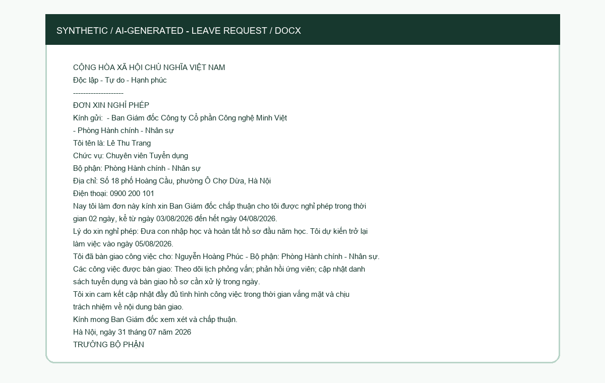
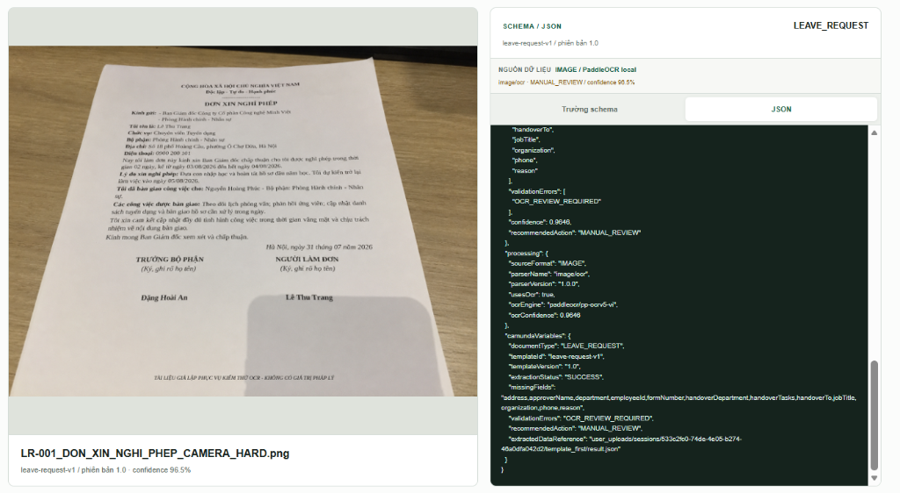
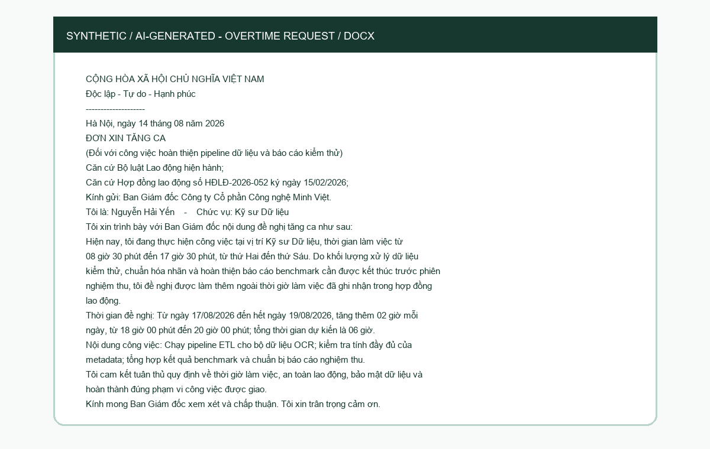
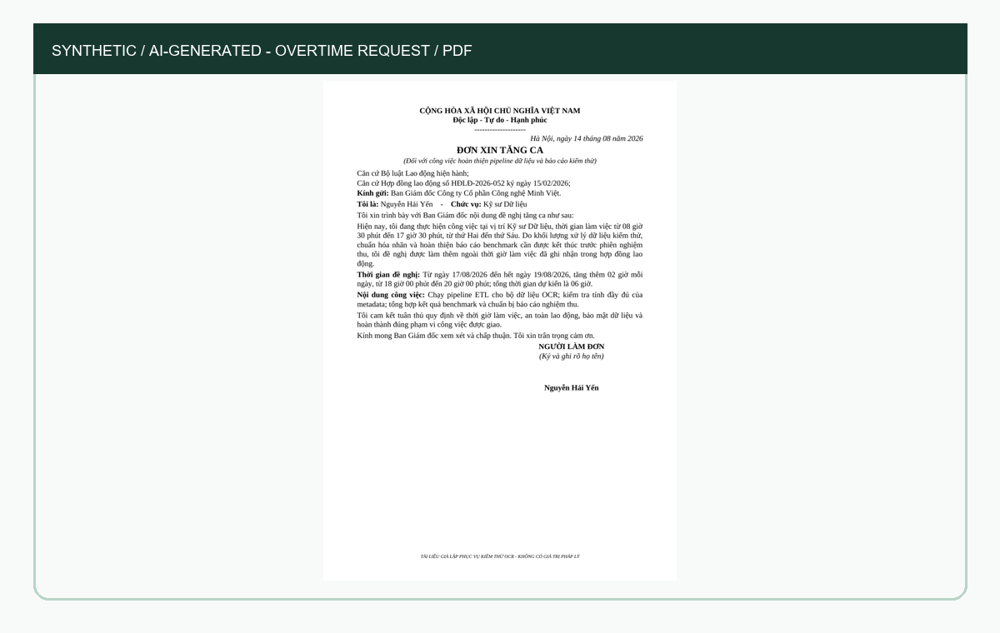
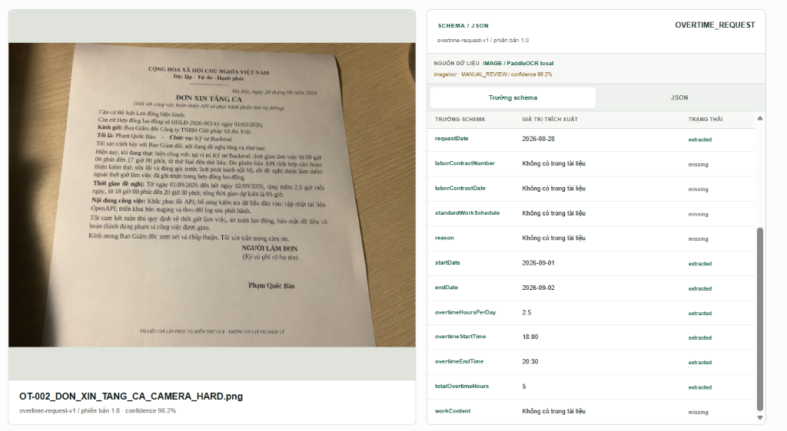
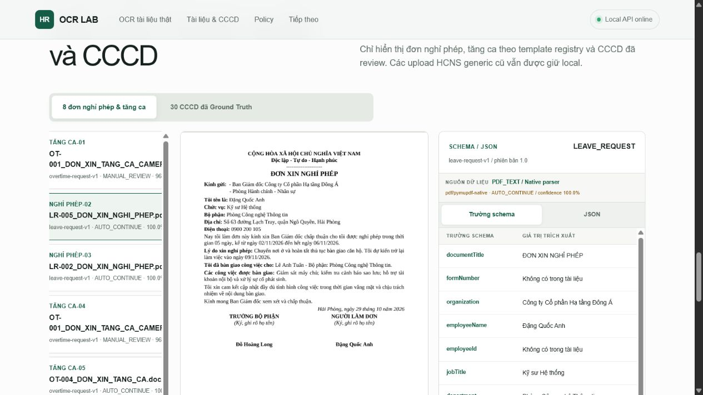
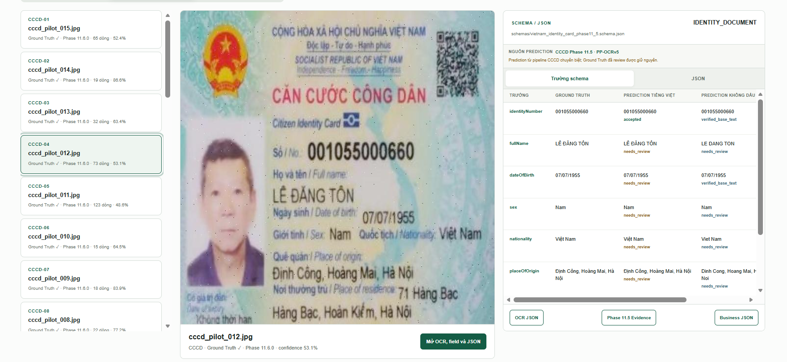
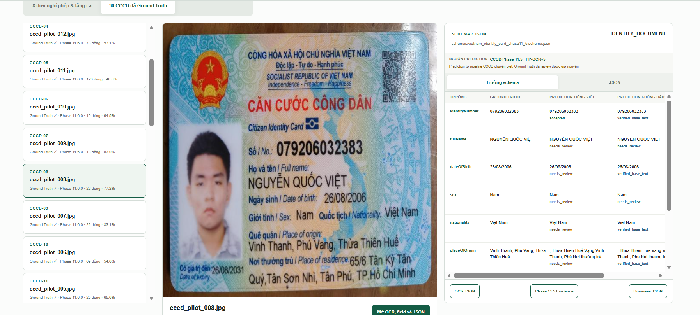
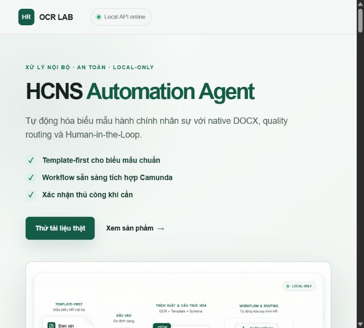
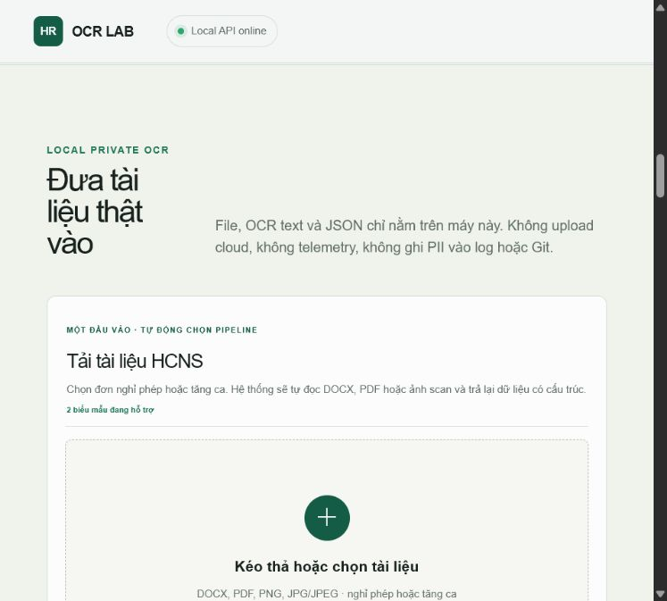

# Weekly Product Report

## Tóm tắt điều hành

HCNS Automation Agent đã có luồng xử lý theo hai biểu mẫu hành chính nhân sự đã biết: đơn nghỉ phép và đơn tăng ca. Hệ thống nhận DOCX, PDF và ảnh scan, ưu tiên đọc trực tiếp dữ liệu có sẵn trong file, sau đó trả JSON kèm nguồn bằng chứng và quyết định có cần người kiểm tra hay không.

Trong tuần này, một vùng tải tài liệu đa định dạng và bản xem trước đã được tích hợp vào website local. DOCX và PDF có lớp chữ đạt 100% trên bộ kiểm thử đã phê duyệt. Ảnh và PDF scan chưa đạt ngưỡng chất lượng, vì vậy kết quả OCR vẫn cần người kiểm tra.

## Tình trạng theo quyết định

| Hạng mục | Trạng thái | Bằng chứng |
|---|---|---|
| DOCX của hai biểu mẫu | Sẵn sàng local | 10/10 phân loại, 90/90 trường bắt buộc |
| PDF có lớp chữ | Sẵn sàng local | 10/10 phân loại, 90/90 trường bắt buộc |
| Ảnh camera và PDF scan | Shadow review | 6/6 xử lý và phân loại, 31/54 field required |
| Tự động chuyển tiếp kết quả OCR | Chưa mở | Không có trường hợp ảnh/scan bị chuyển tiếp tự động sai |
| UI intake một điểm | Sẵn sàng local | DOCX, PDF, PNG, JPG/JPEG; preview cạnh JSON |
| Camunda/HRIS production | Chưa triển khai | Không có API call hay process instance production |

## Evidence cho hai biểu mẫu HCNS

| Loại tài liệu | Path xử lý | Kết quả đã xác minh | Quyết định |
|---|---|---:|---|
| Đơn nghỉ phép DOCX | Đọc trực tiếp | Đúng toàn bộ trường bắt buộc trong bộ kiểm thử | Tự động chuyển tiếp |
| Đơn nghỉ phép PDF | Đọc trực tiếp | Đúng toàn bộ trường bắt buộc trong bộ kiểm thử | Tự động chuyển tiếp |
| Đơn nghỉ phép ảnh | OCR local | Thuộc tập đạt 31/54 trường bắt buộc của sáu ảnh | Cần người kiểm tra |
| Đơn tăng ca DOCX | Đọc trực tiếp | Đúng toàn bộ trường bắt buộc trong bộ kiểm thử | Tự động chuyển tiếp |
| Đơn tăng ca PDF | Đọc trực tiếp | Đúng toàn bộ trường bắt buộc trong bộ kiểm thử | Tự động chuyển tiếp |
| Đơn tăng ca ảnh | OCR local | Thuộc tập đạt 31/54 trường bắt buộc của sáu ảnh | Cần người kiểm tra |

Sáu mẫu HCNS dưới đây là dữ liệu tổng hợp do AI tạo và không đại diện cho người thật. Ảnh kết quả được sinh từ output thật của engine, không lấy Ground Truth làm output.

### Đơn nghỉ phép: đầu vào và kết quả engine

| Định dạng | Đầu vào tổng hợp | Kết quả trích xuất |
|---|---|---|
| DOCX |  | [Xem JSON kết quả](assets/hr/leave-docx-result.json) |
| PDF |  | [Xem JSON kết quả](assets/hr/leave-pdf-result.json) |
| Ảnh camera |  | [Xem JSON kết quả](assets/hr/leave-image-result.json) |

### Đơn tăng ca: đầu vào và kết quả engine

| Định dạng | Đầu vào tổng hợp | Kết quả trích xuất |
|---|---|---|
| DOCX |  | [Xem JSON kết quả](assets/hr/overtime-docx-result.json) |
| PDF |  | [Xem JSON kết quả](assets/hr/overtime-pdf-result.json) |
| Ảnh camera |  | [Xem JSON kết quả](assets/hr/overtime-image-result.json) |

### Ảnh chụp trực tiếp từ LOCAL REAL-DOCUMENT EVIDENCE

Ảnh dưới đây được chụp từ localhost sau khi sửa preview: PDF được render thành ảnh trang đầu, còn ảnh scan hiển thị trực tiếp. Inspector schema/JSON bên phải vẫn giữ nguyên.

| Định dạng | Evidence từ localhost |
|---|---|
| PDF nghỉ phép |  |
## CCCD: evidence tổng hợp và Prediction JSON

Hai ảnh dưới đây do người dùng cung cấp và được xác nhận là dữ liệu AI-generated. Phần JSON là kết quả Prediction của engine local; Ground Truth không được dùng làm output. Các trường `needs_review` vẫn phải được người kiểm tra xác nhận.

### CCCD-01 · `cccd_pilot_012.jpg`



Prediction JSON: [cccd-pilot-012-prediction.json](assets/cccd/cccd-pilot-012-prediction.json)

<details>
<summary>Xem Prediction JSON CCCD-01</summary>

```json
{
  "sourceFile": "cccd_pilot_012.jpg",
  "predictionOrigin": "locked-local-cccd-engine",
  "groundTruthUsedAsOutput": false,
  "fields": {
    "identityNumber": {"value": "001055000660", "confidence": 0.402644, "status": "accepted"},
    "fullName": {"value": "LÊ ĐĂNG TÔN", "confidence": 0.866262, "status": "needs_review"},
    "dateOfBirth": {"value": "07/07/1955", "confidence": 0.58525, "status": "needs_review"},
    "sex": {"value": "Nam", "confidence": 0.801353, "status": "needs_review"},
    "nationality": {"value": "Việt Nam", "confidence": 0.657507, "status": "needs_review"},
    "placeOfOrigin": {"value": "Định Công, Hoàng Mai, Hà Nội", "confidence": 0.79335, "status": "needs_review"},
    "placeOfResidence": {"value": "71 H Hàng là Bạc Hàng Bạc, Hoàn Kiểm, Hà Nội", "confidence": 0.711428, "status": "needs_review"},
    "dateOfExpiry": {"value": null, "confidence": 0.0, "status": "not_found"}
  }
}
```
</details>

### CCCD-02 · `cccd_pilot_008.jpg`



Prediction JSON: [cccd-pilot-008-prediction.json](assets/cccd/cccd-pilot-008-prediction.json)

<details>
<summary>Xem Prediction JSON CCCD-02</summary>

```json
{
  "sourceFile": "cccd_pilot_008.jpg",
  "predictionOrigin": "locked-local-cccd-engine",
  "groundTruthUsedAsOutput": false,
  "fields": {
    "identityNumber": {"value": "079206032383", "confidence": 0.448701, "status": "accepted"},
    "fullName": {"value": "NGUYỄN QUỐC VIỆT", "confidence": 0.731844, "status": "needs_review"},
    "dateOfBirth": {"value": "26/08/2006", "confidence": 0.77347, "status": "needs_review"},
    "sex": {"value": "Nam", "confidence": 0.552332, "status": "needs_review"},
    "nationality": {"value": "Việt Nam", "confidence": 0.45523, "status": "needs_review"},
    "placeOfOrigin": {"value": ", Thừa Thiên Huế Vạng Vinh Thanh, Phú Nơi thường trú", "confidence": 0.770964, "status": "needs_review"},
    "placeOfResidence": {"value": "65/6 Tân Kỳ Tân", "confidence": 0.785389, "status": "needs_review"},
    "dateOfExpiry": {"value": "26/08/2031", "confidence": 0.486915, "status": "accepted"}
  }
}
```
</details>

## Trạng thái sản phẩm và UX

Hai screenshot thể hiện website local có một điểm upload, preview tài liệu và inspector schema/JSON cạnh nhau:





Giao diện hiện có một điểm upload mặc định, hiển thị bản xem trước ảnh/PDF và kết quả có cấu trúc cạnh nhau. Luồng thử nghiệm cũ vẫn được giữ trong cấu hình riêng và không xuất hiện mặc định.

## Rủi ro và kiểm soát

| Rủi ro | Kiểm soát đang áp dụng | Hành động tiếp theo |
|---|---|---|
| Mất dấu tiếng Việt, bố cục khó trên scan | Bắt buộc người kiểm tra, không tự điền trường thiếu | Phân loại lỗi theo từng trường và đọc lại vùng dữ liệu liên quan trên bộ phát triển |
| Overfit theo held-out | Evaluate-once và policy lock | Tạo held-out v2 độc lập sau khi khóa candidate mới |
| Dữ liệu CCCD tổng hợp bị hiểu nhầm là output chuẩn | Gắn nhãn synthetic, Prediction JSON tách khỏi Ground Truth | Giữ `needs_review` và không truyền sang workflow production |
| Drift manifest multi-format | Đã ghi nhận mismatch 30 khai báo/26 file | Sửa manifest và stale reference trong task riêng |
| Sai phạm vi triển khai | API bind loopback, chưa có HRIS write | Railway deployment và external integration cần smoke-test/phê duyệt riêng |

## Đề xuất kế hoạch kế tiếp

1. Đo lỗi theo từng trường trên bộ phát triển ảnh/scan; không sử dụng đáp án chuẩn để điền dữ liệu khi hệ thống đang nhận dạng.
2. Chỉ đọc lại vùng dữ liệu khi có nhãn/vị trí làm bằng chứng; mọi kết quả chưa chắc chắn vẫn cần người kiểm tra.
3. Chạy lại gate multi-format. Chỉ xem xét promotion khi OCR field exact-match đạt ít nhất 44/54 và không làm mất trường đúng.
4. Bổ sung thêm các loại tài liệu bằng cấp, chứng chỉ, bản chấm công,...
5. Tích hợp với hệ thống Camunda đã dựng sẵn dưới dạng External Worker
6. Tích hợp sử dụng với Camera điện thoại với tài liệu thật. Deploy local lên server.


Audit chi tiết: [AUDIT_NOTES.md](AUDIT_NOTES.md). Danh mục artifact: [EVIDENCE_MANIFEST.json](EVIDENCE_MANIFEST.json).
